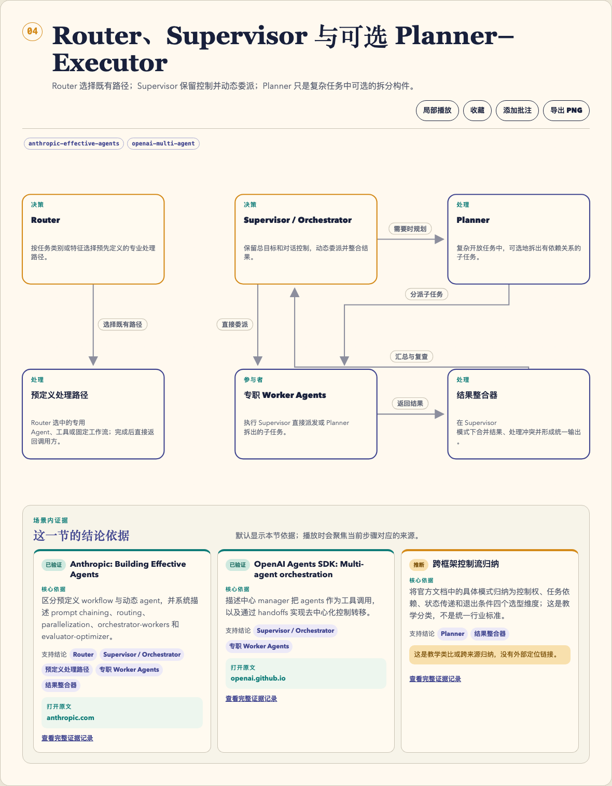

<p align="center">
  
</p>

<h1 align="center">Fireworks Open ELI5</h1>

[English](README.md) · [简体中文](README.zh.md)

一个开放、可移植的 Agent Skill，用来把复杂系统变成真实、可追溯、可交互的视觉故事。它先生成有版本的 JSON 故事规格，再编译成单个、确定性、自包含、可离线运行的 HTML 文件。

它把“小白能懂”和“技术上经得住追问”放在同一个解释器里：读者可以跟随一次真实请求或事件走完整条链路，查看每个结论的依据，切换故障视角，收藏与批注场景，并在不上传源材料的情况下完成多种格式导出。



_真实生成的中文场景：关系图、局部操作与结论级证据同时呈现。_

## 核心特色

- **事实阶梯**：明确分开类比、技术机制与限制条件。
- **结论旁边就是依据**：场景内可直接显示证据状态、核心文本、支持范围，以及来源链接或明确的“无定位信息”边界。
- **四种故事语法**：概念、仓库模块、工程取舍、事故复盘，每种都有独立的摘要视图和语义校验。
- **细致播放**：全局或局部播放真实节点、连线、标签、箭头和证据卡，包含进入、停留、离开阶段，并自动让当前场景保持在视口内。
- **故障透镜与反向检查**：影响、外部症状、降级方案和 teach-back 问题都属于正文，不是附录。
- **读者工作台**：支持主动开启的同源历史、收藏、纯文本批注，以及键盘可访问的目录导航。
- **本地导出**：PDF、当前场景 PNG、全场景 PPTX、Pages 兼容 DOCX，以及可选的、经过真实验证的 `.pages` 转换。
- **天然可移植**：渲染阶段不依赖 npm 包、远程字体、远程资源或网络请求。

## 环境要求

- **Skill 运行时**：Node.js 18 或更高版本，并且能读写本地文件。
- **包依赖**：零依赖。无需执行 `npm install`，也不需要 Python、远程字体或远程渲染服务。
- **渲染**：不需要浏览器和网络。
- **阅读与导出**：使用现代浏览器打开交互 HTML，并在本地导出 PDF、PNG、PPTX 或 DOCX。
- **原生 `.pages` 导出可选**：需要 macOS、Apple Pages 和内置的本地回环助手。

安装器和安装后的 Skill 是两套独立要求。发行 canary 使用的
`skills@1.5.23` CLI 需要 Node.js 22.20 或更高版本；安装完成后的 Skill
仍然只要求 Node.js 18 或更高版本。安装时需要一次性访问公开 GitHub
仓库；`npx` 路径还需要访问 npm registry。安装公开仓库不需要 GitHub
账号或 Token。

## 安装

### 用自然语言安装（推荐）

把下面对应的一段话发给 Agent 即可。Agent 应先检查 `SKILL.md`，遇到同名目录时停止并询问，完成后回报实际安装位置。

**Codex**

> 请从 `https://github.com/yizhiyanhua-ai/fireworks-open-eli5`
> 全局安装 `fireworks-open-eli5` Agent Skill。使用 Codex 内置的 Skill
> 安装器；仓库根目录（`.`）就是 Skill 目录，安装名必须是
> `fireworks-open-eli5`。安装前检查 `SKILL.md`，不要擅自覆盖已有同名
> Skill；安装后验证实际路径，并告诉我是否需要新建 Codex 任务才能使用。

**Claude Code**

> 请从 `https://github.com/yizhiyanhua-ai/fireworks-open-eli5`
> 为 Claude Code 全局安装 `fireworks-open-eli5` Agent Skill。安装前检查
> `SKILL.md`，可用时使用 Agent Skills CLI，不要擅自覆盖已有同名 Skill。
> 如果安装器的环境要求不满足，只报告问题，不要修改我的 Node.js
> 环境；安装后确认 Claude Code 能发现它，并回报实际安装路径。

### 使用 `npx` 安装

开源的 [Agent Skills CLI](https://github.com/vercel-labs/skills) 同时支持
Codex 和 Claude Code：

```bash
# Codex
npx skills@latest add yizhiyanhua-ai/fireworks-open-eli5 -g -a codex -y

# Claude Code
npx skills@latest add yizhiyanhua-ai/fireworks-open-eli5 -g -a claude-code -y

# 同时安装到两者
npx skills@latest add yizhiyanhua-ai/fireworks-open-eli5 -g -a codex -a claude-code -y
```

`-g` 表示用户级全局安装；如果只想在当前项目使用，去掉 `-g`。完成后可用
`npx skills@latest list -g --json` 检查，再新建一个 Agent 任务，让 Skill
被重新发现。Skill 会继承宿主 Agent 的权限，使用前仍应检查其内容。

## 快速开始

```bash
node scripts/validate.mjs assets/example-spec.json
node scripts/render.mjs assets/example-spec.json example.html
node scripts/validate.mjs assets/example-spec.json example.html
```

命令会输出紧凑的 JSON，失败时返回非零退出码。默认只创建新文件；只有明确要替换已知的普通文件时才使用 `--force`，符号链接始终会被拒绝。

运行完整的贡献者与发行检查：

```bash
npm run check
```

它会检查 JavaScript 语法、针对性测试、标准示例、发行包内容，以及从解包后的发行候选中重新渲染并验证的安装 canary。

如果当前环境是 Node.js 22.20 或更高版本，还可以通过固定版本的 Agent
Skills CLI，在隔离目录中实际安装到 Codex 和 Claude Code 并重新渲染：

```bash
npm run check:agent-install
```

## 作为 Agent Skill 使用

安装完成后，提出一个需要证据支撑的视觉解释请求，例如：

> 解释一个排队任务如何经过这个仓库。引用真实文件，让我播放请求路径，并显示租约过期时哪里会出问题。

Agent 工作流见 [SKILL.md](SKILL.md)，版本 1 故事规格见 [references/spec-contract.md](references/spec-contract.md)。

## 生成链路

```text
问题 + 受众 + 证据
        │
        ▼
有版本的 JSON 故事规格
        │ 校验
        ▼
确定性 HTML 渲染器
        │
        ├── 离线交互解释器
        ├── 打印 / PDF
        ├── 当前场景 PNG
        ├── 全场景 PPTX
        ├── Pages 兼容 DOCX
        └── 可选的原生 Pages 转换
```

JSON 规格是可移植的事实来源。HTML 会携带它的规范化 SHA-256；校验器还能根据给定规格重新渲染，并对产物做字节级一致性检查。

## 读者工作台

每个解释器都带目录抽屉。收藏排在最前面，之后可以切换当前目录、以前实际打开过的解释器和批注浏览模式。读者无需启动整篇动画，就能单独播放、收藏、批注或导出某个场景。

本地资料库默认关闭，只有读者选择 **启用本地资料库** 后才会记录状态。它只记录相同 scheme、host 和 port 下实际打开过的解释器，不扫描文件系统。收藏与批注保存在浏览器本地、未加密，清除该来源的浏览器数据后也会被删除；它们不会改写源 JSON 或生成的 HTML。`file://` 或不可用的存储环境会退化为仅当前会话的内存状态。

完整的持久化、隐私、无障碍、播放和导出约定见 [references/library-and-export.md](references/library-and-export.md)。

## 导出

| 操作 | 结果 | 验证边界 |
|---|---|---|
| 打印 / PDF | 浏览器打印对话框 | 由读者在浏览器支持时选择“存储为 PDF” |
| PNG | 当前场景 1600×900 图片 | 校验 PNG 签名、尺寸和场景证据脚注 |
| PPTX | 每个场景一张 16:9 幻灯片 | 校验 ZIP 签名和必要的 OOXML 部件 |
| DOCX | 每个场景一张 16:9 页面 | 校验 ZIP 签名和必要的 OOXML 部件 |
| 原生 Pages | 由 Apple Pages 真正保存的 `.pages` 包 | 必须包含 `Index/Document.iwa`，并能在 Pages 中重新打开 |

PNG、PPTX 和 DOCX 都在浏览器本地生成，不使用第三方库。原生 Pages 转换绝不会通过重命名 DOCX 来伪造。可信的解释器目录可以这样启动：

```bash
node scripts/serve.mjs --root /absolute/path/to/explainers --port 8772
```

助手只绑定 `127.0.0.1`，校验精确来源和轮换进程令牌，对生成的 DOCX/PNG 结构做体积与格式约束，串行执行转换，并清理任务级临时文件。这些控制用于防止跨站网页触发浏览器动作，不构成对其他本地进程的身份认证。

## 安全与隐私

渲染器读取本地文件并写出一个本地文件。生成的 HTML 使用哈希白名单 CSP，不包含远程资源、XHR、WebSocket、`eval` 或 HTML 字符串 DOM 注入。唯一的连接是用户主动触发、同源、指向可选 Pages 助手的本地回环请求。引用的 HTTP(S) URL 只是读者可点击的普通链接，不是运行时依赖。

批注有数量和长度限制，只以文本方式插入。校验器会拒绝不安全的来源 URL、外部资源、运行时代码篡改、规格哈希漂移和意外 CSP 哈希。漏洞报告方式见 [SECURITY.md](SECURITY.md)。

## 项目结构

- [SKILL.md](SKILL.md)：Agent 工作流与交付边界
- `assets/example-spec.json`：完整的中文 DNS 示例
- `assets/explainer-shell.html`：离线视觉与交互壳
- `scripts/render.mjs`：确定性渲染器
- `scripts/validate.mjs`：规格与产物校验器
- `scripts/serve.mjs`：仅回环访问的原生 Pages 助手
- `references/`：证据、故事语法、视觉、报告、工作台与导出约定
- `evals/`：任务质量和触发评测
- `tests/`：Node 内置测试与对抗性夹具

## 参与贡献

先阅读 [CONTRIBUTING.md](CONTRIBUTING.md)，然后运行：

```bash
npm run check
```

发行包使用显式白名单，并保留 `private: true`，防止被意外发布到 npm。本仓库的目标是分发 Agent Skill，不是提供 npm 运行时库。

## 许可证与归属

Apache-2.0，详见 [LICENSE](LICENSE) 与 [NOTICE](NOTICE)。

Fireworks Open ELI5 是受 Anthropic 社区 `eli5` Skill 启发的独立实现，不受 Anthropic 官方背书。
