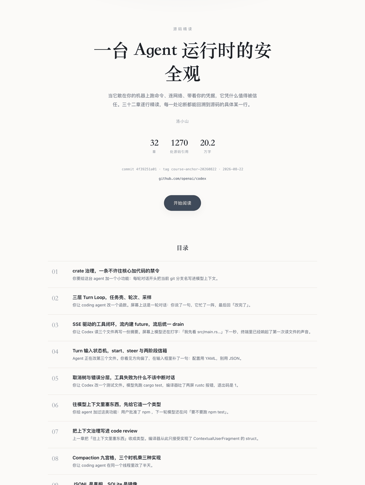
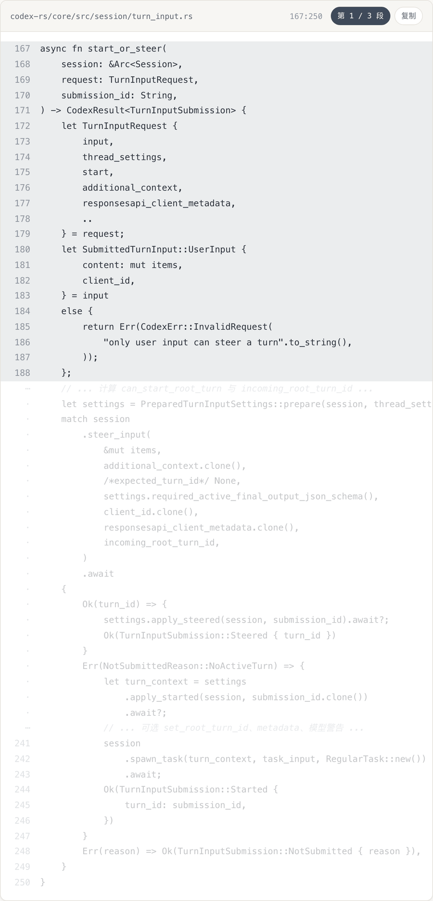
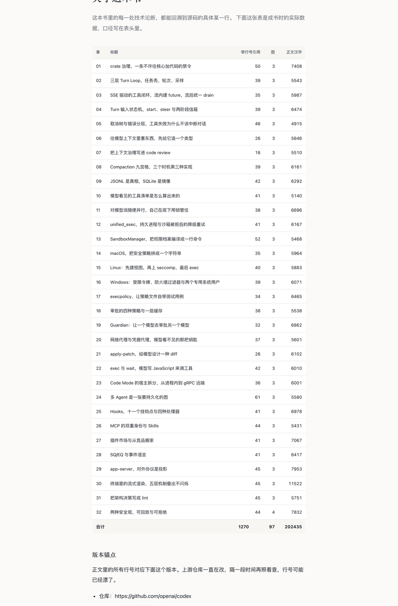
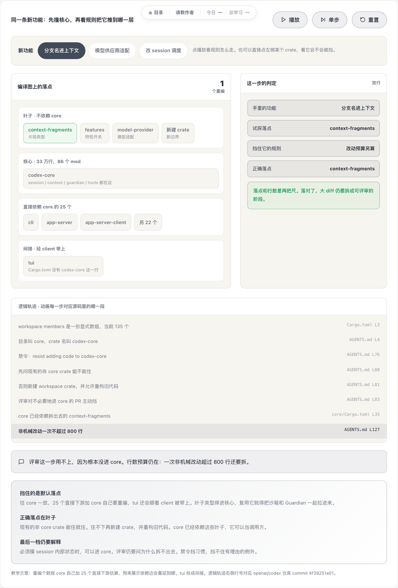

# 一条纵向切片：同一章从大纲走到课页

拿到空模板容易不知道填到什么程度。这里放同一章在三个阶段的真实成品，对着看就有尺子。

源项目是 openai/codex，Rust 单仓 90 多个 crate。选的是第 1 章，讲这个仓库靠什么阻止核心 crate 继续膨胀。选它的原因：它是首章，不依赖任何前置知识；主题是依赖方向治理，换任何语言、任何规模的项目都成立。

---

## 三个阶段的成品

| 文件 | 对应阶段 | 看什么 |
|---|---|---|
| `stage2-outline-entry.md` | 阶段二 · 大纲 | 定位怎么立、锚点写到多细 |
| `../sample/chapters/01-crate-governance.md` | 阶段三 · 章节书稿 | 八段结构的完整形态，50 处带行号引用 |
| `stage4-book-cover.png` | 阶段四 · 成书 | 封面与目录 |
| `stage4-book-stepping.png` | 阶段四 · 成书 | 引用块的行号与逐段步进 |
| `stage4-book-colophon.png` | 阶段四 · 成书 | 封底的逐章数据与版本锚点 |
| `stage4-page-demo.png` | 阶段四 · 课页（可选形态） | 交互演示区该长什么样 |

---

## 阶段二：大纲

`stage2-outline-entry.md`

两处节选：课程定位，加上第 1 章的锚点条目。

要注意的是定位部分没有直接列章节，而是先回答「这门课解答哪一个问题」，并把答案收束成一句话。这句话决定后面哪些内容进、哪些不进。缺了它，大纲会退化成源码目录的中文翻译。

锚点条目有五个固定字段：核心问题、源码锚点、对比锚点、边界条件示例、互动演示。源码锚点具体到行，比如 `AGENTS.md:72-83`，这样写作 Agent 不用自己找料，直接去核实。

---

## 阶段三：章节书稿

`../sample/chapters/01-crate-governance.md`，约 6 万字符，50 处带行号引用，3 张图。这一章同时是样张的第 1 章，所以放在 `sample/` 里，不在这个目录下再存一份。

八段结构：场景还原、逐行精读、设计决策分析、边界条件剖析、横向对比、互动演示设计、可迁移结论、思考题。文件末尾有一段交付自查，逐项写实际达成数。

三处值得专门看：

**逐行精读**是篇幅主体，一段代码一段话交替推进。每贴一段代码，前面一句说明这段要证明什么，后面用白话讲输入输出。不是贴一大坨再统一解释。

**边界条件剖析**里的追问全部落到源码具体分支，没有一句「取决于配置」。这一段是拉开深度的地方。

**互动演示设计**是写给下一阶段的人看的，包含分步动画、每步的字幕文案、逻辑轨迹面板的每一行伪代码加真实行号。它不写 HTML，但细到照着就能实现。

---

## 阶段四：成书

三张截图来自 `book/build_book.py` 编出来的书，配置只填了书名、作者、被读仓库和版本锚点。截图对应的书可以直接翻：[三章样张](https://itshen.github.io/source-reading-methodology/)，第 1 章就是这一章。

`stage4-book-cover.png` 是封面加目录。封面上那句副标题就是阶段二立的那个问题；下面三个数字（章数、引用数、字数）和版本锚点是给读者判断可信度用的。目录里每章的一句话摘要是从该章「场景还原」的头一句自动取的，不满意可以在章节元信息里写 `> 摘要：`覆盖。

`stage4-book-stepping.png` 是引用块，也是整本书最值得看的一处细节。截图里那一块声明 `167:250`，中间有两处省略：

- 开头一段从 167 正着数到 188
- 结尾一段从 250 倒着数回 241
- 夹在两处省略之间的那些行标 `·`，**不给行号**

因为省略跳过了多少行，只有源文件知道。宁可不显示，也不显示一个编出来的行号。头部的「第 1 / 3 段」按钮点一下会按连续段依次高亮，让读者看清哪几行在源文件里真的连在一起。

`stage4-book-colophon.png` 是封底：逐章的引用数、图数、汉字数，以及被精读仓库的 commit 与 tag。这张表是这本书敢不敢让人查的凭证。

## 阶段四的另一条路：交互课页

如果产出形态是课程站的课页而不是书，`stage4-page-demo.png` 是那条路的成品。三样硬要求：

1. 底部一句人话字幕，跟着步进更新
2. 逻辑轨迹面板，一行一句白话，右侧标真实文件与行号（`AGENTS.md L76`、`Cargo.toml L3`），随动画高亮当前行
3. 播放、单步、重置三个按钮，进入视野自动播放一次

页面上没有源码面板。代码留在书里，页面负责让人明白机制。

截图对应的是线上的实际页面，演示可以真的点：[xueai.app](https://xueai.app/?from=source-reading-methodology) 里「解剖 OpenAI Codex」那一篇的第 1 节。

---

## 一个提醒

这份样例的行号对应 openai/codex commit `4f39251a01`。上游一直在改，现在照着去查大概已经漂了。这正好说明为什么阶段一要先打 tag：行号是这套方法论的地基，不锁版本，写到第十章时第一章的引用已经全部失效，而且你无法判断是当初写错还是后来改了。
