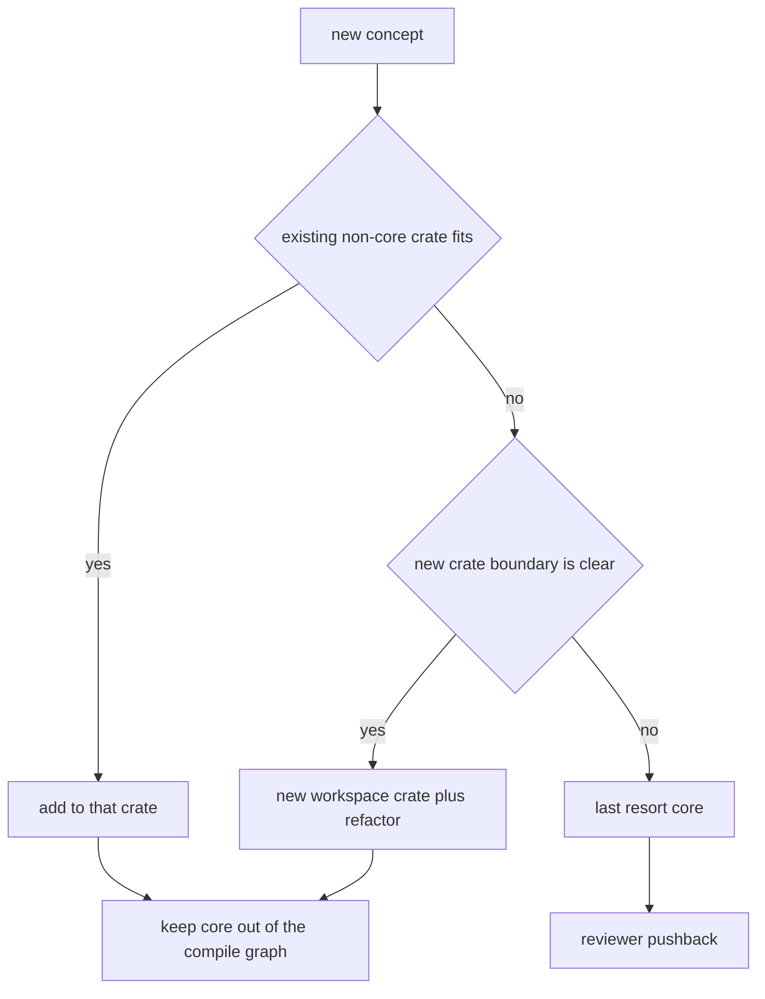
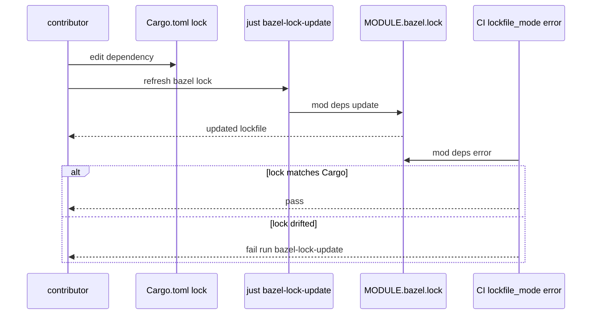
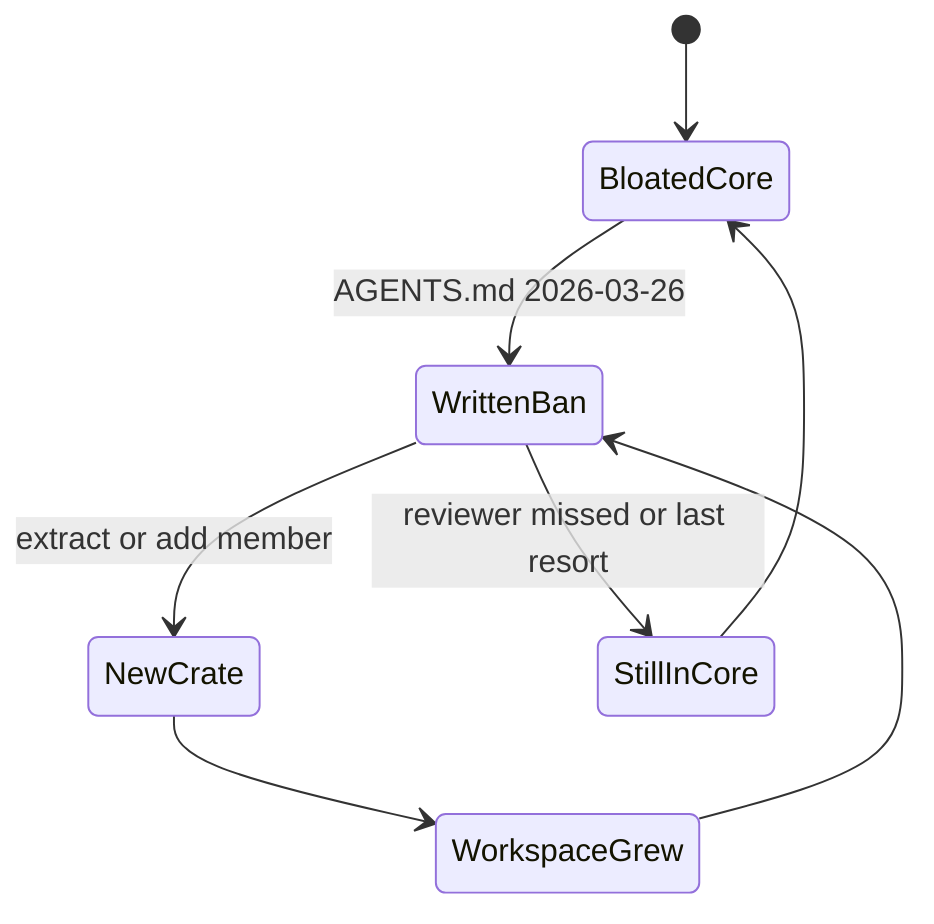

# 第 1 章：crate 治理，一条不许往核心加代码的禁令

> 源码核对基于 openai/codex commit `4f39251a01`（2026-08-22），tag `course-anchor-20260822`
> 对照 DSH 课页：`dsh-1.html`；对照 Grok 课页：`12-1.html`
> 本章字数：约 15000 字（不含代码与图）

## 场景还原

你要给这台 agent 加一个小功能：每轮对话开头把当前 git 分支名写进模型上下文。打开仓库，第一反应是往 `codex-rs/core/` 里加。session、context、guardian、tools 都在那儿，新文件放进去最省事。依赖表不用改，调用链不用跨 crate，评审时也能说功能就在核心旁边。

过了一周，同样的理由又进来三条。一个截断工具输出的 helper，一个模型供应商适配，一个会话恢复的边角。`core/src/lib.rs` 顶部又多了三个 `mod`。下游 crate 只要写 `use codex_core::...`，编译图跟着变宽。本地只跑 `just test -p codex-core`，等待时间从几十秒变成几分钟。

再过一个月，有人想单独复用「上下文片段」那个类型，发现它焊在 core 里。要复用就得把整个 core 拉进来，包括沙箱、MCP、Guardian。新 crate 要么依赖这个巨物，要么把类型再抄一份。

仓库自己把这件事写成禁令。`AGENTS.md` 用加粗英文写 `resist adding code to codex-core`。新概念先找别的 crate，或者新建 crate。评审遇到往 core 里堆功能的 PR，被要求主动挡回去。

这条禁令写进文件的日期是 2026-03-26，commit `609019c6e5`，PR `#15910`。当时 `codex-core` 已经是 `codex-rs/` 里最大的 crate。立完之后 workspace 成员从 75 个长到 135 个，core 的生产代码却还是涨了。禁令挡住的是默认往核心扔，挡不住核心继续长。本章就读这条禁令、它管的那几个数字，以及 Cargo 和 Bazel 为什么必须一起改。

## 逐行精读

先把仓库的真实体量摊开，再读三条治理规则，最后看双构建系统怎样把「改一处依赖」变成两份锁文件的合同。

这张图回答：一个新功能按仓库自己的规则该落在哪。



### 清单里到底有多少个 crate

一份流传很广的说法是这套运行时大约 90 个 crate。根清单在 `codex-rs/Cargo.toml`。接下来这段要证明什么：workspace 成员是一份显式数组，每个字符串对应一个目录，也就是一个 crate。

```1:20:codex-rs/Cargo.toml
[workspace]
members = [
    "aws-auth",
    "analytics",
    "agent-graph-store",
    "agent-identity",
    "backend-client",
    "bwrap",
    "build-info",
    "ansi-escape",
    "async-utils",
    "app-server",
    "app-server-transport",
    "app-server-daemon",
    "app-server-client",
    "app-server-protocol",
    "app-server-protocol-noop-macros",
    "app-server-test-client",
    "apply-patch",
    "arg0",
```

数组收到最后四个名字，然后才是 resolver。

```130:139:codex-rs/Cargo.toml
    "terminal-detection",
    "test-binary-support",
    "thread-manager-sample",
    "thread-store",
    "uds",
    "codex-experimental-api-macros",
    "plugin",
    "model-provider",
]
resolver = "2"
```

把 `members` 数组里的字符串数一遍，得到 135。含测试辅助 crate，比如 `exec-server/tests/support`。这是当前 tag 上的事实，不是约数。

目录名和 crate 名不是一回事。`AGENTS.md` 开篇把前缀写死：目录叫 `core`，crate 名叫 `codex-core`。

```1:5:AGENTS.md
# Rust/codex-rs

In the codex-rs folder where the rust code lives:

- Crate names are prefixed with `codex-`. For example, the `core` folder's crate is named `codex-core`
```

`core/Cargo.toml` 把这句话落成字段。`name` 是给 Cargo 的包名，`[lib].name` 是给 `use` 的。

```1:9:codex-rs/core/Cargo.toml
[package]
edition.workspace = true
license.workspace = true
name = "codex-core"
version.workspace = true

[lib]
name = "codex_core"
path = "src/lib.rs"
```

新 crate 默认继承 2024 edition。`cargo new -w` 不用再写一遍。

```141:148:codex-rs/Cargo.toml
[workspace.package]
version = "0.0.0"
# Track the edition for all workspace crates in one place. Individual
# crates can still override this value, but keeping it here means new
# crates created with `cargo new -w ...` automatically inherit the 2024
# edition.
edition = "2024"
license = "Apache-2.0"
```

### 行数分布：少数巨物，一长串小包

在 `codex-rs/` 下对每个 workspace 成员统计 `.rs` 行数，不含 `target/`。当前 tag 的结果如下。数字是 `wc` 数出来的，含测试。

| crate 目录 | `.rs` 文件数 | 行数 |
|---|---:|---:|
| `core` | 582 | 330255 |
| `tui` | 492 | 271839 |
| `app-server` | 239 | 147638 |
| `exec-server` | 129 | 48004 |
| `core-plugins` | 72 | 42214 |

135 个成员合计 3198 个 `.rs` 文件、1434093 行。大于等于 1 万行的 24 个，2 千到 1 万的 34 个，小于 2 千的 77 个。大多数 crate 各自只有几千行，少数几个吃掉了大半体积。

另一份常见说法把这四个数字写成 tui 27 万、core 20 万、app-server 5 万、core-plugins 4.2 万。和当前 tag 对得上的只有 tui 与 core-plugins。core 的全部 `.rs` 已经到 33 万。若去掉测试文件（路径含 `tests/`、文件名以 `_tests.rs` 结尾、或就叫 `tests.rs`），core 剩 316 个文件、103498 行。app-server 当前是 14.8 万，不是 5 万。

`core/src/lib.rs` 自己就是一张目录。文件头先禁掉库代码直接写 stdout，然后是一长串 `mod`。

```1:10:codex-rs/core/src/lib.rs
//! Root of the `codex-core` library.

// Prevent accidental direct writes to stdout/stderr in library code. All
// user-visible output must go through the appropriate abstraction (e.g.,
// the TUI or the tracing stack).
#![deny(clippy::print_stdout, clippy::print_stderr)]

mod apply_patch;
mod apps;
mod client;
```

把这个文件里的顶层 `mod` 数一遍，得到 86 个：85 个是 `mod xxx;` 这种指向文件的声明，还有一个 `pub(crate) mod mentions` 直接把模块体内联在了 `lib.rs` 里。自己复算的时候只匹配分号结尾会少数一个。session、compact、guardian、tools、rollout、mcp 都还在 core 里。禁令没有把核心拆空，它只是要求新概念不要再默认往这里堆。

谁在吃 core：按 `Cargo.toml` 里恰好写作 `codex-core =` 的键来数，25 个 workspace 成员直接依赖它。`cli`、`app-server`、`app-server-client`、`mcp-server` 和一批 `ext/*` 在名单里。`tui` 的 `Cargo.toml` 没有这一行，它依赖 `codex-app-server-client`，再由 client 拉 core。往 core 加一行，直接下游 25 个要重编，tui 仍会顺着 client 被带上。

```41:42:codex-rs/cli/Cargo.toml
codex-core = { workspace = true }
codex-core-plugins = { workspace = true }
```

```16:21:codex-rs/app-server-client/Cargo.toml
codex-app-server = { workspace = true }
codex-app-server-protocol = { workspace = true }
codex-arg0 = { workspace = true }
codex-config = { workspace = true }
codex-core = { workspace = true }
codex-exec-server = { workspace = true }
```

```30:31:codex-rs/tui/Cargo.toml
codex-app-server-client = { workspace = true }
codex-app-server-protocol = { workspace = true }
```

core 自己的 `[dependencies]` 有 98 项，其中 61 项是 `codex-*`。它既是被依赖最多的中心之一，也是依赖最宽的中心。编译图朝两个方向扩。接下来这段要证明什么：core 已经把拆出去的 crate 再依赖回来，包括刚读过的 `context-fragments` 和 `features`。

```26:42:codex-rs/core/Cargo.toml
codex-analytics = { workspace = true }
codex-agent-graph-store = { workspace = true }
codex-api = { workspace = true }
codex-app-server-protocol = { workspace = true }
codex-apply-patch = { workspace = true }
codex-async-utils = { workspace = true }
codex-client = { workspace = true }
codex-code-mode = { workspace = true }
codex-connectors = { workspace = true }
codex-context-fragments = { workspace = true }
codex-config = { workspace = true }
codex-core-plugins = { workspace = true }
codex-diagnostics = { workspace = true }
codex-exec-server = { workspace = true }
codex-extension-api = { workspace = true }
codex-extension-items = { workspace = true }
codex-features = { workspace = true }
```

### 禁令正文：resist adding code to codex-core

接下来这段要证明什么：仓库把「core 已经膨胀」写成原因，把「先找别的 crate 或新建 crate」写成动作，把「评审主动挡」写成执行方式。没有 lint，没有编译器开关。

```72:83:AGENTS.md
## The `codex-core` crate

Over time, the `codex-core` crate (defined in `codex-rs/core/`) has become bloated because it is the largest crate, so it is often easier to add something new to `codex-core` rather than refactor out the library code you need so your new code neither takes a dependency on, nor contributes to the size of, `codex-core`.

To that end: **resist adding code to codex-core**!

Particularly when introducing a new concept/feature/API, before adding to `codex-core`, consider whether:

- There is an existing crate other than `codex-core` that is an appropriate place for your new code to live.
- It is time to introduce a new crate to the Cargo workspace for your new functionality. Refactor existing code as necessary to make this happen.

Likewise, when reviewing code, do not hesitate to push back on PRs that would unnecessarily add code to `codex-core`.
```

四句话，顺序是原因、禁令、两条出路、评审义务。

原因写的是便利性陷阱。core 最大，往里面加最省事。省事的代价是新代码既依赖 core，又继续把 core 喂大。禁令要打断的就是这股惯性。

两条出路是有顺序的。先问现有的非 core crate 能不能住。再问该不该新建一个 workspace crate，并且允许为此重构旧代码。core 是最后一档，不是默认档。

执行方是评审的人，包括人和 AI。原文是 `do not hesitate to push back`。仓库里检索 `resist adding code to codex-core`，只命中 `AGENTS.md` 这一处。没有对应的 clippy lint，也没有 Bazel 检查。这条规则靠读，不靠红灯。

`609019c6e5` 的提交说明把同一件事又说了一遍。`codex-core` 已经是最大 crate，默认往它身上堆会让 workspace 更难保持模块化。贡献者应先找现有的非 core crate，或者引入新 crate。评审遇到不必要地扩大 core 的 PR，应主动挡。那次提交只改了 `AGENTS.md` 13 行。源码中没有单独的设计文档，以上为从提交说明和禁令正文反推，标注为推断：团队当时已经感觉到惯性，选择先写规则，再慢慢拆。

### 禁令之后，债是怎么还的

禁令当天，`codex-core` 有 425 个 `.rs` 文件、205390 行。去掉测试后是 216 个文件、80318 行。当前 tag 对应 582 个文件、330255 行；去掉测试后是 316 个文件、103498 行。生产代码仍涨了约 2.3 万行。

债的另一半写在 crate 出生日期上。135 个成员里，75 个的 `Cargo.toml` 首次出现早于 2026-03-26，60 个在禁令当天或之后才进清单。当天抽出的是 `tools`。之后比较完整的一批包括：

1. `codex-mcp`（2026-04-01，`#15919`，从 core 抽出 MCP）
2. `models-manager` 与 `model-provider-info`（2026-04-02，`#16389`，从 core 抽出模型所有权）
3. `core-plugins`（2026-04-15，`#17022` 附近，插件加载与市场）
4. `file-watcher`（2026-05-08，`#21290`，从 core 搬走）
5. `context-fragments`（2026-06-03，`#26xxx`，上下文片段类型独立成 crate）

`context-fragments` 的包清单几乎没有业务依赖。它只碰 protocol 和一段字符串工具。这就是禁令要的形状：新概念带上自己需要的那一点，不把 core 拖进来。

```1:9:codex-rs/context-fragments/Cargo.toml
[package]
edition.workspace = true
license.workspace = true
name = "codex-context-fragments"
version.workspace = true

[lib]
name = "codex_context_fragments"
path = "src/lib.rs"
```

对外只 re-export 两个片段类型和一个 trait。文件本身只有 6 行。

```1:6:codex-rs/context-fragments/src/lib.rs
mod additional_context;
mod fragment;

pub use additional_context::AdditionalContextDeveloperFragment;
pub use additional_context::AdditionalContextUserFragment;
pub use fragment::ContextualUserFragment;
```

`features` 更早一步，2026-03-19 就从 core 拆出，禁令还没落纸。它的包清单同样不依赖 `codex-core`。

```1:10:codex-rs/features/Cargo.toml
[package]
edition.workspace = true
license.workspace = true
name = "codex-features"
version.workspace = true

[lib]
doctest = false
name = "codex_features"
path = "src/lib.rs"
```

拆出去之后，特性开关的生命周期可以单独演进。`Stage` 是完整枚举，五个变体穷尽了从开发中到删除的路径。

```41:58:codex-rs/features/src/lib.rs
/// High-level lifecycle stage for a feature.
#[derive(Debug, Clone, Copy, PartialEq, Eq)]
pub enum Stage {
    /// Features that are still under development, not ready for external use
    UnderDevelopment,
    /// Experimental features made available to users through the `/experimental` menu
    Experimental {
        name: &'static str,
        menu_description: &'static str,
        announcement: &'static str,
    },
    /// Stable features. The feature flag is kept for ad-hoc enabling/disabling
    Stable,
    /// Deprecated feature that should not be used anymore.
    Deprecated,
    /// The feature flag is useless but kept for backward compatibility reason.
    Removed,
}
```

`impl` 用穷尽 match，通配分支没有出现。`AGENTS.md` 第 21 行要求 match 尽量穷尽，这里就是那条规则的落地。

```60:66:codex-rs/features/src/lib.rs
impl Stage {
    pub fn experimental_menu_name(self) -> Option<&'static str> {
        match self {
            Stage::Experimental { name, .. } => Some(name),
            Stage::UnderDevelopment | Stage::Stable | Stage::Deprecated | Stage::Removed => None,
        }
    }
```

还有一个方向相反的 crate。`core-api` 在 2026-04-29 出现，头注释写明它是建在 `codex-core` 之上的公开门面。

```1:1:codex-rs/core-api/src/lib.rs
//! Public facade for thread management APIs built on `codex-core`.
```

拆出去的是类型和子系统。留下来给外部用的，再收成一层 facade。core 没有因此变小，调用方至少可以少直接摸 86 个 `mod`。评审规则把对外 API 也写小：少暴露测试专用 helper。

```85:89:AGENTS.md
## Code Review Rules

### Crate API surface

Keep crate API surfaces as small as possible. Avoid proliferating test-only helpers.
```

`core-plugins` 的包名仍带着 core，目录已经独立。当前 72 个 `.rs` 文件、42214 行。禁令后的拆分经常长成这种中间态：名字还像核心，编译图已经分开。

### 模块体量：500 行目标，800 行改开新文件

crate 级禁令下面还有一层文件级规则。接下来这段要证明什么：目标是 500 行，超过大约 800 行就该开新模块，并且点名了五个已经在吸无关改动的文件。

```49:61:AGENTS.md
- Avoid large modules:
  - Prefer adding new modules instead of growing existing ones.
  - Target Rust modules under 500 LoC, excluding tests.
  - If a file exceeds roughly 800 LoC, add new functionality in a new module instead of extending
    the existing file unless there is a strong documented reason not to.
  - This rule applies especially to high-touch files that already attract unrelated changes, such
    as `codex-rs/tui/src/app.rs`, `codex-rs/tui/src/bottom_pane/chat_composer.rs`,
    `codex-rs/tui/src/bottom_pane/footer.rs`, `codex-rs/tui/src/chatwidget.rs`,
    `codex-rs/tui/src/bottom_pane/mod.rs`, and similarly central orchestration modules.
  - When extracting code from a large module, move the related tests and module/type docs toward
    the new implementation so the invariants stay close to the code that owns them.
  - Avoid adding new standalone methods to `codex-rs/tui/src/chatwidget.rs` unless the change is
    trivial; prefer new modules/files and keep `chatwidget.rs` focused on orchestration.
```

500 行不含测试。800 行是软上限，允许「有充分书面理由」继续加。五个点名文件在当前 tag 上的行数如下，同样是 `wc` 数出来的。

| 被点名的文件 | 总行数 | 测试大约从哪开始 |
|---|---:|---|
| `tui/src/app.rs` | 900 | 第 897 行起是 `test_support` / `tests` |
| `tui/src/bottom_pane/chat_composer.rs` | 12859 | 第 4925 行起挂测试模块 |
| `tui/src/bottom_pane/footer.rs` | 2075 | 未在本章逐行拆 |
| `tui/src/chatwidget.rs` | 2064 | 第 2063 行还有 `#[cfg(test)]` |
| `tui/src/bottom_pane/mod.rs` | 3155 | 未在本章逐行拆 |

`app.rs` 的生产部分大约 896 行，刚好压在 800 之上。它的头注释承认自己只该管编排。

```1:4:codex-rs/tui/src/app.rs
//! Top-level TUI application state and runtime wiring.
//!
//! This module owns the `App` struct, shared imports, and the high-level run loop that coordinates
//! the focused app submodules.
```

`chatwidget.rs` 的头注释把职责写成编排：收协议事件、更新 history cell、驱动主视口和 overlay。第 60 到 61 行专门禁止再往这里加独立方法。

```1:4:codex-rs/tui/src/chatwidget.rs
//! The main Codex TUI chat surface.
//!
//! `ChatWidget` consumes protocol events, builds and updates history cells, and drives rendering
//! for both the main viewport and overlay UIs.
```

`chat_composer.rs` 是五个点名文件里最夸张的一个。测试模块从 4925 行才开始，前面大约 4924 行是生产代码，已经是 800 行上限的六倍。后面的 `mod tests` 再铺 7900 多行。规则写了「抽出时把测试一起搬走」，这个文件两边都超了。

```1:10:codex-rs/tui/src/bottom_pane/chat_composer.rs
//! The chat composer is the bottom-pane text input state machine.
//!
//! It is responsible for:
//!
//! - Editing the input buffer (a [`TextArea`]), including placeholder "elements" for attachments.
//! - Routing keys to the active popup (slash commands, file search, skill/apps mentions).
//! - Promoting typed slash commands into atomic elements when the command name is completed.
//! - Handling submit vs newline on Enter.
//! - Turning raw key streams into explicit paste operations on platforms where terminals
//!   don't provide reliable bracketed paste (notably Windows).
```

```4925:4930:codex-rs/tui/src/bottom_pane/chat_composer.rs
#[cfg(test)]
#[path = "chat_composer_effort_tests.rs"]
mod effort_tests;

#[cfg(test)]
mod tests {
```

core 里超过 800 行的 `.rs` 有 101 个，tui 里有 82 个。前几名大多是测试：`core/src/config/config_tests.rs` 12821 行，`tui/src/app/tests.rs` 8552 行。规则按「不含测试」计，这些测试文件不直接犯规。犯规的是生产侧已经过线、还继续被点名为 high-touch 的那五个。

模块规则和 crate 禁令是同一类东西。都承认膨胀已经发生，都把增量往外推，都不提供机器红灯。点名五个文件，等于公开承认这五个最容易在评审里被忽略。

### 单次改动也不许太大

第三条尺管的是 diff，不管文件存量。

```125:131:AGENTS.md
### Change size guidance (800 lines)

Unless the change is mechanical the total number of changed lines should not exceed 800 lines.
For complex logic changes the size should be under 500 lines.

If the change is larger, explore whether it can be split into reviewable stages and identify the smallest coherent stage to land first.
Base the staging suggestion on the actual diff, dependencies, and affected call sites.
```

机械改动豁免，比如全仓 rename。复杂逻辑的预算更紧，500 行。超了要拆成可评审的阶段，先落最小的连贯一块。依据是实际 diff、依赖和受影响的调用点，不是感觉。

这条 2026-06-01 才从别处搬进 `AGENTS.md`，commit `c955f73078`。比 core 禁令晚了两个月。三层尺子叠在一起：crate 别再喂 core，文件别再过 800，一次 PR 别再过 800。任何一层单独看都像风格建议。三层一起看，针对的是同一件事：AI 和人都倾向于把改动写大、写进已经很大的文件。

### 双构建：Cargo 能过，Bazel 仍可能红

治理规则写在 markdown 里。依赖合同写在两套构建系统里。改 `Cargo.toml` 或 `Cargo.lock` 之后，必须同步刷新 `MODULE.bazel.lock`。`include_str!` 这类编译期读文件，还要改对应 crate 的 `BUILD.bazel`。

```37:43:AGENTS.md
- If you change Rust dependencies (`Cargo.toml` or `Cargo.lock`), run `just bazel-lock-update` from the
  repo root to refresh `MODULE.bazel.lock`, and include that lockfile update in the same change. CI
  verifies lockfile drift.
- Bazel does not automatically make source-tree files available to compile-time Rust file access. If
  you add `include_str!`, `include_bytes!`, `sqlx::migrate!`, or similar build-time file or
  directory reads, update the crate's `BUILD.bazel` (`compile_data`, `build_script_data`, or test
  data) or Bazel may fail even when Cargo passes.
```

最后半句是关键合同。Cargo 过了不算完。Bazel 可能仍然失败。本地 `cargo test` 绿、CI 红，是这条规则预见到的日常事故。

`just bazel-lock-update` 只做一件事：让 Bazel 按 update 模式重写 lock。

```143:154:justfile
[no-cd]
bazel-lock-update:
    bazel mod deps --lockfile_mode=update

[no-cd]
[unix]
bazel-lock-check:
    {{ justfile_directory() }}/scripts/check-module-bazel-lock.sh

[windows]
bazel-lock-check:
    bazel mod deps --lockfile_mode=error; if ($LASTEXITCODE -ne 0) { Write-Error "MODULE.bazel.lock is out of date. Run 'just bazel-lock-update' and commit the updated lockfile."; exit 1 }
```

Unix 上的 check 脚本把失败文案写死。lock 过期就退出 1，提示你跑 update 再提交。

```1:9:scripts/check-module-bazel-lock.sh
#!/usr/bin/env bash
set -euo pipefail

repo_root="$(cd "$(dirname "${BASH_SOURCE[0]}")/.." && pwd)"
if ! "${repo_root}/.github/scripts/run_bazel_with_buildbuddy.py" mod deps --lockfile_mode=error; then
  echo "MODULE.bazel.lock is out of date."
  echo "Run 'just bazel-lock-update' and commit the updated lockfile."
  exit 1
fi
```

另一份常见说法把 `MODULE.bazel.lock` 写成 154 万行。当前文件是 2149 行，体积 1543460 字节，约 1.54 MB。把字节数读成了行数。内容是 JSON，记录 Bazel 注册表模块的哈希，不是 Rust 源码。

```1:3:MODULE.bazel.lock
{
  "lockFileVersion": 26,
  "registryFileHashes": {
```

`include_str!` 的落点可以看 TUI 的 tooltip。源码里一行宏，把隔壁的 `tooltips.txt` 编进二进制。

```23:23:codex-rs/tui/src/tooltips.rs
const RAW_TOOLTIPS: &str = include_str!("../tooltips.txt");
```

Cargo 看见相对路径就会打包。Bazel 默认不把源树文件交给编译期读取。所以 `tui/BUILD.bazel` 用 `compile_data = glob(...)` 把整棵 crate 文件树（再加两份协作模板）显式列进编译输入。

```3:16:codex-rs/tui/BUILD.bazel
codex_rust_crate(
    name = "tui",
    compile_data = glob(
        include = ["**"],
        allow_empty = True,
        exclude = [
            "**/* *",
            "BUILD.bazel",
            "Cargo.toml",
        ],
    ) + [
        "//codex-rs/collaboration-mode-templates:templates/default.md",
        "//codex-rs/collaboration-mode-templates:templates/plan.md",
    ],
```

更小的例子是 `utils/cargo-bin`。它在编译期注入 `CODEX_REPO_ROOT_MARKER`，所以 `BUILD.bazel` 必须同时写 `compile_data` 和 `rustc_env`。

```8:17:codex-rs/utils/cargo-bin/BUILD.bazel
codex_rust_crate(
    name = "cargo-bin",
    compile_data = ["repo_root.marker"],
    crate_name = "codex_utils_cargo_bin",
    lib_data_extra = ["repo_root.marker"],
    rustc_env = {
        "CODEX_REPO_ROOT_MARKER": "$(rlocationpath :repo_root.marker)",
    },
    test_data_extra = ["repo_root.marker"],
)
```

测试里要拉起本仓库的二进制，两套构建的路径约定不同。`AGENTS.md` 要求统一走 `codex_utils_cargo_bin::cargo_bin`，不要直接用 `assert_cmd::Command::cargo_bin`。

```216:220:AGENTS.md
### Spawning workspace binaries in tests (Cargo vs Bazel)

- Prefer `codex_utils_cargo_bin::cargo_bin("...")` over `assert_cmd::Command::cargo_bin(...)` or `escargot` when tests need to spawn first-party binaries.
  - Under Bazel, binaries and resources may live under runfiles; use `codex_utils_cargo_bin::cargo_bin` to resolve absolute paths that remain stable after `chdir`.
- When locating fixture files or test resources under Bazel, avoid `env!("CARGO_MANIFEST_DIR")`. Prefer `codex_utils_cargo_bin::find_resource!` so paths resolve correctly under both Cargo and Bazel runfiles.
```

`CargoBinError` 把失败原因穷举成四个变体。找不到当前 exe、找不到当前目录、环境变量指向的路径不存在、按名字找遍仍失败。

```11:31:codex-rs/utils/cargo-bin/src/lib.rs
#[derive(Debug, thiserror::Error)]
pub enum CargoBinError {
    #[error("failed to read current exe")]
    CurrentExe {
        #[source]
        source: std::io::Error,
    },
    #[error("failed to read current directory")]
    CurrentDir {
        #[source]
        source: std::io::Error,
    },
    #[error("CARGO_BIN_EXE env var {key} resolved to {path:?}, but it does not exist")]
    ResolvedPathDoesNotExist { key: String, path: PathBuf },
    #[error("could not locate binary {name:?}; tried env vars {env_keys:?}; {fallback}")]
    NotFound {
        name: String,
        env_keys: Vec<String>,
        fallback: String,
    },
}
```

`cargo_bin` 先读 `CARGO_BIN_EXE_*`。在 `cargo test` 里这些值是绝对路径，在 `bazel test` 里是 runfiles 的 rlocationpath。函数头注释把这层差异写死。最后才回退到 `assert_cmd`。

```33:69:codex-rs/utils/cargo-bin/src/lib.rs
/// Returns an absolute path to a binary target built for the current test run.
///
/// In `cargo test`, `CARGO_BIN_EXE_*` env vars are absolute.
/// In `bazel test`, `CARGO_BIN_EXE_*` env vars are rlocationpaths, intended to be consumed by `rlocation`.
/// This helper allows callers to transparently support both.
#[allow(deprecated)]
pub fn cargo_bin(name: &str) -> Result<PathBuf, CargoBinError> {
    let env_keys = cargo_bin_env_keys(name);
    for key in &env_keys {
        if let Some(value) = std::env::var_os(key) {
            return resolve_bin_from_env(key, value);
        }
    }
    match assert_cmd::Command::cargo_bin(name) {
        Ok(cmd) => {
            let mut path = PathBuf::from(cmd.get_program());
            if !path.is_absolute() {
                path = std::env::current_dir()
                    .map_err(|source| CargoBinError::CurrentDir { source })?
                    .join(path);
            }
            if path.exists() {
                Ok(path)
            } else {
                Err(CargoBinError::ResolvedPathDoesNotExist {
                    key: "assert_cmd::Command::cargo_bin".to_owned(),
                    path,
                })
            }
        }
        Err(err) => Err(CargoBinError::NotFound {
            name: name.to_owned(),
            env_keys,
            fallback: format!("assert_cmd fallback failed: {err}"),
        }),
    }
}
```

输入是二进制目标名。输出是绝对路径，或者带原因的错误。Cargo 与 Bazel 对调用方消失。双构建的成本被收进这一个 crate。每个测试不必再各写一套路径解析。

名字里的连字符要单独处理。Cargo 导出环境变量时会把 `-` 换成 `_`。接下来这段要证明什么：`cargo_bin_env_keys` 两种名字都试。

```71:82:codex-rs/utils/cargo-bin/src/lib.rs
fn cargo_bin_env_keys(name: &str) -> Vec<String> {
    let mut keys = Vec::with_capacity(2);
    keys.push(format!("CARGO_BIN_EXE_{name}"));

    // Cargo replaces dashes in target names when exporting env vars.
    let underscore_name = name.replace('-', "_");
    if underscore_name != name {
        keys.push(format!("CARGO_BIN_EXE_{underscore_name}"));
    }

    keys
}
```

夹具路径走另一条宏。`find_resource!` 必须是宏，因为它要在调用点捕获编译期环境变量。Bazel 下用 `BAZEL_PACKAGE` 加 runfiles，Cargo 下用 `CARGO_MANIFEST_DIR`。

```114:138:codex-rs/utils/cargo-bin/src/lib.rs
/// Macro that derives the path to a test resource at runtime, the value of
/// which depends on whether Cargo or Bazel is being used to build and run a
/// test. Note the return value may be a relative or absolute path.
/// (Incidentally, this is a macro rather than a function because it reads
/// compile-time environment variables that need to be captured at the call
/// site.)
///
/// This is expected to be used exclusively in test code because Codex CLI is a
/// standalone binary with no packaged resources.
#[macro_export]
macro_rules! find_resource {
    ($resource:expr) => {{
        let resource = std::path::Path::new(&$resource);
        if $crate::runfiles_available() {
            // When this code is built and run with Bazel:
            // - we inject `BAZEL_PACKAGE` as a compile-time environment variable
            //   that points to native.package_name()
            // - at runtime, Bazel will set runfiles-related env vars
            $crate::resolve_bazel_runfile(option_env!("BAZEL_PACKAGE"), resource)
        } else {
            let manifest_dir = std::path::Path::new(env!("CARGO_MANIFEST_DIR"));
            Ok(manifest_dir.join(resource))
        }
    }};
}
```

这张时序图回答：改依赖之后，哪一步以谁为准。



依赖的编辑入口是 Cargo。Bazel lock 是派生物。判定是否过期的是 CI 里的 `lockfile_mode=error`。两边不一致时，过的是你刚改的 Cargo，红的是没刷新的 Bazel。以 CI 为准，因为它挡住合并。以 Cargo 为源，因为人改的是那一份。

跨平台差异写在构建层，不写在 crate 清单里。workspace 成员三个平台共用同一份 `Cargo.toml`。`AGENTS.md` 要求测试和功能默认支持 Linux、macOS、Windows，除非功能本身绑死某个操作系统。`argument-comment-lint` 由 Bazel 驱动，CI 三个平台都跑，本地一次跑不齐。`MODULE.bazel` 里 Windows MSVC 运行时要显式接受 EULA 才会物化，Linux、macOS 和 Windows GNU 不需要。crate 治理规则本身与平台无关。双构建和 lint 的执行面与平台有关。

```317:322:AGENTS.md
## Platform Support

Tests and features must support Linux, macOS and Windows unless feature is explicitly OS-specific.

Codex supports running connected app-server and exec-server on different operating systems. See the
`$remote-tests` skill for details about integration testing these configurations.
```

## 设计决策分析

`AGENTS.md` 是仓库自带的评审红线。crate 禁令、模块体量、改动预算、双构建同步，四条都写在这份文件里。crate 级 README 和模块头 `//!` 补的是局部合同，比如 `core-api` 的 facade 定位、`features` 的开关注册表、`cargo-bin` 的双构建路径。源码中没有单独解释「为什么用评审规则、不用插件加载器」的设计文档。以下为从实现反推，标注为推断。

Codex 的能力按编译期 crate 切开，不按运行时插件切开。新能力要进 `members` 数组，要写 `BUILD.bazel`，要重新编译。想阻止核心膨胀，能下手的位置只有评审和 CI。评审管「该不该进 core」，CI 管「两份锁有没有一起改」。它没有一条运行时注册表可以让第三方在不改仓库的情况下替换 session 或 agent loop。

不这样做的后果可以从当前数字读出来。如果继续默认往 core 加，86 个 `mod` 会变成 100 个，25 个直接下游每次都陪着重编。如果完全禁止往 core 加、又没有新建 crate 的出口，新功能会挤进已经过线的 `chat_composer.rs` 这类文件，模块规则立刻失效。如果只保留 Cargo、丢掉 Bazel lock 同步，本地绿、CI 红会变成每个依赖 PR 的固定税。如果 `include_str!` 不要求改 `BUILD.bazel`，tooltip 和策略文本会在 Bazel CI 上变成找不到的文件。

800 行改动预算针对的是评审带宽。一次 PR 超过这个数，人看不清调用点，AI 生成的大 diff 更容易混进无关重构。拆成阶段的要求写明依据是 diff 和依赖，避免把「再开一个 PR」变成把半成品丢到主干。

点名五个 TUI 文件，是因为编排模块会吸引无关改动。分支名提示、粘贴处理、快捷键、状态栏文案，都会找到 `chatwidget.rs` 或 `chat_composer.rs`。规则把「别再往这两个文件加独立方法」写成明文，等于把未来的 PR 描述预先写进仓库。

`core-api` 和 `context-fragments` 给出两种还债手法。一种是继续依赖 core，但对外只开一扇门。一种是把类型连根拔出，让它不再需要 core。前者便宜，后者才真正缩小编译图。禁令正文两句出路里，第二句带了 `Refactor existing code as necessary`。光新建 crate、不把旧类型搬出去，core 的行数不会掉。当前生产代码从禁令时的 80318 涨到 103498，说明便宜手法用得更多。

## 边界条件剖析

### 1. 禁令立的时候 core 已经 20 万行，之后债还了没有

立规当天 core 全部 `.rs` 205390 行，去掉测试 80318 行。当前全部 330255 行，去掉测试 103498 行。生产代码没有还到比立规时更小，反而涨了约 29%。

还掉的是增量默认落点。禁令后新进清单的 60 个 crate 里，相当一部分commit message 带 Extract / Move / split。MCP、模型管理、插件加载、文件监视、上下文片段、HTTP 客户端、历史类型，都不再以「写进 core」为第一选择。workspace 从 75 个成员长到 135 个，是还债的可见痕迹。

没还掉的是存量。`lib.rs` 仍有 86 个顶层 `mod`。五个被点名的 TUI 文件全部超过 800 行，`chat_composer.rs` 的生产部分约 4924 行。core 超过 800 行的文件还有 101 个。禁令没有附带「本季度把 core 减到 N 行」的指标，也没有机器人在 PR 里统计 `codex-rs/core/` 的净增值。

所以「债还了没有」要拆开看。增量惯性还了一部分，存量几乎没还。如果你的问题是「新功能还会不会默认进 core」，答案是评审被要求挡，实际仍有功能继续进。如果你的问题是「core 会不会因此变小」，答案是到这个 tag 为止，没有。

### 2. Bazel 和 Cargo 判定不一致时以哪个为准

分三种不一致，答案落到不同行。

第一种，依赖锁不一致。人改了 `Cargo.toml` 或 `Cargo.lock`，没跑 `just bazel-lock-update`。`AGENTS.md` 第 37 到 39 行要求同一份变更里带上 `MODULE.bazel.lock`。CI 跑 `lockfile_mode=error`。脚本在失败时打印 `MODULE.bazel.lock is out of date.` 并退出 1。合并以 Bazel lock 检查为准。编辑以 Cargo 为准。修复动作是刷新 lock，不是改回 Cargo。

第二种，编译期文件不一致。人加了 `include_str!`，Cargo 本地通过，`BUILD.bazel` 没写 `compile_data`。`AGENTS.md` 第 40 到 43 行把结果写死：`Bazel may fail even when Cargo passes`。以 Bazel 为准。修复动作是补 `compile_data` / `build_script_data` / test data。

第三种，测试里找二进制或夹具的路径不一致。人写了 `env!("CARGO_MANIFEST_DIR")` 或 `assert_cmd::Command::cargo_bin`。Cargo 下能绿，Bazel runfiles 下路径漂。`AGENTS.md` 第 218 到 220 行要求改走 `cargo_bin` 和 `find_resource!`。以能在两套构建下都解析出绝对路径的那一层为准，也就是 `codex-utils-cargo-bin`。

没有第四种「运行时两套构建给出不同业务结果」的仲裁器。检索关键词 `cargo bazel disagree`、`prefer cargo`、`prefer bazel` 作为业务判定，未找到对应实现。不一致被当成构建事故，不当成策略选择。

### 3. 有人就是要往 core 加，机器挡得住吗

挡不住。仓库里唯一出现 `resist adding code to codex-core` 的地方是 `AGENTS.md` 第 76 行。没有 `CODEOWNERS` 把 `codex-rs/core/` 锁给特定组，没有 lint 统计 core 的新增行数，没有 CI job 名字里带 `core-growth`。检索关键词 `resist adding`、`codex-core growth`、`core size lint`，业务代码零命中。

挡得住的是旁边那几条。依赖没刷 lock，CI 红。`include_str!` 没改 `BUILD.bazel`，Bazel 红。不透明字面量没写 `/*param_name*/`，`just argument-comment-lint` 红，且 CI 三平台都跑。这些红灯不区分改动是不是进了 core。

所以一条只写在 markdown 里的禁令，失效模式是评审漏看、AI 没把 `AGENTS.md` 当硬约束、或者有人写出「这次必须进 core」的理由。五个点名文件的现状就是这种失效已经发生过的证据。

## 横向对比

同一个问题：运行时长到几十上百个包以后，靠什么阻止核心继续膨胀。三边给出三种答案。数字先对齐口径，再谈机制。

Codex 的 135 是 `codex-rs/Cargo.toml` 的 workspace members，含 `exec-server/tests/support` 这类测试辅助 crate。下面 DSH、Grok 的数字按各自清单数，并标明是否含等价物。并排时不要把「产品包」和「整仓 workspace」混成一列。

| 仓库 | 清单口径 | 数字 | 是否含测试辅助 / 第三方 |
|---|---|---:|---|
| Codex | Cargo `members` | 135 | 含测试辅助 crate |
| Grok | 根 `Cargo.toml` 的 `members` | 79 | 含 `xai-grok-test-support`、`xai-test-utils`、`xai-grok-pager-pty-harness`；另含 `third_party/` 4 个 |
| DSH | `packages/<group>/<pkg>/package.json`，即 workspaces 里的 `packages/*/*` | 219 包 / 49 组 | 含 `test-support` 6 个、`examples` 3 个 |
| DSH | 根 `package.json` 的 workspaces glob 全匹配 | 235 | 219 再加 `vendor/*` 9、`apps/*` 2、`native/landlock-run` 及子包 4、`website` 1 |

和 Codex 135 最可比的是「整份 workspace 清单」：Grok 79，DSH 235。课页 `dsh-1.html` 用的是第二行口径（49 组 219 包），和当前 `packages/*/*` 仍然一致。课页 `12-1.html` 的 79 / 62 与当前 Grok `Cargo.toml` 仍然一致。

### Codex：编译期切开，评审规则刹车

代价是新能力必须改仓库、改 `members` 数组、重新编译。25 个 crate 已经直接依赖 core，禁令又没有机器红灯，存量可以继续涨。换来的是类型和二进制边界清楚，`context-fragments` 这种小 crate 可以不依赖 core 独立编译。双构建再加一道「Cargo 绿不算完」。

### DSH：内核只留装卸，能力全是插件

根 `AGENTS.md` 把原则写成加粗英文。接下来这段要证明什么：产品叙事和仓库红线是同一句话。

```1:3:AGENTS.md
# AGENTS.md

DeepSeek Harness is a plugin-based agent harness on vendored Cordis: **everything is a plugin**. Read [docs/architecture.md](docs/architecture.md) before changing `packages/`; follow [docs/AGENTS.md](docs/AGENTS.md) for documentation.
```

`docs/architecture.md` 把这句话落成可替换性。Cordis 只收服务、类型化事件和可逆副作用。模型适配器、工具注册表、会话日志、agent loop 都是插件。没有需要打补丁的特权内核。

```9:13:docs/architecture.md
## Cordis

[Cordis](cordis-primer.md) is the framework under dsh: plugins contribute services, typed events, and reversible effects to a shared context. Every part of the product is a plugin, including the model adapter, the tool registry, the session log, and the agent loop itself, so every part is replaceable from configuration.

There is no privileged core to patch: you extend dsh by mounting a plugin beside the others, and registrations are effects that unwind when their plugin unloads.
```

包数按目录数。根 workspaces 用 glob，不必每次改成员数组。

```11:18:package.json
  "workspaces": [
    "vendor/*",
    "packages/*/*",
    "native/landlock-run",
    "native/landlock-run/packages/*",
    "apps/*",
    "website"
  ],
```

在 `packages/` 下数恰好两级的 `package.json`，得到 219 个包、49 个分组。分组名包括 `core`、`llm`、`shell`、`session`、`test-support` 等。`test-support` 6 个、`examples` 3 个算在 219 里，相当于 Codex 把测试辅助 crate 算进 135。fixture 目录 `packages/typert/generator/tests/fixtures/` 另有 7 个 `package.json`，不匹配 `packages/*/*`，不算进 219，也不算进 235。

新包落进现有分组时，根 `package.json` 不用改。cookbook 把这条写成门禁合同。

```39:39:docs/cookbook/adding-a-package.md
Covered automatically by globs or package-manifest discovery — no edits needed: root `package.json` workspaces, `scripts/publint-all.ts`, `tsdown.config.ts`, `.oxlintrc.json`, `scripts/check-workspace-constraints.ts`.
```

强制解耦靠三层，不只靠一句口号。

第一层是导出形状。服务包默认导出 class，函数插件具名导出 `name` / `inject` / `Config` / `apply`。混用会让 Loader 丢掉函数插件的命名空间。

```5:5:packages/AGENTS.md
- **Plugin exports:** service packages default-export their service class; function plugins named-export `name` / `inject` / `Config` / `apply` and have no default export. Mixing the forms makes the Loader discard the function plugin's namespace ([postmortem](../docs/postmortem/0001-acp-default-export-drops-inject.md)).
```

第二层是每个包必须自带 `./invariant`，由 `verify-package-invariants` 门禁检查。空包要写明 `No runtime invariant:` 的理由。

```18:18:packages/AGENTS.md
- **Every package owns `./invariant`.** Register the manifest name; check an event/data relation or give empty installers package-specific `No runtime invariant:` reasons. Generated companions, unexplained empties, and ignored reporters fail [`verify-package-invariants`](../.agents/notes/implemented/architecture/2026-07-19-package-invariant-runtime-contracts.md).
```

第三层是装卸真的会卸。vendor 进仓的 Loader 在 fiber 被替换或删除时打 `unload` 日志，注册作为副作用回滚。

```172:175:vendor/loader/src/index.ts
  showLog(entry: Entry, type: string) {
    if (entry.options.group || !entry.parent.tree.enableLogs) return
    this.ctx.root.logger?.('loader').info('%s plugin %C', type, entry.options.name)
  }
```

树外能力不必 fork 仓库。bundle README 写明安装命令。

```13:13:packages/bundle/README.md
In-box bundles resolve from the dsh installation; out-of-tree bundles install into a profile through `dsh plugin --profile <name> add <package>`.
```

DSH 可以没有「不许往核心加代码」这种禁令，因为它把业务放进可装卸的包。`packages/core/` 仍在，但是产品 API 脊柱，不是唯一能加功能的地方。膨胀如果发生，发生在某个插件包里，卸载就能回滚注册。代价是运行时组装的复杂性、插件之间的契约、以及一份清单写错就会少挂整组能力。Codex 用编译期 crate 换掉了这套装卸器，所以必须在评审层补一刀。

对照页仍是 `dsh-1.html`。那一课问的是加能力要不要改仓库源码。DSH 的答案是 glob 发现的插件包加 YAML 清单，外加树外 `dsh plugin add`。Codex 的答案是新建 workspace 成员加评审 push back。两边都在防核心膨胀，一手伸向加载器，一手伸向人。

### Grok Build：同样是 Cargo workspace，清单自动生成

根 `Cargo.toml` 第一行写明这份 workspace 是生成的。接下来这段要证明什么：成员数组是事实来源，但人应该改各 crate 自己的清单。

```1:10:Cargo.toml
# Auto-generated workspace root. Prefer editing per-crate Cargo.toml files.

[workspace]
resolver = "2"
members = [
    "crates/build/xai-proto-build",
    "crates/codegen/ptyctl",
    "crates/codegen/ptyctl-cli",
    "crates/codegen/xai-acp-lib",
    "crates/codegen/xai-agent-lifecycle",
```

数组收到 `third_party/` 四个成员后结束。把引号字符串数一遍，得到 79。其中 `crates/codegen/` 62、`crates/common/` 11、`crates/build/` 1、`prod/` 1、`third_party/` 4。课页 `12-1.html` 的 79 与 62 仍然成立。

```80:85:Cargo.toml
    "prod/mc/cli-chat-proxy-types",
    "third_party/dagre_rust",
    "third_party/graphlib_rust",
    "third_party/mermaid-to-svg",
    "third_party/ordered_hashmap",
]
```

和 Codex 135 比，Grok 79 是同一口径的 Cargo members。Grok 把测试辅助放进清单：`xai-grok-test-support`、`xai-test-utils`，外加 `xai-grok-pager-pty-harness`。`third_party/` 四个是 vendored 源码 crate，Codex 的 135 里没有对等的 in-tree 第三方图库。DSH 的对等物是 `vendor/*` 那 9 个，它们只出现在 235 里，不出现在 219 里。

组织方式写在根 README。pager-bin 是组合入口，pager 是 TUI，shell 是 agent 运行时，tools 和 workspace 是领域能力，其余 codegen crate 是闭包，common / build / prod 是叶子，third_party 是 vendored Mermaid 栈。

```83:99:README.md
## Repository layout

| Path | Contents |
|------|----------|
| `crates/codegen/xai-grok-pager-bin` | Composition-root package; builds the `xai-grok-pager` binary |
| `crates/codegen/xai-grok-pager` | The TUI: scrollback, prompt, modals, rendering |
| `crates/codegen/xai-grok-shell` | Agent runtime + leader/stdio/headless entry points |
| `crates/codegen/xai-grok-tools` | Tool implementations (terminal, file edit, search, ...) |
| `crates/codegen/xai-grok-workspace` | Host filesystem, VCS, execution, checkpoints |
| `crates/codegen/...` | The rest of the CLI crate closure (config, MCP, markdown, sandbox, ...) |
| `crates/common/`, `crates/build/`, `prod/mc/` | Small shared leaf crates pulled in by the closure |
| `third_party/` | Vendored upstream source (Mermaid diagram stack) — see below |

> [!IMPORTANT]
> The root `Cargo.toml` (workspace members, dependency versions, lints,
> profiles) is **generated** — treat it as read-only. Prefer editing per-crate
> `Cargo.toml` files.
```

组合入口自己解释了为什么要单独成 crate。pager 库如果反过来依赖 `minimal` 渲染模式，会和 cargo 成环。bin 在启动时把 IoC hook 打进去。

```9:16:crates/codegen/xai-grok-pager-bin/Cargo.toml
# Composition-root binary for the Grok Build TUI. The artifact is still named
# `xai-grok-pager`. This package exists so the binary can link both the pager
# library and the optional `xai-grok-pager-minimal` render mode: `minimal`
# depends on `xai-grok-pager`, so the pager library cannot depend back on it
# (cargo cycle). The binary installs the minimal-mode IoC hooks at startup.
[[bin]]
name = "xai-grok-pager"
path = "src/main.rs"
```

agent 也是从 shell 抽出来的一等 crate。README 写明任何宿主都能消费这份 `Agent`。

```1:9:crates/codegen/xai-grok-agent/README.md
# `xai-grok-agent`

Agent builder, definition parsing, and system prompt assembly.

This crate extracts a first-class `Agent` type from `xai-grok-shell`.
An `Agent` bundles tools, system prompt, system-reminder policy,
compaction policy, and model configuration into a single, portable
object that any host can consume — whether that host is
`xai-grok-shell`, another in-process host, or a headless batch runner.
```

仓库根没有 `AGENTS.md`。检索关键词 `resist adding`、`Avoid large modules`、`codex-core`，未找到对应实现。Grok 用生成的 members 清单、目录分层和组合入口来引导人改对 crate。它没有写成给评审看的「不许往某个宿主 crate 加代码」。源码中没有设计文档解释为什么不写这条禁令。以下为从缺失反推，标注为推断：切分本身被当成足够的地图，膨胀靠组合入口和抽 crate 消化，比如 `xai-grok-agent` 从 shell 拆出。

同一种语言、同一类 Cargo 清单，Codex 多付的是评审文本和双构建锁。Grok 少付那层明文刹车，代价是新人更容易把功能加进已经很大的 pager 或 shell。DSH 用 glob 加 Loader 把门开在运行时。三边各自能省掉对方的东西。DSH 省掉「往核心加代码」的禁令，因为业务在可卸的包里。Grok 省掉第二份构建锁和一份给 AI 看的 core 禁令，因为根清单是生成的、改动落在各 crate。Codex 省掉运行时插件装卸器，因为能力在编译期焊进二进制。各自付的学费：插件契约、宿主 crate 膨胀、评审漏看加 lock 漂移。

这张状态图回答：禁令立住之后，系统实际走到哪几个稳态。



## 互动演示设计

演示要让读者明白的一句话：往 core 加一个功能，依赖边会蔓延到已经依赖 core 的下游；按禁令新建 crate，蔓延停在新边界上。

舞台比喻：一张桌面，中间是 core 这块已经很大的积木，周围是 25 块已经直接搭在它身上的积木。tui 站在更外一圈，通过 app-server-client 间接连着。读者手里还有一块新功能积木。放上 core，桌面会震动，直接下游和间接的 tui 一起亮起来表示要重编。放进一块新的空白底座，只有新底座自己亮。

形态是模拟器，名字叫 crate 依赖体检台。

舞台元素：

1. 中央力导向图。节点是 crate，面积按 `.rs` 行数。core、tui、app-server、exec-server、core-plugins 五个最大节点默认可见，其余按阈值折叠。颜色只用一种主色加灰。
2. 右侧数字条。实时显示「将被重编的 crate 数」和「估算增量编译分钟数」。分钟数是演示用的假值，按被点亮节点的行数加权，不冒充真实 `cargo` 计时。
3. 底部逻辑轨迹面板，一行一句白话，右侧标行号。
4. 顶部两个按钮：「假装往 core 加一个功能」「按禁令新建 crate」。再加一个「还原」按钮。
5. 可选滑块：新功能预计行数，100 到 2000，默认 400。只影响估算分钟数和是否触发「超过 800 行改动预算」的字幕，不改变真实源码。

分步：

第一步。图上只点亮清单。135 个成员收成一圈，五个巨物在中间。字幕先报真实数字，不报约数。

字幕：先看清单。135 个成员，core 33 万行，25 个包直接靠在它身上。

第二步。读者点「假装往 core 加一个功能」。新节点从手边飞进 core，core 面积胀一圈。25 条直接依赖边依次亮起，cli、app-server、app-server-client、mcp-server 和 `ext/*` 外圈跟着亮。tui 再晚一拍，从 client 那条边被带亮。右侧数字条跳到 26（core 自己加 25 个直接下游），旁注 tui 是间接。如果滑块大于 800，底部多一条「单次改动预算被打破」的提示。

字幕：放进核心。已经靠着它的包全部陪着重编。

第三步。读者点「还原」，再点「按禁令新建 crate」。新节点落在空白处，只和它真正需要的一两个小 crate 连边，比如 protocol。core 不亮，那 25 个直接下游不亮，tui 也不亮。右侧数字条停在 1 到 3。

字幕：新建边界。重编译停在新包自己和它点名的依赖。

第四步。读者把滑块拉到 1500，再分别点两个按钮。往 core 加时，字幕同时亮「crate 禁令」和「800 行改动预算」。新建 crate 时只亮改动预算，提示把 PR 拆成两段。

字幕：行数预算和落点是两把尺。落对了，大 diff 仍要拆。

读者能操作的控件：

- 「假装往 core 加一个功能」按钮
- 「按禁令新建 crate」按钮
- 「还原」按钮
- 新功能行数滑块
- 点图上任意节点，侧栏显示目录名、crate 名、`.rs` 行数、是否依赖 core
- 「只看直接依赖 core 的 25 个」开关，用来检查第二步点亮的是不是同一批

逻辑轨迹面板伪代码：

```text
读 workspace members 数组                                L2   Cargo.toml
数出 135 个成员                                          L3   Cargo.toml members
核对目录 core 的包名是 codex-core                        L4   AGENTS.md
新功能先问现有非 core crate                              L80  AGENTS.md
否则新建 workspace crate 并重构                          L81  AGENTS.md
评审对进 core 的 PR 主动挡                               L83  AGENTS.md
文件超过约 800 行就开新模块                              L52  AGENTS.md
非机械改动的 diff 不超过 800 行                          L127 AGENTS.md
改 Cargo.toml 必须刷新 MODULE.bazel.lock                 L37  AGENTS.md
include_str 还要改 BUILD.bazel                           L40  AGENTS.md
```

动画步进时高亮当前行。第二步停在「评审主动挡」之前，用来表现惯性已经发生、禁令还没生效。第三步从「先问现有 crate」走到「新建 crate」，不再进入 core。若演示要对比 DSH，左侧切到「插件树」模式：新能力变成树上一个可装卸节点，不改中央积木。该侧按 `docs/architecture.md` 的装卸语义和 `package.json` workspaces 的 219 / 235 口径播放。Grok 侧如需开关，按根 `Cargo.toml` 的 79 个成员着色，切分按 `README.md` 的 Repository layout。

估算编译时间必须标明是演示假值。真实增量编译和机器、cache、features 有关，源码里没有一张官方分钟表。

## 可迁移结论

值得抄的是「默认落点」写成明文，并且让评审有权挡。`resist adding code to codex-core` 不依赖某种语言。任何已经出现上帝包的仓库都可以在 `AGENTS.md` 或贡献指南里写：新概念先找现有包，否则新建包，评审对进核心的 PR 必须问一句为什么不能拆。

抄的最小形态是一份 JSON 或 YAML 清单，加上加载期的三项检查。下面这份 TypeScript 草案不依赖 Cargo，也不依赖 Bazel。

```ts
interface Pkg {
  name: string;
  loc: number;
  deps: string[];
}

const CORE = "core";
const FILE_SOFT_LIMIT = 800;
const DIFF_SOFT_LIMIT = 800;

function reviewNewCode(opts: {
  targetPkg: string;
  newLoc: number;
  diffLines: number;
  mechanical: boolean;
  packages: Pkg[];
}): string[] {
  const flags: string[] = [];
  const core = opts.packages.find((p) => p.name === CORE);
  if (opts.targetPkg === CORE && core && core.loc > 50_000) {
    flags.push("resist adding code to core; try an existing package or a new package");
  }
  if (opts.newLoc > FILE_SOFT_LIMIT) {
    flags.push("file exceeds ~800 LoC; open a new module");
  }
  if (!opts.mechanical && opts.diffLines > DIFF_SOFT_LIMIT) {
    flags.push("split into a reviewable stage under 800 changed lines");
  }
  return flags;
}
```

十行量级的原因：三项检查都是阈值比较，不需要解析语法。CI 里对「本次 diff 进了哪个包、新增多少行」跑一次就够。漏写目标包等于漏写检查，加载器不会替你猜。性价比高，是因为上帝包的典型失败模式就是「这次很小、先放核心」。把很小也当成要解释的例外，惯性才会断。

可以一起抄的还有：点名已经在吸无关改动的文件。五个路径写成清单，比一句「保持文件短小」好执行。抽出时代码、测试、模块头注释一起走，避免旧文件留下空壳测试。

不必抄的是 135 个 crate、Cargo 加 Bazel 两套锁、`MODULE.bazel.lock` 那 1.54 MB 哈希表、以及把特性开关做成带 `Stage` 状态机的独立 crate。那些是 OpenAI 的体量、三平台 CI 和 AI 大规模写代码的威胁模型下才养得起的层。自己做内部 agent，先抄「核心最后一档」和「一次改动的行数预算」。包的数量等真有第二条产品线再长。

分层关系也值得记住。crate 禁令挡住默认落点。模块上限挡住单个文件继续吸改动。改动预算挡住一次 PR 大到无法看。双构建锁挡住「本地绿、上游红」。任何一层都可以拒绝。默认 fail closed 只适用于锁和编译期文件，不适用于 core 禁令本身。core 禁令挡得住习惯，挡不住有理由的例外，也挡不住漏看。不要把它写成无法绕过。

## 思考题

1. 在 `codex-rs/` 下数一遍 workspace 成员。把 `Cargo.toml` 里 `members = [` 到 `]` 之间的带引号字符串数出来，确认是 135。再对 `core`、`tui`、`app-server`、`core-plugins` 四个目录跑 `find <dir> -name '*.rs' ! -path '*/target/*' | xargs wc -l`，对照本章表格。如果对不上，先确认你在 tag `course-anchor-20260822` 上。这道题只读，不改文件。

2. 打开 `AGENTS.md` 第 54 到 57 行点名的五个文件，分别 `wc -l`。确认 `chat_composer.rs` 总行数是 12859，再用编辑器跳到第 4925 行，确认测试模块从这里开始。把五个数字写下来，标出哪些已经超过 800。改完观察即可，不要提交。这道题用来核对「被点名的文件是不是真的过线」。

3. 打开 `codex-rs/tui/src/tooltips.rs` 第 23 行的 `include_str!("../tooltips.txt")`，再到 `codex-rs/tui/BUILD.bazel` 看 `compile_data` 的 `glob`。在自己的笔记里写两句话：Cargo 为什么能直接过，Bazel 为什么必须写 `compile_data`。然后看 `scripts/check-module-bazel-lock.sh` 第 6 到 8 行，写下 lock 过期时的退出码和提示原文。这道题不需要真的跑 Bazel。若你的环境已经有 Bazel，可以在不改业务代码的前提下跑 `just bazel-lock-check`，观察当前 lock 是否已经同步，跑完不提交任何文件。

---

## 交付自查

- 源码原文引用：50 处，其中完整定义 6 处（`Stage` 枚举、`Stage::experimental_menu_name`、`CargoBinError` 枚举、`cargo_bin` 函数、`cargo_bin_env_keys` 函数、`find_resource!` 宏）
- 精读的规范性材料：`AGENTS.md` 第 1 到 5 行（crate 命名）、第 37 到 43 行（双构建）、第 49 到 61 行（模块体量）、第 72 到 83 行（core 禁令全文）、第 85 到 89 行（crate API 表面）、第 125 到 131 行（改动预算）、第 216 到 220 行（Cargo 与 Bazel 测试路径）、第 317 到 322 行（三平台）；DSH `AGENTS.md` 第 1 到 3 行、`docs/architecture.md` 第 9 到 13 行、`packages/AGENTS.md` 第 5 与 18 行；Grok 根 `Cargo.toml` 与 `README.md` Repository layout
- 双侧对比：2 组。Codex `codex-rs/Cargo.toml` members 对照 DSH `package.json` workspaces 与 `docs/architecture.md`；Codex crate 禁令对照 Grok 根 `Cargo.toml` members、`README.md` 分层与 `xai-grok-pager-bin` 组合入口
- Mermaid 图：3 张（flowchart 1 张，sequenceDiagram 1 张，stateDiagram-v2 1 张）
- 边界条件追问：3 个
- 跨平台差异：crate 清单与平台无关；双构建 lint 与 MSVC EULA、三平台 CI 已交代
- 思考题：3 道，含动手题 3 道
- 文风禁忌逐项搜索：已确认无 `——`、无 `……`、无「不是…而是…」、引号均为「」
- 全部行号已用 Read 工具实读核实：是
