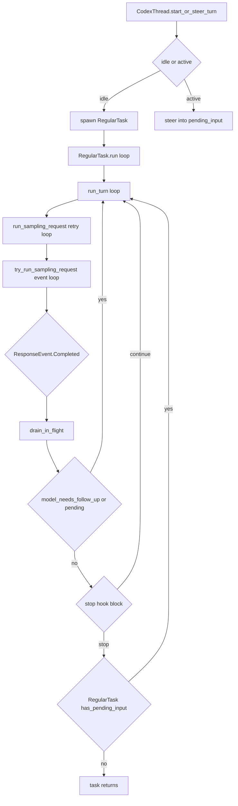
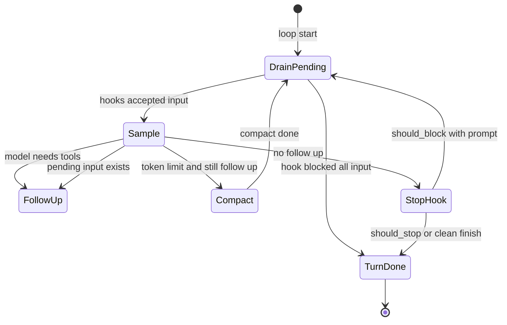
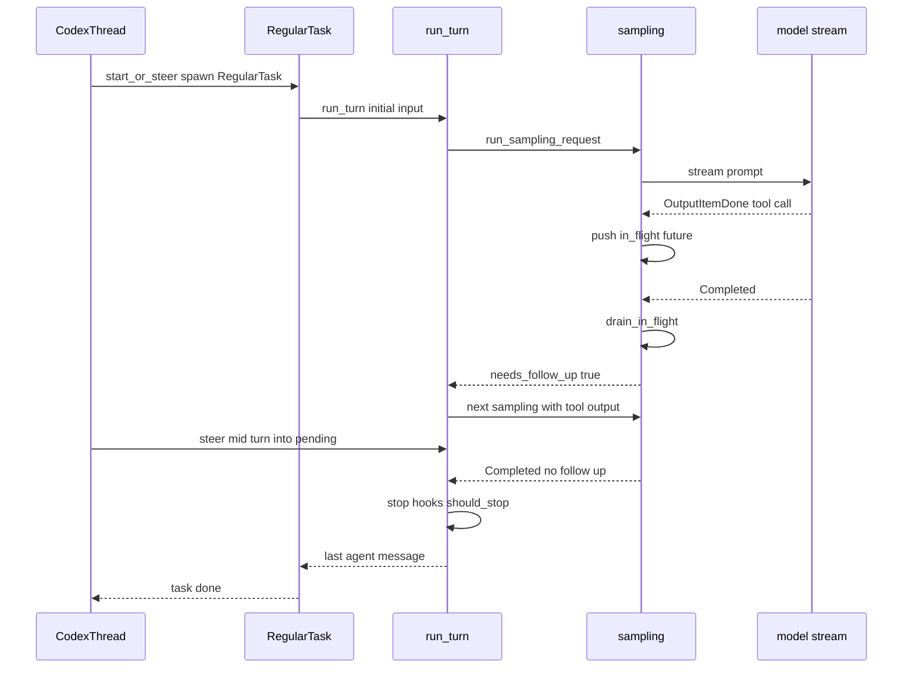

# 第 2 章：三层 Turn Loop，任务壳、轮次、采样

> 源码核对基于 openai/codex commit `4f39251a01`（2026-08-22），tag `course-anchor-20260822`
> 对照 DSH 课页：`dsh-3.html`
> 本章字数：约 13972 字（不含代码与图）

## 场景还原

你让 coding agent 改一个函数。屏幕上这是一轮对话：你说了一句，它忙了一阵，最后回「改完了」。

忙的时候其实叠了四件事：模型调了三次工具，你中途补了一句「测试用 pytest」，它写完助手消息后 Stop hook 说还没跑 linter，于是又采了一次样。

这四件事如果塞进同一个 `while`，就只能靠几个布尔抢出口。谁先检查、谁能打断谁，会变成口头约定。

Codex 拆成三层。任务壳 `RegularTask::run` 决定这一趟还要不要再开一轮。`run_turn` 决定工具续跑、插话和 hook 要不要继续。采样层只把一次模型流收到 `Completed`。少一层，就少一个干净插口：插话、续跑和流重试会搅在一起。

## 逐行精读

这张图回答：一句话从对外入口走到模型流，经过哪三层循环。



### 对外入口：先 steer，steer 不成再开工

`CodexThread::start_or_steer_turn` 自己不看会话空不空闲。注释写明：返回值只表示 Core 接没接住这条输入，不等 hooks，也不等采样。调用方不必先问「现在有没有活动轮」，把请求扔进来即可。

它甚至不自己投递。真正出门的是下面这个私有函数：Steer 模式跳过开工容量检查，其余模式先问 `ensure_execution_capacity_for_turn_start`，然后把请求和模式一起交给 `io.submit_turn_input`。会话锁、活动轮、任务表都不在这一层打开。

```333:344:codex-rs/core/src/codex_thread.rs
    /// Submits turn input without requiring the caller to inspect thread state.
    ///
    /// The result describes whether Core started a turn, steered an active
    /// turn, or declined it without recording or enqueueing the input. Only
    /// user input is accepted.
    pub async fn start_or_steer_turn(
        &self,
        request: TurnInputRequest,
    ) -> CodexResult<TurnInputSubmission> {
        self.submit_turn_input_with_mode(request, TurnInputMode::StartOrSteer)
            .await
    }
```

```466:479:codex-rs/core/src/codex_thread.rs
    async fn submit_turn_input_with_mode(
        &self,
        request: TurnInputRequest,
        mode: TurnInputMode,
    ) -> CodexResult<TurnInputSubmission> {
        if !matches!(mode, TurnInputMode::Steer { .. }) {
            self.session
                .services
                .agent_control
                .ensure_execution_capacity_for_turn_start(self)
                .await?;
        }
        self.io.submit_turn_input(request, mode).await
    }
```

薄包装放在 `CodexThread`，是因为这一层面向 CLI 和 app-server。它们手里只有线程句柄，不该去读 `active_turn`。三种模式共用同一条提交口，调用方换模式，不必换一套会话内部 API。

模式是三个值。`StartOrSteer` 是「空闲就开、忙着就插」。另外两个把决定权留给调用方。

```127:136:codex-rs/protocol/src/turn_input.rs
/// How Core should route submitted turn input.
#[derive(Clone, Debug, Eq, PartialEq)]
pub enum TurnInputMode {
    /// Start a regular turn when idle, otherwise steer the active regular turn.
    StartOrSteer,
    /// Start only when the thread is idle.
    StartIfIdle,
    /// Steer only if this exact turn is active.
    Steer { expected_turn_id: String },
}
```

分流为什么下沉，模块头写明了：这里是 Core 唯一决定「开工、插入、还是拒收」的地方。它答完就返回，不等 user-prompt hook，不改内存里的模型上下文，不写 rollout，也不开采样。持久设置在 Started 和 Steered 上都生效，开工专用选项只在 Started 上用。

```1:9:codex-rs/core/src/session/turn_input.rs
//! Handles reply-bearing turn-input operations.
//!
//! This is the one place Core decides whether submitted input starts a turn,
//! steers an active turn, or is rejected. It replies after that decision; it
//! does not wait for user-prompt hooks, updating the in-memory model context,
//! rollout persistence, or sampling.
//!
//! Persistent thread settings apply on Started and Steered. Turn start
//! options only apply on Started.
```

把分流放在 session 侧，是因为只有这里同时看得见 `steer_input` 的失败原因、`ActiveTurn` 和 `spawn_task`。`CodexThread` 若自己判断空闲，判断和真正开工之间会裂开一条缝：中间可能被别的任务抢先。`handle` 按模式分到 `start_or_steer`、`start_if_idle`、`steer` 三个函数，空闲判定只发生一次，和开工在同一把会话锁的视野里。

真正的分流在 `start_or_steer`。它先调用 `session.steer_input`。成功就返回 `Steered`。只有 `NoActiveTurn` 才拼好 `task_input`，再 `spawn_task(..., RegularTask::new())`。

```167:250:codex-rs/core/src/session/turn_input.rs
async fn start_or_steer(
    session: &Arc<Session>,
    request: TurnInputRequest,
    submission_id: String,
) -> CodexResult<TurnInputSubmission> {
    let TurnInputRequest {
        input,
        thread_settings,
        start,
        additional_context,
        responsesapi_client_metadata,
        ..
    } = request;
    let SubmittedTurnInput::UserInput {
        content: mut items,
        client_id,
    } = input
    else {
        return Err(CodexErr::InvalidRequest(
            "only user input can steer a turn".to_string(),
        ));
    };
    let can_start_root_turn = start.parent_turn_id.is_none() && start.root_turn_id.is_none();
    let incoming_root_turn_id = start
        .parent_turn_id
        .as_ref()
        .map(|_| start.root_turn_id.clone());
    let settings = PreparedTurnInputSettings::prepare(session, thread_settings, start).await?;
    match session
        .steer_input(
            &mut items,
            additional_context.clone(),
            /*expected_turn_id*/ None,
            settings.required_active_final_output_json_schema(),
            client_id.clone(),
            responsesapi_client_metadata.clone(),
            incoming_root_turn_id,
        )
        .await
    {
        Ok(turn_id) => {
            settings.apply_steered(session, submission_id).await?;
            Ok(TurnInputSubmission::Steered { turn_id })
        }
        Err(NotSubmittedReason::NoActiveTurn) => {
            let turn_context = settings
                .apply_started(session, submission_id.clone())
                .await?;
            if can_start_root_turn
                && !items.is_empty()
                && turn_context
                    .turn_metadata_state
                    .can_start_root_turn(&turn_context.session_source)
            {
                turn_context
                    .turn_metadata_state
                    .set_root_turn_id(submission_id.clone());
            }
            if let Some(responsesapi_client_metadata) = responsesapi_client_metadata {
                turn_context
                    .turn_metadata_state
                    .set_responsesapi_client_metadata(responsesapi_client_metadata);
            }
            session
                .maybe_emit_model_warnings_for_turn(turn_context.as_ref())
                .await;
            turn_context.session_telemetry.user_prompt(&items);
            let mut task_input = merge_additional_context_input(session, additional_context).await;
            if !items.is_empty() {
                task_input.push(TurnInput::UserInput {
                    content: items,
                    client_id,
                });
            }
            session
                .spawn_task(turn_context, task_input, RegularTask::new())
                .await;
            Ok(TurnInputSubmission::Started {
                turn_id: submission_id,
            })
        }
        Err(reason) => Ok(TurnInputSubmission::NotSubmitted { reason }),
    }
}
```

输入是 `TurnInputRequest`。输出是 `TurnInputSubmission`：`Started`、`Steered`、`NotSubmitted`。协议注释写明，前两个都不等于采样已经开始。对外入口只判断：这句话是插进正在跑的任务，还是新开一个 `RegularTask`。三层循环从任务壳才开始转。

### 任务壳：一种任务，一个小 trait

会话里能跑的工作不只有普通对话。压缩和审查是平级的任务类型。

```67:72:codex-rs/core/src/state/turn.rs
#[derive(Clone, Copy, Debug, Eq, PartialEq)]
pub(crate) enum TaskKind {
    Regular,
    Review,
    Compact,
}
```

三种任务共用 `SessionTask`。模块注释写明这个 trait 故意很小：报自己的 `kind`，在 `run` 里干活，取消时可以覆写 `abort`。

```179:211:codex-rs/core/src/tasks/mod.rs
/// Async task that drives a [`Session`] turn.
///
/// Implementations encapsulate a specific Codex workflow (regular chat,
/// reviews, ghost snapshots, etc.). Each task instance is owned by a
/// [`Session`] and executed on a background Tokio task. The trait is
/// intentionally small: implementers identify themselves via
/// [`SessionTask::kind`], perform their work in [`SessionTask::run`], and may
/// release resources in [`SessionTask::abort`].
pub(crate) trait SessionTask: Send + Sync + 'static {
    /// Describes the type of work the task performs so the session can
    /// surface it in telemetry and UI.
    fn kind(&self) -> TaskKind;

    /// Returns the tracing name for a spawned task span.
    fn span_name(&self) -> &'static str;

    /// Executes the task until completion or cancellation.
    ///
    /// Implementations typically stream protocol events using `session` and
    /// `ctx`, returning an optional final agent message when finished. The
    /// provided `cancellation_token` is cancelled when the session requests an
    /// abort; implementers should watch for it and terminate quickly once it
    /// fires. Returning [`Some`] yields a final message that
    /// [`Session::on_task_finished`] will emit to the client. Returning
    /// [`CodexErr::TurnAborted`] completes the task through the aborted-turn
    /// lifecycle instead.
    fn run(
        self: Arc<Self>,
        session: Arc<Session>,
        ctx: Arc<TurnContext>,
        input: Vec<TurnInput>,
        cancellation_token: CancellationToken,
    ) -> impl std::future::Future<Output = SessionTaskResult> + Send;
```

`CompactTask` 和 `ReviewTask` 各走自己的 `run`，不进 `run_turn` 那条采样环。普通对话才是 `RegularTask`。

接下来这段要证明什么：任务壳只做三件事。发一次 `TurnStarted`，吃掉启动预热，然后只要队列里还有待处理输入，就再调一次 `run_turn`。

```30:92:codex-rs/core/src/tasks/regular.rs
impl SessionTask for RegularTask {
    fn kind(&self) -> TaskKind {
        TaskKind::Regular
    }

    fn span_name(&self) -> &'static str {
        "session_task.turn"
    }

    async fn run(
        self: Arc<Self>,
        sess: Arc<Session>,
        ctx: Arc<TurnContext>,
        input: Vec<TurnInput>,
        cancellation_token: CancellationToken,
    ) -> SessionTaskResult {
        let run_turn_span = trace_span!("run_turn");
        // Regular turns emit `TurnStarted` inline so first-turn lifecycle does
        // not wait on startup prewarm resolution.
        let prewarmed_client_session = async {
            let event = EventMsg::TurnStarted(TurnStartedEvent {
                turn_id: ctx.sub_id.clone(),
                trace_id: ctx.trace_id.clone(),
                started_at: ctx.turn_timing_state.started_at_unix_secs().await,
                model_context_window: ctx.model_context_window(),
                collaboration_mode_kind: ctx.mode,
            });
            sess.send_event(ctx.as_ref(), event).await;
            sess.set_server_reasoning_included(/*included*/ false).await;
            sess.consume_startup_prewarm_for_regular_turn(&cancellation_token)
                .await
        }
        .instrument(trace_span!("regular_task.prepare_run_turn"))
        .await;
        let prewarmed_client_session = match prewarmed_client_session {
            SessionStartupPrewarmResolution::Cancelled => {
                run_hooks_and_record_inputs(&sess, &ctx, &input, PersistContext::Standard).await;
                return Ok(None);
            }
            SessionStartupPrewarmResolution::Unavailable { .. } => None,
            SessionStartupPrewarmResolution::Ready(prewarmed_client_session) => {
                Some(*prewarmed_client_session)
            }
        };
        let mut next_input = input;
        let mut prewarmed_client_session = prewarmed_client_session;
        loop {
            let last_agent_message = run_turn(
                Arc::clone(&sess),
                Arc::clone(&ctx),
                next_input,
                prewarmed_client_session.take(),
                cancellation_token.child_token(),
            )
            .instrument(run_turn_span.clone())
            .await?;
            if !sess.input_queue.has_pending_input(&sess.active_turn).await {
                return Ok(last_agent_message);
            }
            next_input = Vec::new();
        }
    }
}
```

输入是初始用户消息加可选预热会话。输出是最后一条助手消息。第二次进 `run_turn` 时 `next_input` 为空，新消息从 `input_queue` 取。`TurnStarted` 只发一次，`turn_id` 取自 `ctx.sub_id`，多次 `run_turn` 共用它。

事件本身很小。前端和回放都靠这一条边界把后续事件收成一簇。

```2035:2049:codex-rs/protocol/src/protocol.rs
pub struct TurnStartedEvent {
    pub turn_id: String,
    // Persist for rollout consumers that correlate turns with telemetry traces.
    #[serde(default, skip_serializing_if = "Option::is_none")]
    #[ts(optional)]
    pub trace_id: Option<String>,
    /// Unix timestamp (in seconds) when the turn started.
    #[serde(default, skip_serializing_if = "Option::is_none")]
    #[ts(type = "number | null", optional)]
    pub started_at: Option<i64>,
    // TODO(aibrahim): make this not optional
    pub model_context_window: Option<i64>,
    #[serde(default)]
    pub collaboration_mode_kind: ModeKind,
}
```

对前端意味着：TUI 用 `user_turn_pending_start` 表示「用户已经提交，Core 的 `TurnStarted` 还没到」。第二次 `run_turn` 不再发事件，输入框不会再闪一次「新的一轮开始了」，工具续跑和 stop hook 续跑都挂在同一条时间轴上。`UserShellCommandTask` 的注释把这件事写成禁令：已经有活动轮时，辅助命令不许再发一对 `TurnStarted` / `TurnComplete`。

对回放意味着：rollout 用 `TurnStarted` 当规范边界。按 `turn_id` 截断时，必须在原始条目里找到这条事件，合成出来的旧 ID 不能当 fork 点。同一任务里的多次采样、多次 `run_turn`，回放时仍是同一个 turn 桶。

```158:163:codex-rs/core/src/thread_rollout_truncation.rs
/// Return a rollout prefix ending after the requested persisted terminal turn.
///
/// The turn must still be present in the effective post-rollback history and
/// must have an explicit persisted TurnStarted boundary. Synthetic IDs
/// generated while projecting legacy rollouts are intentionally unsupported
/// because they do not provide a stable raw rollout boundary for a fork.
```

源码中没有单独的设计文档，以下为从实现反推，标注为推断：任务壳要保住的是「这一趟还活着」，好让 hook 收工后再补的一句话不必重发 `TurnStarted`。空闲时信箱叫醒走 `maybe_start_turn_for_pending_work_with_sub_id`（`tasks/mod.rs` 第 463 行）。终止条件：`has_pending_input` 为假就返回。那一次会换一个新的 `sub_id`，界面上才是下一轮。

### 轮次层：一次回复，两种下场

`run_turn` 的文件头注释把合同写成两段。模型每次采样原则上回两类东西：函数调用，或助手消息。一次采样里可以带回多条，实务上通常一条。有函数调用就执行，结果送进下一次采样。只有助手消息，这一轮可以收工。

```139:159:codex-rs/core/src/session/turn.rs
/// Takes initial turn input and runs a loop where, at each sampling request,
/// the model replies with either:
///
/// - requested function calls
/// - an assistant message
///
/// While it is possible for the model to return multiple of these items in a
/// single sampling request, in practice, we generally one item per sampling request:
///
/// - If the model requests a function call, we execute it and send the output
///   back to the model in the next sampling request.
/// - If the model sends only an assistant message, we record it in the
///   conversation history and consider the turn complete.
///
pub(crate) async fn run_turn(
    sess: Arc<Session>,
    turn_context: Arc<TurnContext>,
    input: Vec<TurnInput>,
    prewarmed_client_session: Option<ModelClientSession>,
    cancellation_token: CancellationToken,
) -> CodexResult<Option<String>> {
```

进主循环之前先做采样前压缩、拍 `StepContext`、注入 skills、写入初始输入。任一步失败可能 `return Ok(None)`，任务壳再看队列。主循环注释写明：pending 默认在下次建模前排进历史，开轮和自动压缩后两处要推迟。

```287:323:codex-rs/core/src/session/turn.rs
    // Although from the perspective of codex.rs, TurnDiffTracker has the lifecycle of a Task which contains
    // many turns, from the perspective of the user, it is a single turn.
    let turn_diff_tracker = Arc::new(tokio::sync::Mutex::new(
        TurnDiffTracker::with_environment_display_roots(display_roots),
    ));

    // `ModelClientSession` is turn-scoped and caches WebSocket + sticky routing state, so we reuse
    // one instance across retries within this turn.
    // Pending input is drained into history before building the next model request.
    // However, we defer that drain until after sampling in two cases:
    // 1. At the start of a turn, so the fresh turn input in `input` gets sampled first.
    // 2. After auto-compact, when model/tool continuation needs to resume before any steer.

    let mut next_step_context = Some(first_step_context);
    loop {
        // Note that pending_input would be something like a message the user
        // submitted through the UI while the model was running. Though the UI
        // may support this, the model might not.
        let pending_input = if can_drain_pending_input {
            sess.input_queue
                .get_pending_input(&sess.active_turn)
                .await
                .0
        } else {
            Vec::new()
        };

        if run_hooks_and_record_inputs(
            &sess,
            &turn_context,
            &pending_input,
            PersistContext::Standard,
        )
        .await
        {
            break;
        }
```

`can_drain_pending_input` 初值是 `input.is_empty()`：开轮时先采 `input` 里的主题，采样成功后再改成 `true`。pending 先过 `run_hooks_and_record_inputs`（`turn.rs` 第 615 行），hook 要停且没有被接受的用户消息，就 `break`。然后组 prompt，调用 `run_sampling_request`。回来后轮次层把两件事合成一个布尔。

```394:420:codex-rs/core/src/session/turn.rs
        match sampling_request_result {
            Ok((sampling_request_output, sampling_request_input)) => {
                let SamplingRequestResult {
                    needs_follow_up: model_needs_follow_up,
                    last_agent_message: sampling_request_last_agent_message,
                } = sampling_request_output;
                if model_needs_follow_up {
                    sess.input_queue
                        .accept_mailbox_delivery_for_current_turn(
                            &sess.active_turn,
                            &turn_context.sub_id,
                        )
                        .await;
                }
                can_drain_pending_input = true;
                // Process async hooks only after sampling and its tools have finished.
                drain_async_hook_results(&sess, &turn_context, /*before_user_prompt*/ false).await;
                let (has_pending_input, token_status) = async {
                    let has_pending_input =
                        sess.input_queue.has_pending_input(&sess.active_turn).await;
                    let token_status = super::context_window::context_window_token_status(
                        sess.as_ref(),
                        turn_context.as_ref(),
                    )
                    .await;
                    (has_pending_input, token_status)
                }
```

`needs_follow_up` 在这一层被重算：`model_needs_follow_up || has_pending_input`。信箱若已切到 `NextTurn`，`has_pending_input` 故意返回假，邮件留给下一趟。判定先看 turn 上的 pending 和投递阶段，阶段不是 `CurrentTurn` 就直接假。

```342:363:codex-rs/core/src/session/input_queue.rs
    pub(crate) async fn has_pending_input(&self, active_turn: &Mutex<Option<ActiveTurn>>) -> bool {
        let (has_turn_pending_input, accepts_mailbox_delivery) = {
            let active = active_turn.lock().await;
            match active.as_ref() {
                Some(active_turn) => {
                    let turn_state = active_turn.turn_state.lock().await;
                    (
                        !turn_state.pending_input.items.is_empty(),
                        turn_state.accepts_mailbox_delivery_for_current_turn(),
                    )
                }
                None => (false, true),
            }
        };
        if !accepts_mailbox_delivery {
            return false;
        }
        if has_turn_pending_input {
            return true;
        }
        self.has_pending_mailbox_items().await
    }
```

阶段机本身写在 `TurnState` 旁边。开轮默认 `CurrentTurn`。模型写出用户可见的最终答案后切到 `NextTurn`。同一任务又接到 steer 或工具续跑，再开回 `CurrentTurn`。

```37:56:codex-rs/core/src/state/turn.rs
/// Whether mailbox deliveries should still be folded into the current turn.
///
/// State machine:
/// - A turn starts in `CurrentTurn`, so queued child mail can join the next
///   model request for that turn.
/// - After user-visible terminal output is recorded, we switch to `NextTurn`
///   to leave late child mail queued instead of extending an already shown
///   answer.
/// - If the same task later gets explicit same-turn work again (a steered user
///   prompt or a tool call after an untagged preamble), we reopen `CurrentTurn`
///   so that pending child mail is drained into that follow-up request.
#[derive(Clone, Copy, Debug, Default, Eq, PartialEq)]
pub(crate) enum MailboxDeliveryPhase {
    /// Incoming mailbox messages can still be consumed by the current turn.
    #[default]
    CurrentTurn,
    /// The current turn already emitted visible final answer text; mailbox
    /// messages should remain queued for a later turn.
    NextTurn,
}
```

切到 `NextTurn` 的动作在 `defer_mailbox_delivery_to_next_turn`（`input_queue.rs` 第 206 行）。pending 里已有用户 steer 或带 `trigger_turn` 的邮件，它不切。调用点在 `record_completed_response_item_with_finalized_facts`（`stream_events_utils.rs` 第 99 行）：条目是用户可见的收尾，就推迟信箱。

轮次层在 `!needs_follow_up` 时才跑 stop hook。hook 要续跑，这一层自己 `continue`，任务壳和采样层都还没退。

```500:550:codex-rs/core/src/session/turn.rs
                if !needs_follow_up {
                    last_agent_message = sampling_request_last_agent_message;
                    let stop_outcome = run_turn_stop_hooks(
                        &sess,
                        &step_context,
                        stop_hook_active,
                        last_agent_message.clone(),
                    )
                    .await;
                    if stop_outcome.should_block {
                        if let Some(hook_prompt_message) =
                            build_hook_prompt_message(&stop_outcome.continuation_fragments)
                        {
                            sess.record_response_item_and_emit_turn_item(
                                &turn_context,
                                hook_prompt_message,
                            )
                            .await;
                            sess.input_queue
                                .accept_mailbox_delivery_for_current_turn(
                                    &sess.active_turn,
                                    &turn_context.sub_id,
                                )
                                .await;
                            stop_hook_active = true;
                            continue;
                        } else {
                            sess.send_event(
                                &turn_context,
                                EventMsg::Warning(WarningEvent {
                                    message: "Stop hook requested continuation without a prompt; ignoring the block.".to_string(),
                                }),
                            )
                            .await;
                        }
                    }
                    if stop_outcome.should_stop {
                        break;
                    }
                    if run_legacy_after_agent_hook(
                        &sess,
                        &turn_context,
                        &sampling_request_input,
                        last_agent_message.clone(),
                    )
                    .await
                    {
                        return Ok(None);
                    }
                    break;
                }
```

`should_block` 带 prompt，就写成一条 hook 消息，重新打开 `CurrentTurn`，继续 `run_turn` 循环。`should_block` 却没有 prompt，发一条警告，假装没拦。`should_stop` 只退出 `run_turn`，控制权回到 `RegularTask`。任务壳再问一次 `has_pending_input`。

两处都读同一个函数，语义不同。轮次层在采样刚刚结束时问，问的是「这一轮还要不要再采一次」。任务壳在 `run_turn` 已经 `break` 之后问，问的是「这一趟任务还要不要再进一次 `run_turn`」。前者把插话和工具结果留在同一个 `turn_id` 里。后者是界面已经可以收工、队列里又来了必须处理的输入。

去掉轮次层那一问：模型写出最终答案后，`run_turn` 会去跑 stop hook 并 `break`，中途那句「测试用 pytest」只能等任务壳再进一次 `run_turn`。功能上还能补上，只是多一次函数返回，stop hook 会在插话进模型之前先跑一轮。

去掉任务壳那一问：`run_turn` 因 `should_stop` 返回后，任务直接结束。队列里后到的用户消息要么消失，要么等会话变空闲，由 `maybe_start_turn_for_pending_work` 换一个 `turn_id` 新开任务。`TurnStarted` 会再闪一次，回放里变成两个 turn 桶。

这张状态图回答：`run_turn` 在什么条件下继续，什么条件下把控制权交回任务壳。



### 采样层：流收到 Completed，再 drain 工具

采样层自己还有两圈。外圈 `run_sampling_request` 处理可重试错误。内圈 `try_run_sampling_request` 消费一条 SSE 流。

返回值很小：要不要续跑，以及最后一条助手消息。

```1573:1577:codex-rs/core/src/session/turn.rs
#[derive(Debug)]
struct SamplingRequestResult {
    needs_follow_up: bool,
    last_agent_message: Option<String>,
}
```

`run_sampling_request` 每次重试都重新 `build_prompt`。成功就带着这次的 `output` 和原始 `input` 返回。上下文超限、用量见顶直接上抛。其余错误看 `is_retryable()`，可重试才进 `handle_retryable_response_stream_error`。

```1383:1440:codex-rs/core/src/session/turn.rs
        let prompt = build_prompt(
            prompt_input,
            step_context.as_ref(),
            base_instructions.clone(),
        );
        let err = match try_run_sampling_request(
            tool_runtime.clone(),
            Arc::clone(&sess),
            Arc::clone(&step_context),
            Arc::clone(&turn_store),
            client_session,
            responses_metadata,
            Arc::clone(&turn_diff_tracker),
            &prompt,
            cancellation_token.child_token(),
        )
        .await
        {
            Ok(output) => {
                return Ok((output, original_input.unwrap_or(prompt.input)));
            }
            Err(err) => match err.details() {
                CodexErrorDetails::ContextWindowExceeded => {
                    sess.set_total_tokens_full(&turn_context).await;
                    return Err(err);
                }
                CodexErrorDetails::UsageLimitReached(e) => {
                    let rate_limits = e.rate_limits.clone();
                    if let Some(rate_limits) = rate_limits {
                        sess.update_rate_limits(&turn_context, *rate_limits).await;
                    }
                    return Err(err);
                }
                _ => err,
            },
        };

        if original_input.is_none() {
            original_input = Some(prompt.input);
        }

        if !err.is_retryable() {
            return Err(err);
        }

        handle_retryable_response_stream_error(
            &mut retry_state,
            max_retries,
            err,
            client_session,
            &sess,
            &turn_context,
            ResponsesStreamRequest::Sampling,
        )
        .await?;
        turn_context.turn_timing_state.record_sampling_retry();
    }
}
```

组 prompt 时 `build_prompt` 把 `parallel_tool_calls` 写成 `true`。模型被允许一次点多个工具。执行侧是否真并行，是工具运行时的事，采样层不管。

`try_run_sampling_request` 先 `stream()`，再 `or_cancel`。取消在取下一条事件时变成 `CodexErr::TurnAborted`。流在 `Completed` 之前关掉，报 `stream closed before response.completed`。

```2266:2286:codex-rs/core/src/session/turn.rs
        let event = match stream
            .next()
            .instrument(trace_span!(parent: &handle_responses, "receiving"))
            .or_cancel(&cancellation_token)
            .await
        {
            Ok(event) => event,
            Err(codex_async_utils::CancelErr::Cancelled) => {
                break Err(CodexErr::TurnAborted);
            }
        };

        let event = match event {
            Some(Ok(event)) => event,
            Some(Err(err)) => break Err(err),
            None => {
                break Err(CodexErr::Stream(
                    "stream closed before response.completed".into(),
                ));
            }
        };
```

`ResponseEvent` 把流上的事穷举成一组变体。采样层的 `match event` 必须覆盖全部，这和 `AGENTS.md` 要求 match 尽量穷尽是同一条纪律。终止采样的主出口是 `Completed`。

```76:123:codex-rs/codex-api/src/common.rs
pub enum ResponseEvent {
    Created,
    SafetyBuffering(SafetyBuffering),
    OutputItemDone(ResponseItem),
    OutputItemAdded(ResponseItem),
    /// Emitted when the server includes `OpenAI-Model` on the stream response.
    /// This can differ from the requested model when backend safety routing applies.
    ServerModel(String),
    /// Emitted when the server recommends additional account verification.
    ModelVerifications(Vec<ModelVerification>),
    /// Emitted when the server includes moderation metadata for first-party turn presentation.
    TurnModerationMetadata(TurnModerationMetadataEvent),
    /// Emitted when `X-Reasoning-Included: true` is present on the response,
    /// meaning the server already accounted for past reasoning tokens and the
    /// client should not re-estimate them.
    ServerReasoningIncluded(bool),
    Completed {
        response_id: String,
        token_usage: Option<TokenUsage>,
        /// Did the model affirmatively end its turn? Some providers do not set this,
        /// so we rely on fallback logic when this is `None`.
        end_turn: Option<bool>,
    },
    OutputTextDelta(String),
    ToolCallInputDelta {
        item_id: String,
        call_id: Option<String>,
        delta: String,
    },
    ReasoningSummaryDelta {
        delta: String,
        summary_index: i64,
    },
    ReasoningSummaryDone {
        item_id: String,
        text: String,
        summary_index: i64,
    },
    ReasoningContentDelta {
        delta: String,
        content_index: i64,
    },
    ReasoningSummaryPartAdded {
        summary_index: i64,
    },
    RateLimits(RateLimitSnapshot),
    ModelsEtag(String),
}
```

`Completed` 到来时，采样层先刷完助手文本，再记 token，再看 `end_turn`。服务端明确说还没结束（`Some(false)`），就把 `needs_follow_up` 置真。然后带着当前累加值离开事件循环。

```2539:2584:codex-rs/core/src/session/turn.rs
            ResponseEvent::Completed {
                response_id,
                token_usage,
                end_turn,
            } => {
                sess.services
                    .analytics_events_client
                    .track_code_mode_tool_call(
                        codex_analytics::CodeModeToolCallFact::SamplingResponseCompleted {
                            thread_id: sess.thread_id.to_string(),
                            turn_id: turn_context.sub_id.clone(),
                            response_id: response_id.clone(),
                            tool_call_ids: std::mem::take(&mut analytics_tool_call_ids),
                        },
                    );
                flush_assistant_text_segments_all(
                    &sess,
                    &turn_context,
                    plan_mode_state.as_mut(),
                    &mut assistant_message_stream_parsers,
                )
                .await;
                sess.send_event(
                    &turn_context,
                    EventMsg::RawResponseCompleted(RawResponseCompletedEvent {
                        response_id,
                        token_usage: token_usage.clone(),
                    }),
                )
                .await;
                let budget_result = sess
                    .record_token_usage_info(&turn_context, token_usage.as_ref())
                    .await;
                should_emit_token_count = true;
                should_emit_turn_diff = true;
                if let Err(err) = budget_result {
                    break Err(err);
                }
                if let Some(false) = end_turn {
                    needs_follow_up = true;
                }
                break Ok(SamplingRequestResult {
                    needs_follow_up,
                    last_agent_message,
                });
            }
```

工具调用不在 `Completed` 才开始。`OutputItemDone` 当时就会 `handle_output_item_done`。命中工具时，结果结构里的 `needs_follow_up` 被置真，future 推进 `FuturesOrdered`。

```196:201:codex-rs/core/src/stream_events_utils.rs
#[derive(Default)]
pub(crate) struct OutputItemResult {
    pub last_agent_message: Option<String>,
    pub needs_follow_up: bool,
    pub tool_future: Option<InFlightFuture<'static>>,
}
```

```316:327:codex-rs/core/src/stream_events_utils.rs
            record_completed_response_item(ctx.sess.as_ref(), ctx.turn_context.as_ref(), &item)
                .await;

            let cancellation_token = ctx.cancellation_token.child_token();
            let tool_future: InFlightFuture<'static> = Box::pin(
                ctx.tool_runtime
                    .clone()
                    .handle_tool_call(call, cancellation_token),
            );

            output.needs_follow_up = true;
            output.tool_future = Some(tool_future);
```

事件循环结束之后，采样层还要 `drain_in_flight`。工具结果按完成顺序写入历史。某个 future 失败只记日志。取消检查放在 drain 之后，已经记过的 token 仍会发出。

```2130:2154:codex-rs/core/src/session/turn.rs
async fn drain_in_flight(
    in_flight: &mut FuturesOrdered<BoxFuture<'static, CodexResult<ResponseInputItem>>>,
    sess: Arc<Session>,
    turn_context: Arc<TurnContext>,
) -> CodexResult<()> {
    while let Some(res) = in_flight.next().await {
        match res {
            Ok(response_input) => {
                let response_item = response_input.into();
                sess.record_conversation_items(&turn_context, std::slice::from_ref(&response_item))
                    .await;
                mark_thread_memory_mode_polluted_if_external_context(
                    sess.as_ref(),
                    turn_context.as_ref(),
                    &response_item,
                )
                .await;
            }
            Err(err) => {
                error_or_panic(format!("in-flight tool future failed during drain: {err}"));
            }
        }
    }
    Ok(())
}
```

```2749:2762:codex-rs/core/src/session/turn.rs
    drain_in_flight(&mut in_flight, sess.clone(), turn_context.clone()).await?;
    drop(tool_blocking_timing_guard);

    if should_emit_token_count {
        // A tool call such as request_user_input can intentionally pause the turn. Emit token
        // counts only after pending tools resolve so clients do not see progress events while the
        // turn is waiting on the user. This also needs to happen before returning cancellation so
        // token usage already recorded from the completed response is still persisted.
        sess.send_token_count_event(&turn_context).await;
    }

    if cancellation_token.is_cancelled() {
        return Err(CodexErr::TurnAborted);
    }
```

早期资料常把采样层的出口写成「收到 `Completed`」。当前源码里，这一层至少有五种离开方式。它们都发生在 `run_turn` 还没重算 pending、也还没跑 stop hook 之前。

第一种，重试。`run_sampling_request` 自己是个 `loop`。上下文超限和用量见顶直接 `return Err`。其余错误问 `is_retryable()`。可重试才进 `handle_retryable_response_stream_error`，然后 `record_sampling_retry`，重新 `build_prompt`。控制权没离开采样层。`run_turn` 看见的仍是同一次调用。

第二种，取消。事件循环用 `or_cancel` 取下一条。token 一响，立刻 `break Err(CodexErr::TurnAborted)`。流已经 `Completed`、正在 `drain_in_flight` 时再取消，走另一条：工具结果仍写入历史，token 事件照发，然后函数末尾再查 `cancellation_token.is_cancelled()`，回报同一个 `TurnAborted`。取消检查故意放在 drain 之后，避免界面以为这一轮没发生过。

第三种，流中断。`stream.next()` 得到 `None`，还没见到 `Completed`，报 `stream closed before response.completed`。这是 `Err`，不是带着半成品 `SamplingRequestResult` 回去。`run_turn` 按采样失败处理，不会把半截助手消息当成收工。

第四种，`end_turn: Some(false)`。`Completed` 已经到了，事件循环会离开。服务端明确说模型还没结束这一轮，采样层把 `needs_follow_up` 置真再返回。`None` 表示提供方没设这个字段，走后面的兜底：看有没有工具、pending、助手消息。`Some(true)` 不会在这里清掉已经累加的 `needs_follow_up`。工具调用在 `OutputItemDone` 时就把这个布尔点亮了。

第五种，mailbox 预抢。流里出现 commentary 或 reasoning，并且信箱非空，采样层会提前带着 `needs_follow_up: true` 离开，不等 `Completed`。源码留了一句 `todo: remove before stabilizing multi-agent v2`。这是例外路径，主合同仍是先 `Completed` 再 drain。

```2361:2366:codex-rs/core/src/session/turn.rs
                let preempt_for_mailbox_mail = match &item {
                    ResponseItem::Message { role, phase, .. } => {
                        role == "assistant" && matches!(phase, Some(MessagePhase::Commentary))
                    }
                    ResponseItem::Reasoning { .. } => true,
                    ResponseItem::AgentMessage { .. } => false,
```

这张时序图回答：用户一句话、一次工具、一次插话，控制权在哪一层。



三层各自的出口如下。

1. 任务壳：`run_turn` 返回后 `has_pending_input` 为假，结束；为真，空输入再进 `run_turn`。
2. 轮次层：`needs_follow_up` 为真就继续采样；为假再问 stop hook。`should_block` 带 prompt 就续跑，`should_stop` 或干净收工才 `break`。
3. 采样层：重试留在本层；取消和流中断走 `Err`；`Completed` 后看 `end_turn`；mailbox 预抢提前离开。drain 完工具才把结果交回 `run_turn`。

## 设计决策分析

`AGENTS.md` 不管循环怎么切，管的是模块体积和 match 纪律。`turn.rs` 用 `wc -l` 计得 2791 行，已经超过「大约 800 行就该拆」的红线。评审条款原文如下。

```49:57:AGENTS.md
- Avoid large modules:
  - Prefer adding new modules instead of growing existing ones.
  - Target Rust modules under 500 LoC, excluding tests.
  - If a file exceeds roughly 800 LoC, add new functionality in a new module instead of extending
    the existing file unless there is a strong documented reason not to.
  - This rule applies especially to high-touch files that already attract unrelated changes, such
    as `codex-rs/tui/src/app.rs`, `codex-rs/tui/src/bottom_pane/chat_composer.rs`,
    `codex-rs/tui/src/bottom_pane/footer.rs`, `codex-rs/tui/src/chatwidget.rs`,
    `codex-rs/tui/src/bottom_pane/mod.rs`, and similarly central orchestration modules.
```

同一份文件里，`SessionTask` 的注释要求 trait 保持很小。任务种类可以增加，循环骨架不许跟着膨胀。只有 `Regular` 进入三层环。

`AGENTS.md` 第 21 行要求 match 尽量穷尽。`try_run_sampling_request` 对 `ResponseEvent` 的 17 个变体逐个处理。

源码中没有单独的循环设计文档。以下从实现反推，标为推断。

三层按「谁有资格决定继续」切开。采样层只看见这一次流，能重试，不能收整轮。轮次层看见工具、pending、预算和 hook，能续采样，不能重发 `TurnStarted`。任务壳看见任务还在、队列里是否还有活。

不这样做的后果可以从分支里读出来。采样层若直接看 pending，流没结束就插入用户消息，prompt 缓存和 in-flight 工具会对不齐。`run_turn` 若在 hook 续跑时拆任务，`TurnStarted` 会再闪一次，回放也会多出一个 turn 桶。没有任务壳，hook 刚结束后到达的那句话会掉进 `maybe_start_turn_for_pending_work`，换成新的 `turn_id`。

分流下沉也是同一类保护。`CodexThread` 若自己读 `active_turn` 再决定开工，读和 `spawn_task` 之间可能被另一条提交抢先。`turn_input.rs` 把「看空闲」和「开工」放在同一处，薄包装只负责容量检查和投递。

推迟 drain 的两条例外是同一类保护：开轮先采 `input`，压缩后先让模型续上。`MailboxDeliveryPhase` 用阶段代替第二条语义队列。代价是 `has_pending_input` 在 `NextTurn` 下会撒谎。

## 边界条件剖析

### 1. `run_turn` 中途用户又发一条消息，哪一层接住

分四个时刻。

时刻 A：空闲。`steer_input` 返回 `NoActiveTurn`，消息作为 `run_turn` 的 `input` 进去，循环开头不排队列。

时刻 B：任务已在跑。`start_or_steer` 走 `Steered`，消息进 `pending_input`。当前采样看不见它。`Completed` 且 drain 之后，`run_turn` 重算 `has_pending_input`，为真就续跑。

时刻 C：最终答案已写出，阶段切到 `NextTurn`。用户 steer 仍在 turn 的 pending 里。子 agent 旁路邮件被当成下一轮的货，`has_pending_input` 返回假，由 `maybe_start_turn_for_pending_work` 新开任务。

时刻 D：流里出现 commentary 或 reasoning 且信箱非空。采样层会提前带着 `needs_follow_up: true` 离开。源码留了一句 `todo: remove before stabilizing multi-agent v2`。这是例外，不是主路径。

```2397:2404:codex-rs/core/src/session/turn.rs
                needs_follow_up |= output_result.needs_follow_up;
                // todo: remove before stabilizing multi-agent v2
                if preempt_for_mailbox_mail && sess.input_queue.has_pending_mailbox_items().await {
                    break Ok(SamplingRequestResult {
                        needs_follow_up: true,
                        last_agent_message,
                    });
                }
```

结论：用户插话由对外入口写入队列，由轮次层在下一次循环开头取走。任务壳只处理「`run_turn` 已经返回、队列里还有货」。采样层默认不接插话。

### 2. stop hook 返回 block，是三层一起退还是只退一层

只退零层，或只退轮次层。不会三层一起退。

`run_turn_stop_hooks` 在 `!needs_follow_up` 之后才跑。它按会话来源选 Stop 或 SubagentStop。内部子 agent 直接返回默认 `StopOutcome`，等于没有 hook。

```66:74:codex-rs/hooks/src/events/stop.rs
#[derive(Debug, Default)]
pub struct StopOutcome {
    pub hook_events: Vec<HookCompletedEvent>,
    pub should_stop: bool,
    pub stop_reason: Option<String>,
    pub should_block: bool,
    pub block_reason: Option<String>,
    pub continuation_fragments: Vec<HookPromptFragment>,
}
```

聚合规则写在 `aggregate_results`：任一 handler 要 stop，整次就是 stop。`should_block` 只有在没人要 stop 时才为真。stop 优先于 block。

```367:373:codex-rs/hooks/src/events/stop.rs
fn aggregate_results<'a>(
    results: impl IntoIterator<Item = &'a StopHandlerData>,
) -> StopHandlerData {
    let results = results.into_iter().collect::<Vec<_>>();
    let should_stop = results.iter().any(|result| result.should_stop);
    let stop_reason = results.iter().find_map(|result| result.stop_reason.clone());
    let should_block = !should_stop && results.iter().any(|result| result.should_block);
```

回到 `run_turn` 的三个出口：

1. `should_block` 且拼出了 continuation prompt：写入历史，打开 `CurrentTurn`，`continue`。采样层早已返回。任务壳还在等这次 `run_turn`。控制权留在轮次层。
2. `should_block` 但没有 prompt：警告 `ignoring the block`，再看 `should_stop`。
3. `should_stop`：`break` 离开 `run_turn`。`RegularTask` 随后检查 `has_pending_input`。队列空，任务结束；队列不空，空输入再进 `run_turn`。

所以 block 是轮次层内部续跑。stop 是轮次层把控制权交回任务壳。采样层两种情况都不重新进入。

### 3. 采样收到 Completed 之后，工具 future 还没跑完怎么办

事件循环在 `Completed` 处 `break`，函数还没返回。`drain_in_flight` 按顺序等完工具。token 事件和取消检查都在 drain 之后：流已结束，工具结果仍要落历史，然后才回报 `TurnAborted`。模块注释把顺序写成合同：先 persist 再 drain。工具失败走 `error_or_panic`，不把整次采样打成 `Err`。

### 4. `RegularTask` 和 `run_turn` 都看 pending，会不会转两圈

会，职责不同。同一句用户话最多只该被一处取走。

`run_turn` 在采样后看 pending，是为了同一轮里把工具结果或插话再送给模型。只要 `has_pending_input` 为真，它自己 `continue`，任务壳那一圈还没轮到。`RegularTask` 在 `run_turn` 返回后再看，是为了界面已收工、队列里又来了必须处理的输入。第二次调用时 `next_input` 为空，`can_drain_pending_input` 初值为真，循环开头就会把队列排进历史。

`NextTurn` 下 `has_pending_input` 为假。两处判断此时都会放手。信箱里剩下的 `trigger_turn` 邮件由 `maybe_start_turn_for_pending_work` 换一个 `turn_id` 新开任务，再发一次 `TurnStarted`。用户 steer 仍在 turn 的 pending 里，阶段机不会为了旁路邮件把已经上屏的答案再拉长。

源码中没有单独说明「为什么要问两次」。以下为从实现反推，标注为推断：两次判断夹住 stop hook。hook 续跑时控制权留在轮次层，任务壳看不见。hook 放行后任务壳才有机会接手「收工瞬间又来的那一句」。只留一处，就会把 hook 和后到消息挤进同一个出口。

## 横向对比

同一问题：一轮对话要拆几层，层与层之间用什么交接。三边给了三种切法。

### Codex：按生命周期切成任务、轮次、采样

代价是读者要同时记住三个 `loop`、两个 `needs_follow_up`（采样累加值，轮次重算值）以及 `MailboxDeliveryPhase`。换来三个独立插口：插话等轮次下一圈，流重试关在采样层，stop hook 续跑不必重发 `TurnStarted`。

### DSH：按语义切成 Turn、Step、Inbox

对照页是 `dsh-3.html`。实现落在 `packages/core/agent-loop/src/agent.ts` 和 `packages/core/agent/src/inbox.ts`。文件头把这个 driver 写成「queued turns and step-boundary input」，循环从 session log 派生每一次请求。

DSH 的外圈是 `kick`：`while (await this.turn()) {}`。`turn()` 返回真，表示 inbox 里还有活，同一条 driver 继续开下一轮。返回假，driver 退回 idle。这和 `RegularTask` 的 `loop { run_turn; if !has_pending_input { return } }` 是同一类骨架。

```210:212:packages/core/agent-loop/src/agent.ts
  private async kick(): Promise<void> {
    try {
      while (await this.turn()) {}
```

`turn()` 自己再套一层 `while (true)`。每一圈先 `preStep`，再 `this.step(...)`。终止条件写在两行：`turnEnds` 有值，并且 `inbox.nextStep` 空了，才 `break`。工具若往 next-step 塞了后续，这一轮还继续。`turn()` 末尾再问 `inbox.hasPending`，有货就重置 step 计数、换新的 AbortController，返回真给 `kick`。

```246:330:packages/core/agent-loop/src/agent.ts
  private async turn(): Promise<boolean> {
    if (this.phase.kind !== 'running') {
      this.throwError(new Error(`agent "${this.id}": turn without driver reservation`))
    }
    const phase = this.phase
    const { signal } = phase.abort
    signal.throwIfAborted()
    const turn = phase.turn + 1
    try {
      this.session.append('turn/start', { turn })
    } catch (error: unknown) {
      this.throwError(error)
    }
    phase.turn = turn
    let turnEnds: TurnEndReason | null = null
    let target: InboxTarget = 'next-turn'
    try {
      while (true) {
        signal.throwIfAborted()
        const step = phase.step + 1
        const decision = await this.preStep(target, { turn, step })
        if (decision.kind === 'reject') {
          turnEnds = { kind: 'blocked' }
          return false
        }
        if (turnEnds && decision.messages.length === 0) break
        // A removed waking message or an enter decision rewritten to empty
        // still owns the initial turn boundary, but it spends no model call.
        if (phase.step === 0 && decision.messages.length === 0) {
          turnEnds = { kind: 'completed' }
          return false
        }
        signal.throwIfAborted()
        this.session.append('step/start', { turn, step })
        phase.step = step
        try {
          for (const message of decision.messages) {
            this.session.append('user/message', message, { surfaceOp: 'append' })
          }
          // max-tokens is sticky: once any step hits the ceiling, later steps
          // that complete normally must not downgrade the turn outcome.
          const stepEnd = await this.step(decision.assembly)
          // max-tokens stays sticky: a later completed step must not
          // downgrade the turn outcome.
          if (turnEnds === null || turnEnds.kind !== 'max-tokens') turnEnds = stepEnd
        } finally {
          this.session.append('step/end', { turn, step })
        }
        signal.throwIfAborted()
        if (turnEnds && this.inbox.nextStep.length === 0) {
          await this.dispatch.serial('agent/turn-stopping', { turn, signal })
          signal.throwIfAborted()
        }
        if (turnEnds && this.inbox.nextStep.length === 0) break
        target = 'next-step'
      }
    } catch (error: unknown) {
      if (signal.aborted) {
        turnEnds = { kind: 'aborted', reason: signal.reason as AgentCancelCause }
        throw error
      }
      // Every failure is structured: an `LlmError` keeps its facts, anything
      // else flattens to `errorChain` text under the `UNKNOWN` code.
      turnEnds = {
        kind: 'error',
        error: error instanceof LlmError
          ? error.failure
          : { message: errorChain(error), code: 'UNKNOWN' },
      }
      this.throwError(error)
    } finally {
      try {
        // oxlint-disable-next-line typescript/no-non-null-assertion -- every exit assigns a turn ending
        this.session.append('turn/end', { turn, reason: turnEnds! })
      } catch (error: unknown) {
        this.throwError(error)
      }
    }
    if (!this.inbox.hasPending) return false
    phase.abort = new AbortController()
    // A fresh controller makes a latch set on the old one stale: the live driver claims the queue itself.
    phase.wakeRequested = false
    phase.step = 0
    return true
  }
```

`step()` 才是一次模型请求。内层 `while (true)` 只为请求出错后重试。流用 `for await` 收完，没有 Codex 那种按 `ResponseEvent` 穷举的事件循环。没有工具就 `completed`。有工具就执行，工具带 `concludesTurn` 也当 `completed`，否则返回 `null`，让外层 `turn()` 再开下一步。

```332:401:packages/core/agent-loop/src/agent.ts
  private async step(assembly: PromptAssembly): Promise<StepEndReason | null> {
    /* v8 ignore next -- private callers establish the running phase before executing a step */
    if (this.phase.kind !== 'running') throw new Error(`agent "${this.id}": step outside running phase`)
    const { turn, step, abort: { signal } } = this.phase
    signal.throwIfAborted()
    const system = renderPrompt(assembly)

    while (true) {
      const { request, preparedCall } = await this.buildRequest(
        turn, step, assembly.tools, system, this.session.deriveMessages(), signal,
      )
      const assembler = new BlockAssembler()
      const chunkSeqs: number[] = []
      const stream = preparedCall?.stream(request) ?? this.loopCtx.llm.stream(request)
      signal.throwIfAborted()
      for await (const chunk of stream) {
        signal.throwIfAborted()
        chunkSeqs.push(this.session.append('assistant/chunk', { turn, step, chunk }).seq)
        assembler.push(chunk)
      }
      signal.throwIfAborted()
      const finish = assembler.finish
      if (finish.kind === 'error' || finish.kind === 'aborted') {
        const action = await this.dispatch.waterfall(
          'agent/request-error', {
            turn,
            step,
            provider: request.provider,
            failure: finish.failure,
            retryPolicy: preparedCall?.retryPolicy,
            signal,
          },
          () => Promise.resolve<RequestErrorAction>(undefined),
        )
        signal.throwIfAborted()
        if (action?.kind !== 'retry') {
          throw new LlmError(finish.failure.message, finish.failure.code, finish.failure)
        }
        continue
      }

      const message = createAssistantMessage({
        content: assembler.blocks(),
        source: {
          provider: request.provider,
          model: request.model,
          ...assembler.replayState !== undefined ? { replayState: assembler.replayState } : {},
        },
      })
      this.session.append(
        'assistant/message',
        {
          turn,
          step,
          message,
          ...assembler.usage === undefined ? {} : { usage: assembler.usage },
        },
        { surfaceOp: 'append', sourceEventSeqs: chunkSeqs },
      )
      if (finish.kind === 'max-tokens') return { kind: 'max-tokens' }

      const toolCalls = message.content.filter(block => block.type === 'tool-call')
      if (toolCalls.length === 0) return { kind: 'completed' }
      const { concluded } = await executeToolCalls(
        this.loopCtx, turn, step, toolCalls, signal,
        context => this.inbox.splice('next-step', this.inbox.nextStep.length, 0, [context]),
      )
      return concluded ? { kind: 'completed' } : null
    }
  }
```

第三层不是第三条 `while`。Inbox 是两条数组：`next-turn` 和 `next-step`。三个 API 是同一套 `send()` 的参数预设。

```113:132:packages/core/agent-loop/src/agent.ts
  send(message: UserMessage, target: InboxTarget, wakeup: boolean): void {
    // Waking input cannot join an aborted activity, so it starts the next turn.
    // Captured before the insertion so a reentrant cancel from a splice observer cannot reclassify it.
    const wakingAfterAbort = wakeup && this.phase.kind !== 'idle' && this.phase.abort.signal.aborted
    const resolvedTarget = wakingAfterAbort ? 'next-turn' : target
    this.inbox.splice(resolvedTarget, Infinity, 0, [message])
    if (wakeup) this.wakeDriver(wakingAfterAbort)
  }

  followup(input: UserMessage): void {
    this.send(input, 'next-turn', true)
  }

  steer(input: UserMessage): void {
    this.send(input, 'next-step', true)
  }

  inject(input: UserMessage): void {
    this.send(input, 'next-step', false)
  }
```

取消息用 `claim`。每个 step 开头先取走 next-step 的全部，轮次边界再多取一条 next-turn。被拒批次不回队。中断后还想叫醒司机，入队前会被改投 next-turn。

```71:78:packages/core/agent/src/inbox.ts
  claim(target: InboxTarget, turn: number): UserMessage[] {
    const claimed = this.mutate('next-step', 0, this.nextStep.length, [], false)
    if (target === 'next-turn') {
      claimed.push(...this.mutate('next-turn', 0, 1, [], false))
    }
    for (const message of claimed) this.notifications.claimed(message, turn)
    return claimed
  }
```

所以两边都叫三层，切分维度不同。DSH 按语义：Turn 是一轮完整工作，Step 是一次模型请求加工具，Inbox 是说话时机。Codex 按生命周期：任务壳问「这一趟还活着吗」，轮次问「这一轮还要再采吗」，采样问「这一条流结束了吗」。

DSH 因此能做到的：调用方在入队时选 followup、steer 还是 inject；两条队列可从 session 事件重放；工具后续靠往 next-step splice，不必另开一层采样循环。它没有单独做成一层的，是流事件的穷举合同：重试、取消、drain 工具都挤在 `step()` 里。

Codex 因此能做到的：调用方只丢 `start_or_steer`，不必在入队时选队列；流重试、取消、`end_turn`、mailbox 预抢各有出口；`TurnStarted` 只闪一次，回放按一个 `turn_id` 截。它没有的，是 Inbox 那种可重放的双队列。pending 和 mailbox 用阶段机共用一条「现在能不能取」的判断，`NextTurn` 下会故意撒谎。

### Claude Code：单层 `while (true)` 加状态袋

还原源码里，主循环在 `query.ts`。可变状态放进一个 `state` 对象，循环体顶部解构，`continue` 处写回整袋状态。

```265:307:restored-src/src/query.ts
  // Mutable cross-iteration state. The loop body destructures this at the top
  // of each iteration so reads stay bare-name (`messages`, `toolUseContext`).
  // Continue sites write `state = { ... }` instead of 9 separate assignments.
  let state: State = {
    messages: params.messages,
    toolUseContext: params.toolUseContext,
    maxOutputTokensOverride: params.maxOutputTokensOverride,
    autoCompactTracking: undefined,
    stopHookActive: undefined,
    maxOutputTokensRecoveryCount: 0,
    hasAttemptedReactiveCompact: false,
    turnCount: 1,
    pendingToolUseSummary: undefined,
    transition: undefined,
  }
  // ... 预算跟踪、QueryConfig、memory prefetch，与循环分层无关 ...
  // eslint-disable-next-line no-constant-condition
  while (true) {
```

`needsFollowUp` 是循环体内的局部布尔。助手消息里只要出现 `tool_use` 块，就置真。

```826:835:restored-src/src/query.ts
            if (message.type === 'assistant') {
              assistantMessages.push(message)

              const msgToolUseBlocks = message.message.content.filter(
                content => content.type === 'tool_use',
              ) as ToolUseBlock[]
              if (msgToolUseBlocks.length > 0) {
                toolUseBlocks.push(...msgToolUseBlocks)
                needsFollowUp = true
              }
```

没有 follow-up 时，同一层接着做 413 恢复、stop hook、进入下一 turn。`turnCount` 加一，`transition` 写成 `next_turn`，`state = next`，回到 `while (true)` 顶部。

```1062:1063:restored-src/src/query.ts
    if (!needsFollowUp) {
      const lastMessage = assistantMessages.at(-1)
```

```1722:1729:restored-src/src/query.ts
      pendingToolUseSummary: nextPendingToolUseSummary,
      maxOutputTokensOverride: undefined,
      stopHookActive,
      transition: { reason: 'next_turn' },
    }
    state = next
  } // while (true)
}
```

Claude Code 把续跑、压缩、stop hook 收成同一袋状态。`needsFollowUp` 只由工具块点亮，用户插话走旁边的 `messageQueueManager`。代价是所有出口挤在一个 `while` 里。改一处 `continue`，要同时核对 `stopHookActive`、`turnCount` 和 `transition`。Codex 把这三件事分给三层，DSH 把插话分给 Inbox，两边都不必在同一个布尔上抢门。

三边各自能省掉对方的东西。DSH 用 Inbox 做成数据，省掉第三条生命周期循环，Turn 和 Step 两层 `while` 已经够用。Claude Code 用 `state = next` 省掉任务壳，`turnCount++` 和 `transition: next_turn` 写在同一个 `while` 的尾部。Codex 用 `start_or_steer` 加阶段机，调用方不必在入队时选 followup 还是 steer，换来的是三个独立终止条件。学费分别是三个入队 API、一袋可变状态、三层循环加一套阶段机。

## 互动演示设计

演示要让读者明白：同一段对话在三层上同时走时间轴，控制权每次只在一层。

舞台比喻：三条平行泳道。任务壳是值班班长，轮次是当班司机，采样是检票口。右侧「合并成一层」开关打开后，三条泳道收成一条 `while`，插话和压缩卡在同一个出口。

形态是模拟器，叫三层循环剖面图。

舞台元素：

1. 三条泳道，时间从左向右。色块表示控制权所在层，另外两层灰掉。
2. 预设剧本：用户提问、模型调三个工具、模型回答、用户中途插话、stop hook 要求续跑、最终收工。
3. 右侧逻辑轨迹面板，一行一句白话，标源码行号。
4. 「合并成一层」开关。打开后，插话必须等当前 `while` 迭代结束，压缩和 stop hook 跟采样重试抢同一个 continue。
5. 单步、播放、重置。

分步：

1. 用户提问落入空闲会话。任务壳发出 `TurnStarted`，调用第一次 `run_turn`。字幕：班长接了第一班，turn_id 钉死。
2. 控制权下到采样。三条工具的 `OutputItemDone` 挂上 future，`Completed` 后 drain。字幕：检票口只负责这一列车。
3. 回到轮次。`model_needs_follow_up` 为真，继续采样，不发第二次 `TurnStarted`。字幕：司机自己续开。
4. 读者点「中途插话」。卡片落在 pending，当前采样不中断。字幕：插话先坐候车凳。
5. 最终答案出来，stop hook 带 prompt 拦收工，轮次 `continue`。字幕：司机再开一站。
6. hook 放行，任务壳见队列空，下班。打开「合并成一层」后重放 4、5 步。字幕：合成一层之后，候车凳和红灯抢同一扇门。

读者能操作：单步、播放、重置、「中途插话」、「stop hook 拦一次」、「合并成一层」。

逻辑轨迹面板伪代码：

```text
对外入口 start_or_steer                              L338  codex_thread.rs
  空闲则 spawn RegularTask                            L242  turn_input.rs
  忙碌则 Steered 写入 pending                         L207  turn_input.rs
任务壳发 TurnStarted 后进入 loop                      L76   regular.rs
  调用 run_turn                                       L77   regular.rs
  返回后问 has_pending_input                          L86   regular.rs
轮次循环开头按开关排 pending                          L305  turn.rs
  采样 run_sampling_request                           L381  turn.rs
  重算 needs_follow_up                                L423  turn.rs
  无续跑则跑 stop hook                                L502  turn.rs
  should_block 带 prompt 则 continue                  L525  turn.rs
采样事件循环收到 Completed 才离开                     L2539 turn.rs
  drain_in_flight 后才返回                            L2749 turn.rs
```

动画步进时高亮当前行。合并开关打开后，轨迹收成「while true：采样、看标志、continue」。

## 可迁移结论

值得抄的是三层各自的终止条件，写成三个函数。不要收成一个 `while` 加三个布尔。最小形态用 TypeScript 或 Python 就能落地。

```ts
type SamplingResult = { needsFollowUp: boolean; text?: string };

async function runSampling(prompt: unknown, signal: AbortSignal): Promise<SamplingResult> {
  const stream = await openModelStream(prompt, signal);
  let needsFollowUp = false;
  let text: string | undefined;
  for await (const event of stream) {
    if (event.type === "tool_call") needsFollowUp = true;
    if (event.type === "assistant") text = event.text;
    if (event.type === "completed") break;
  }
  await drainTools();
  return { needsFollowUp, text };
}

async function runTurn(input: string[], signal: AbortSignal): Promise<string | undefined> {
  let pending = [...input];
  while (!signal.aborted) {
    const sampled = await runSampling(buildPrompt(pending), signal);
    pending = takePending();
    if (sampled.needsFollowUp || pending.length > 0) continue;
    const stop = await runStopHooks(sampled.text);
    if (stop.block && stop.prompt) {
      pending = [stop.prompt];
      continue;
    }
    if (stop.stop) return sampled.text;
    return sampled.text;
  }
}

async function runTask(input: string[], signal: AbortSignal): Promise<string | undefined> {
  let next = input;
  while (!signal.aborted) {
    const last = await runTurn(next, signal);
    if (!hasPending()) return last;
    next = [];
  }
}
```

三个函数的返回值就是终止条件。插话只进 `takePending()`。stop hook 只进轮次循环。任务壳只在轮次返回后再看队列。对外入口也可以一起抄：先尝试插入当前轮，插不进去再开工。

不必抄 2791 行的 `turn.rs`、17 路 `ResponseEvent` 和多 agent 信箱预抢。内部 agent 先抄三个函数加一个 pending 数组。阶段机等你真有「答案已上屏、晚到旁路不许延长这一轮」再加。

和平台无关。三层循环不读 `cfg!(target_os)`。平台差异在工具执行和沙箱。

## 思考题

1. 在 `codex-rs/core/src/tasks/regular.rs` 第 86 行，把 `has_pending_input` 的判断改成恒为假，让任务壳在第一次 `run_turn` 返回后立刻结束。用本机 CLI 开一轮对话，等模型开始调工具时再发一句无害的后续（例如「顺便列出当前目录」）。观察：这句后续是消失、等到下一轮用户主动发送才出现，还是由 `maybe_start_turn_for_pending_work` 新开一个 `turn_id`。改完后请还原文件。

2. 打开 `codex-rs/core/src/session/turn.rs` 第 500 行附近。在 `run_turn_stop_hooks` 返回之后打断点，或临时 `eprintln!` 打出 `should_block`、`should_stop`、`continuation_fragments.len()`。写一个会在 Stop hook 里返回 block 且带 prompt 的本地 hook（按仓库 hooks 文档的最小配置）。跑一轮只回一句话、不调工具的对话。确认控制权留在 `run_turn` 循环，`RegularTask` 没有返回，界面上的 `turn_id` 没有变。

3. 用上一节的 TypeScript 草案写一个假模型：第一次采样返回工具调用，第二次返回纯文本。在第二次采样期间往 pending 数组里塞一句用户话。确认这句出现在第三次采样的 prompt 里，且 `runTask` 没有因此新建一层外部循环。这道题不需要 Codex 仓库。

---
## 交付自查

- 源码原文引用：39 处，其中完整定义 10 处（`TaskKind`、`RegularTask::run`、`TurnInputMode`、`MailboxDeliveryPhase`、`TurnStartedEvent`、`SamplingRequestResult`、`ResponseEvent`、`drain_in_flight`、`StopOutcome`、`OutputItemResult`）
- 精读的规范性材料：`AGENTS.md` 第 49 到 57 行；`codex-rs/core/src/session/turn_input.rs` 第 1 到 9 行；`codex-rs/core/src/tasks/mod.rs` 第 179 到 186 行；`codex-rs/core/src/session/turn.rs` 第 139 到 152 行
- 双侧对比：2 组。Codex 任务/轮次/采样对照 DSH `packages/core/agent-loop/src/agent.ts` 的 `kick`/`turn`/`step` 与 `packages/core/agent/src/inbox.ts` 的 `claim`；Codex 对照 Claude Code `restored-src/src/query.ts` 的单层 `while (true)`
- Mermaid 图：3 张（flowchart、sequenceDiagram、stateDiagram-v2 各 1 张）
- 边界条件追问：4 个
- 跨平台差异：与平台无关。三层循环不分支操作系统，平台差异在工具与沙箱
- 思考题：3 道，含动手题 3 道
- 文风禁忌逐项搜索：已确认无 `——`、无 `……`、无「不是…而是…」、引号均为「」
- 全部行号已用 Read 工具实读核实：是
