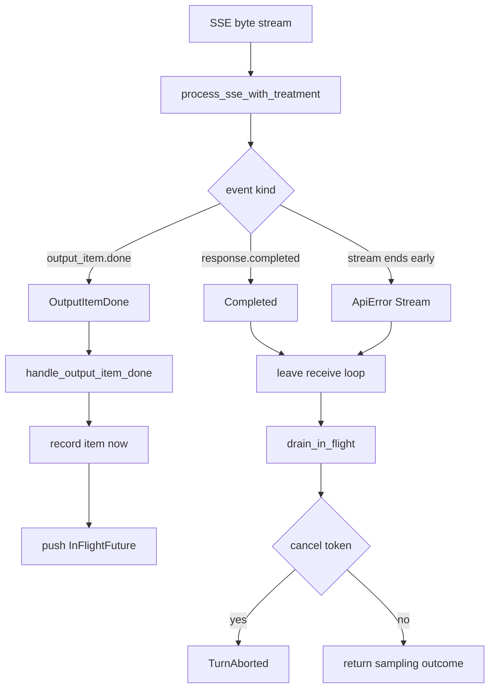
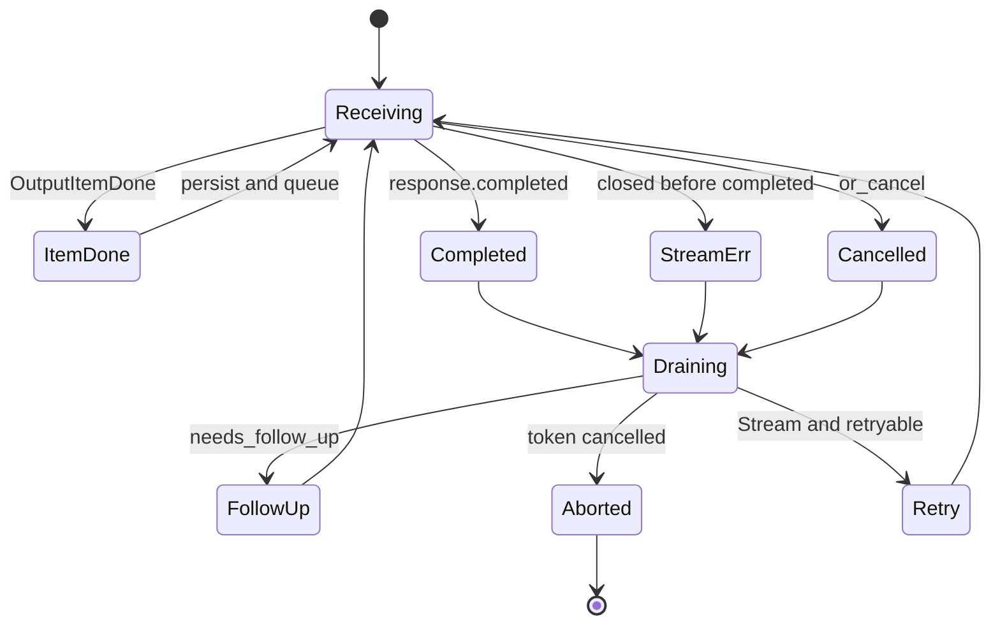

# 第 3 章：SSE 驱动的工具闭环，流内建 future，流后统一 drain

> 源码核对基于 openai/codex commit `4f39251a01`（2026-08-22），tag `course-anchor-20260822`
> 对照 DSH 课页：`dsh-12.html`
> 本章字数：约 6000 字（不含代码与图）

## 场景还原

你让 Codex 读三个文件再写一份摘要。屏幕上模型还在打字：「我先看 `src/main.rs`…」下一秒，终端里已经响起了第一次读文件的声音。模型那句话还没说完，工具已经开工了。

然后你按了 Esc。界面停了。历史里却留下了那次读文件的请求，有时还留下它的结果。你以为取消等于什么都没发生。运行时并不这么记账。

另一头更常见的翻车是断流。模型已经发出两个 `function_call`，第三个还在路上，SSE 在 `response.completed` 到来之前关掉。工具已经跑了一半。下一次重试该看见什么？空历史，还是已经落盘的调用和结果？

这两件事问的是同一个时序问题。模型还在流式输出的时候，工具能不能已经开始跑。跑到一半流断了，或者用户按了 Esc，已经挂起的工作归谁清理，历史里留下什么。

Codex 的答案写在采样循环里：每收到一条 `OutputItemDone`，先把这一条写进历史和 rollout，工具调用再包成 future 挂到 `FuturesOrdered` 上。流无论正常结束、提前关掉还是被取消，都先 `drain` 这些 future，再决定这一次采样是跟进、重试还是中止。

这是本章要带走的时序。流内建 future，流后统一 drain。先 persist，再等结果。

## 逐行精读

调用链从 SSE 字节流走到历史写入。中间隔着三层。第一层把 `response.output_item.done` 收成 `ResponseEvent`。第二层在采样循环里一到就处理，工具调用立刻挂起。第三层等流结束，按挂起顺序把工具结果写回历史。

这张图回答：一条工具调用从 SSE 事件到历史落盘，经过哪几道门。



### SSE 事件先收成 `ResponseEvent`

Responses API 的 SSE 帧先被反序列化成 `ResponsesStreamEvent`。`kind` 对应线上的 `type` 字段。工具调用完整落地时，`kind` 是 `response.output_item.done`，载荷在 `item` 里。

接下来这段要证明什么：解析层看见的是通用 JSON 字段，还没有业务含义。

```164:179:codex-rs/codex-api/src/sse/responses.rs
pub struct ResponsesStreamEvent {
    #[serde(rename = "type")]
    pub(crate) kind: String,
    pub(crate) headers: Option<Value>,
    metadata: Option<Value>,
    response: Option<Value>,
    item: Option<Value>,
    item_id: Option<String>,
    call_id: Option<String>,
    delta: Option<String>,
    text: Option<String>,
    summary_index: Option<i64>,
    content_index: Option<i64>,
    #[serde(default, deserialize_with = "deserialize_present_value")]
    safety_buffering: Option<Value>,
}
```

`process_responses_event` 按 `kind` 分发。`response.output_item.done` 能把 `item` 解成 `ResponseItem`，就产出 `ResponseEvent::OutputItemDone`。解失败只打 debug 日志，这一帧被丢掉，不会冒充成功。

```348:359:codex-rs/codex-api/src/sse/responses.rs
pub fn process_responses_event(
    event: ResponsesStreamEvent,
) -> std::result::Result<Option<ResponseEvent>, ResponsesEventError> {
    match event.kind.as_str() {
        "response.output_item.done" => {
            if let Some(item_val) = event.item {
                if let Ok(item) = serde_json::from_value::<ResponseItem>(item_val) {
                    return Ok(Some(ResponseEvent::OutputItemDone(item)));
                }
                debug!("failed to parse ResponseItem from output_item.done");
            }
        }
```

读循环在 `process_sse_with_treatment`。`timeout` 等下一帧，空流且还没见过 `response.completed`，就送出 `ApiError::Stream("stream closed before response.completed")`。采样循环稍后会把同一句文案收成 `CodexErr::Stream`。

```565:571:codex-rs/codex-api/src/sse/responses.rs
            Ok(None) => {
                let error = response_error.unwrap_or(ApiError::Stream(
                    "stream closed before response.completed".into(),
                ));
                let _ = tx_event.send(Err(error)).await;
                return;
            }
```

`ResponseEvent` 是采样循环要穷尽匹配的那份事件表。我按源文件逐个变体数过，一共 17 个。工具闭环只直接吃其中三个：`OutputItemDone` 开工，`Completed` 收流，其余 delta 只服务界面。`Created`、限速、推理摘要这些变体走旁边的分支，不往 `in_flight` 里塞东西。

```76:123:codex-rs/codex-api/src/common.rs
pub enum ResponseEvent {
    Created,
    SafetyBuffering(SafetyBuffering),
    OutputItemDone(ResponseItem),
    OutputItemAdded(ResponseItem),
    /// Emitted when the server includes `OpenAI-Model` on the stream response.
    /// This can differ from the requested model when backend safety routing applies.
    ServerModel(String),
    /// Emitted when the server recommends additional account verification.
    ModelVerifications(Vec<ModelVerification>),
    /// Emitted when the server includes moderation metadata for first-party turn presentation.
    TurnModerationMetadata(TurnModerationMetadataEvent),
    /// Emitted when `X-Reasoning-Included: true` is present on the response,
    /// meaning the server already accounted for past reasoning tokens and the
    /// client should not re-estimate them.
    ServerReasoningIncluded(bool),
    Completed {
        response_id: String,
        token_usage: Option<TokenUsage>,
        /// Did the model affirmatively end its turn? Some providers do not set this,
        /// so we rely on fallback logic when this is `None`.
        end_turn: Option<bool>,
    },
    OutputTextDelta(String),
    ToolCallInputDelta {
        item_id: String,
        call_id: Option<String>,
        delta: String,
    },
    ReasoningSummaryDelta {
        delta: String,
        summary_index: i64,
    },
    ReasoningSummaryDone {
        item_id: String,
        text: String,
        summary_index: i64,
    },
    ReasoningContentDelta {
        delta: String,
        content_index: i64,
    },
    ReasoningSummaryPartAdded {
        summary_index: i64,
    },
    RateLimits(RateLimitSnapshot),
    ModelsEtag(String),
}
```

`core` 侧只是再导出：`codex-rs/core/src/client_common.rs` 第一行是 `pub use codex_api::ResponseEvent;`。定义以 `codex-api` 这份为准。

### 采样循环：一边收流，一边挂 future

`try_run_sampling_request` 拉起模型流之后，本地建一个空的 `FuturesOrdered`，再设 `needs_follow_up = false`。后面所有「工具还要跑一轮」的信号，都往这个布尔上做或运算。

```2224:2226:codex-rs/core/src/session/turn.rs
    let mut in_flight: FuturesOrdered<BoxFuture<'static, CodexResult<ResponseInputItem>>> =
        FuturesOrdered::new();
    let mut needs_follow_up = false;
```

收流循环用 `stream.next().or_cancel(&cancellation_token)`。取消走 `CodexErr::TurnAborted`。流在 `response.completed` 之前结束，走 `CodexErr::Stream("stream closed before response.completed")`。这两种错误都只是离开 `loop`，还没有轮到清理 future。

`OutputItemDone` 到达后，先补 id、冲掉当前流式条目，再构造 `HandleOutputCtx`，把这一条交给 `handle_output_item_done`。返回值里若带着 `tool_future`，立刻 `push_back`。`needs_follow_up` 用 `|=` 累加，一条工具调用就能把整次采样标成「还要再问模型」。

```2391:2397:codex-rs/core/src/session/turn.rs
                if let Some(tool_future) = output_result.tool_future {
                    in_flight.push_back(tool_future);
                }
                if let Some(agent_message) = output_result.last_agent_message {
                    last_agent_message = Some(agent_message);
                }
                needs_follow_up |= output_result.needs_follow_up;
```

`FuturesOrdered` 保证的是完成顺序按插入顺序出队，跟工具实际谁先跑完无关。三个工具并发，历史里仍按模型发出的顺序写结果。并发闸门在 `ToolCallRuntime` 里，第 11 章会单独拆。本章只需要记住：挂起顺序就是日后 drain 的顺序。

`Completed` 会带可选的 `end_turn`。源码注释写明：有的供应商不设这个字段，客户端要靠别的信号判断。Codex 自己的信号就是前面累加的 `needs_follow_up`。`end_turn == Some(false)` 会再强制标一次。然后 `break Ok(...)`，离开收流循环。

```2539:2584:codex-rs/core/src/session/turn.rs
            ResponseEvent::Completed {
                response_id,
                token_usage,
                end_turn,
            } => {
                sess.services
                    .analytics_events_client
                    .track_code_mode_tool_call(
                        codex_analytics::CodeModeToolCallFact::SamplingResponseCompleted {
                            thread_id: sess.thread_id.to_string(),
                            turn_id: turn_context.sub_id.clone(),
                            response_id: response_id.clone(),
                            tool_call_ids: std::mem::take(&mut analytics_tool_call_ids),
                        },
                    );
                // ... 冲刷文本、发 RawResponseCompleted、记 token ...
                if let Some(false) = end_turn {
                    needs_follow_up = true;
                }
                break Ok(SamplingRequestResult {
                    needs_follow_up,
                    last_agent_message,
                });
            }
```

上面中间那几行用省略标记跳过了分析、冲刷和 token 记账。它们不改变「先 break、后 drain」这个顺序。

这张时序图回答：工具从哪一帧开始跑，结果又在哪一帧写回历史。

```mermaid
sequenceDiagram
    participant SSE as SSE parser
    participant Loop as sampling loop
    participant HO as handle_output_item_done
    participant Hist as history
    participant FO as FuturesOrdered

    SSE->>Loop: OutputItemDone function_call
    Loop->>HO: handle item
    HO->>Hist: persist function_call now
    HO-->>Loop: tool_future
    Loop->>FO: push_back
    Note over FO: tool already running
    SSE->>Loop: OutputItemDone second call
    Loop->>FO: push_back
    SSE->>Loop: Completed
    Loop->>FO: drain_in_flight
    FO->>Hist: persist tool results in insert order
```

### `handle_output_item_done`：先落盘，再挂起

类型别名上方的文档注释把合同写死了。这是注释。它说的是：完成的模型输出要立刻记下来，后面 turn 被取消，历史和 rollout 也保持同步。

```190:201:codex-rs/core/src/stream_events_utils.rs
/// Handle a completed output item from the model stream, recording it and
/// queuing any tool execution futures. This records items immediately so
/// history and rollout stay in sync even if the turn is later cancelled.
pub(crate) type InFlightFuture<'f> =
    Pin<Box<dyn Future<Output = Result<ResponseInputItem>> + Send + 'f>>;

#[derive(Default)]
pub(crate) struct OutputItemResult {
    pub last_agent_message: Option<String>,
    pub needs_follow_up: bool,
    pub tool_future: Option<InFlightFuture<'static>>,
}
```

`OutputItemResult` 是这一帧对采样循环的回执。普通助手文本只填 `last_agent_message`。工具调用填 `tool_future`，并把 `needs_follow_up` 置真。

接下来这段要证明什么：工具调用的落盘发生在 future 被 pin 起来之前。取消来得再快，这一条 `function_call` 已经进历史。

```289:328:codex-rs/core/src/stream_events_utils.rs
pub(crate) async fn handle_output_item_done(
    ctx: &mut HandleOutputCtx,
    item: ResponseItem,
    previously_active_item: Option<TurnItem>,
) -> Result<OutputItemResult> {
    let mut output = OutputItemResult::default();
    let plan_mode = ctx.turn_context.mode == ModeKind::Plan;

    match ToolRouter::build_tool_call(item.clone()) {
        // The model emitted a tool call; log it, persist the item immediately, and queue the tool execution.
        Ok(Some(call)) => {
            ctx.sess
                .input_queue
                .accept_mailbox_delivery_for_current_turn(
                    &ctx.sess.active_turn,
                    &ctx.turn_context.sub_id,
                )
                .await;

            let payload_preview = tool_log_payload(&call.payload, &call.direct_source());
            tracing::info!(
                thread_id = %ctx.sess.thread_id,
                "ToolCall: {} {}",
                call.tool_name,
                payload_preview
            );

            record_completed_response_item(ctx.sess.as_ref(), ctx.turn_context.as_ref(), &item)
                .await;

            let cancellation_token = ctx.cancellation_token.child_token();
            let tool_future: InFlightFuture<'static> = Box::pin(
                ctx.tool_runtime
                    .clone()
                    .handle_tool_call(call, cancellation_token),
            );

            output.needs_follow_up = true;
            output.tool_future = Some(tool_future);
        }
```

输入是一条已经完成的 `ResponseItem`。输出是回执。`build_tool_call` 认出来是工具，就先 `record_completed_response_item`，再 `Box::pin(handle_tool_call(...))`。取消令牌用的是 `child_token()`，父令牌一取消，这个工具跟着取消。

`Ok(None)` 是普通消息或推理。它会 finalize、发 turn item 事件，再走同一条 persist。这条路径不挂 future，也不置 `needs_follow_up`。

`Err(FunctionCallError::RespondToModel)` 是「这条工具请求当场就能回答，或者已经被拒」。请求本身仍先 persist，再把错误文本写成一条 `FunctionCallOutput` 追加进历史，然后置 `needs_follow_up = true`。模型下一轮能看见自己被拒的原因。`Fatal` 直接变成 `CodexErr::Fatal`，采样循环 `break Err`。

`session/tests.rs` 的 `tool_calls_reopen_mailbox_delivery_for_current_turn` 把回执钉死了：工具调用必须 `needs_follow_up == true`，并且带着 `tool_future`。

```10998:10999:codex-rs/core/src/session/tests.rs
    assert!(output.needs_follow_up);
    assert!(output.tool_future.is_some());
```

`build_tool_call` 是纯函数。`FunctionCall`、客户端执行的 `ToolSearchCall`、`CustomToolCall` 收成 `ToolCall`。其余变体返回 `Ok(None)`。`ToolSearchCall` 缺 `call_id` 或 `execution != "client"` 时也是 `Ok(None)`，不会误挂 future。

```148:200:codex-rs/core/src/tools/router.rs
    pub fn build_tool_call(item: ResponseItem) -> Result<Option<ToolCall>, FunctionCallError> {
        match item {
            ResponseItem::FunctionCall {
                name,
                namespace,
                arguments,
                encrypted_function_args,
                call_id,
                ..
            } => {
                let tool_name = ToolName::new(namespace, name).with_default_namespace();
                Ok(Some(ToolCall {
                    tool_name,
                    call_id,
                    payload: ToolPayload::Function { arguments },
                    encrypted_function_args,
                }))
            }
            ResponseItem::ToolSearchCall {
                call_id: Some(call_id),
                execution,
                arguments,
                ..
            } if execution == "client" => {
                let arguments: SearchToolCallParams =
                    serde_json::from_value(arguments).map_err(|err| {
                        FunctionCallError::RespondToModel(format!(
                            "failed to parse tool_search arguments: {err}"
                        ))
                    })?;
                Ok(Some(ToolCall {
                    tool_name: ToolName::plain("tool_search"),
                    call_id,
                    payload: ToolPayload::ToolSearch { arguments },
                    encrypted_function_args: None,
                }))
            }
            ResponseItem::ToolSearchCall { .. } => Ok(None),
            ResponseItem::CustomToolCall {
                name,
                namespace,
                input,
                call_id,
                ..
            } => Ok(Some(ToolCall {
                tool_name: ToolName::new(namespace, name).with_default_namespace(),
                call_id,
                payload: ToolPayload::Custom { input },
                encrypted_function_args: None,
            })),
            _ => Ok(None),
        }
    }
```

`ToolSearchCall` 的参数解析失败走 `RespondToModel`。这就是上面那条「当场回答」分支的来源：解析失败也要给模型一句可读的错，不能把采样打死。

`ToolCall` 本身只有四个字段。执行期认的是 `tool_name` 加 `payload`，历史对齐靠 `call_id`。

```31:37:codex-rs/core/src/tools/router.rs
#[derive(Clone, Debug, PartialEq)]
pub struct ToolCall {
    pub tool_name: ToolName,
    pub call_id: String,
    pub payload: ToolPayload,
    pub encrypted_function_args: Option<Vec<String>>,
}
```

落盘函数把这一条推进会话历史。`record_conversation_items` 会准备图片、包一层 envelope、写入内存历史，再 `persist_rollout_items`。JSONL rollout 和内存历史在这里同步。文档注释说的「history and rollout stay in sync」，对应的就是这两下连续写。

```77:89:codex-rs/core/src/stream_events_utils.rs
pub(crate) async fn record_completed_response_item(
    sess: &Session,
    turn_context: &TurnContext,
    item: &ResponseItem,
) {
    record_completed_response_item_with_finalized_facts(
        sess,
        turn_context,
        item,
        /*finalized_facts*/ None,
    )
    .await;
}
```

```3062:3076:codex-rs/core/src/session/mod.rs
    pub(crate) async fn record_conversation_items(
        &self,
        turn_context: &TurnContext,
        items: &[ResponseItem],
    ) {
        let (items, image_preparations) =
            self.prepare_conversation_items_for_history(turn_context, items);
        let items = items
            .into_owned()
            .into_iter()
            .map(ResponseItemEnvelope::new)
            .collect();
        self.record_prepared_conversation_items(turn_context, items, image_preparations)
            .await;
    }
```

### 工具失败先收成模型看得见的结果

`handle_tool_call` 是挂到 `in_flight` 上的那个 future。它把 `FunctionCallError` 分成两路。`Fatal` 变成 `CodexErr::Fatal`，会在 drain 时被看见。其余错误，包括 `RespondToModel`，收成一条失败的 `ResponseInputItem`，对 drain 来说仍是 `Ok`。

```73:89:codex-rs/core/src/tools/parallel.rs
    pub(crate) fn handle_tool_call(
        self,
        call: ToolCall,
        cancellation_token: CancellationToken,
    ) -> impl std::future::Future<Output = Result<ResponseInputItem, CodexErr>> {
        let error_call = call.clone();
        let source = call.direct_source();
        let future = self.handle_tool_call_with_source(call, source, cancellation_token);
        async move {
            match future.await {
                Ok(response) => Ok(response.into_response()),
                Err(FunctionCallError::Fatal(message)) => Err(CodexErr::Fatal(message)),
                Err(other) => Ok(Self::failure_response(error_call, other)),
            }
        }
        .in_current_span()
    }
```

`FunctionCallError` 只有两个变体。完整定义如下。工具执行期能对外说的话，就这两种。

```5:10:codex-rs/tools/src/function_call_error.rs
pub enum FunctionCallError {
    #[error("{0}")]
    RespondToModel(String),
    #[error("Fatal error: {0}")]
    Fatal(String),
}
```

`core` 用 `codex-rs/core/src/function_tool.rs` 再导出同一份类型。定义以 `codex-tools` 这份为准。

取消路径在 `handle_tool_call_with_source` 的 `select` 里。父令牌取消后，若工具还没跑到终态，就 abort 任务，造一条 `AbortedToolOutput`。`exec_command` 的文案是 `Wall time: {secs:.1} seconds\naborted by user`，其余工具是 `aborted by user after {secs:.1}s`。这条结果仍是 `Ok`，drain 会把它当普通工具输出写进历史。Esc 不会把已经发出的 `function_call` 从 transcript 里抹掉，它只会多写一条「被用户中止」的输出。

### 流结束后统一 drain，然后再看取消

收流循环无论 `Ok` 还是 `Err`，都会落到同一段收尾。先冲刷还在飞的助手文本，再 `drain_in_flight`。`in_flight` 非空时会记一笔 tool-blocking 耗时。drain 结束之后，才检查 `cancellation_token.is_cancelled()`。

```2744:2762:codex-rs/core/src/session/turn.rs
    let tool_blocking_timing_guard = if in_flight.is_empty() {
        None
    } else {
        Some(turn_context.turn_timing_state.begin_tool_blocking())
    };
    drain_in_flight(&mut in_flight, sess.clone(), turn_context.clone()).await?;
    drop(tool_blocking_timing_guard);

    if should_emit_token_count {
        // A tool call such as request_user_input can intentionally pause the turn. Emit token
        // counts only after pending tools resolve so clients do not see progress events while the
        // turn is waiting on the user. This also needs to happen before returning cancellation so
        // token usage already recorded from the completed response is still persisted.
        sess.send_token_count_event(&turn_context).await;
    }

    if cancellation_token.is_cancelled() {
        return Err(CodexErr::TurnAborted);
    }
```

注释原文把意图写清楚了：token 计数也要等工具结束再发，而且必须发生在返回取消之前，已经记下来的用量不能因为取消被扔掉。这是注释，和代码顺序一致。

`drain_in_flight` 自己是一个 `while let Some(res) = in_flight.next().await`。`Ok` 就把 `ResponseInputItem` 转成 `ResponseItem`，再 `record_conversation_items`。`Err` 走 `error_or_panic`，循环继续。函数最后固定返回 `Ok(())`。

```2130:2154:codex-rs/core/src/session/turn.rs
async fn drain_in_flight(
    in_flight: &mut FuturesOrdered<BoxFuture<'static, CodexResult<ResponseInputItem>>>,
    sess: Arc<Session>,
    turn_context: Arc<TurnContext>,
) -> CodexResult<()> {
    while let Some(res) = in_flight.next().await {
        match res {
            Ok(response_input) => {
                let response_item = response_input.into();
                sess.record_conversation_items(&turn_context, std::slice::from_ref(&response_item))
                    .await;
                mark_thread_memory_mode_polluted_if_external_context(
                    sess.as_ref(),
                    turn_context.as_ref(),
                    &response_item,
                )
                .await;
            }
            Err(err) => {
                error_or_panic(format!("in-flight tool future failed during drain: {err}"));
            }
        }
    }
    Ok(())
}
```

`error_or_panic` 在 debug 断言打开时 `panic!`，release 只打 `error!`。所以「第二个工具 Fatal，第一和第三个结果还写不写」这件事，debug 和 release 答案不一样。边界条件一节会落到这两条分支。

```93:99:codex-rs/core/src/util.rs
pub(crate) fn error_or_panic(message: impl std::string::ToString) {
    if cfg!(debug_assertions) {
        panic!("{}", message.to_string());
    } else {
        error!("{}", message.to_string());
    }
}
```

drain 之后，`needs_follow_up` 回到 `run_turn`。采样输出里的 `model_needs_follow_up` 为真，就会重新打开当前轮的信箱投递。最终 `needs_follow_up = model_needs_follow_up || has_pending_input`。为假才去跑 stop hook、结束这一轮。为真就继续下一轮采样，上一轮 drain 进去的工具结果会出现在下一轮 prompt 里。

```396:423:codex-rs/core/src/session/turn.rs
                let SamplingRequestResult {
                    needs_follow_up: model_needs_follow_up,
                    last_agent_message: sampling_request_last_agent_message,
                } = sampling_request_output;
                if model_needs_follow_up {
                    sess.input_queue
                        .accept_mailbox_delivery_for_current_turn(
                            &sess.active_turn,
                            &turn_context.sub_id,
                        )
                        .await;
                }
                can_drain_pending_input = true;
                // Process async hooks only after sampling and its tools have finished.
                drain_async_hook_results(&sess, &turn_context, /*before_user_prompt*/ false).await;
                let (has_pending_input, token_status) = async {
                    let has_pending_input =
                        sess.input_queue.has_pending_input(&sess.active_turn).await;
                    let token_status = super::context_window::context_window_token_status(
                        sess.as_ref(),
                        turn_context.as_ref(),
                    )
                    .await;
                    (has_pending_input, token_status)
                }
                .instrument(trace_span!("run_turn.collect_post_sampling_state"))
                .await;
                let needs_follow_up = model_needs_follow_up || has_pending_input;
```

注释写明：异步 hook 只在采样和它的工具都结束后处理。工具闭环和 hook 闭环是两段 drain，顺序固定。

### 断流之后，先 drain，再决定重不重试

`CodexErrorDetails::Stream` 的文档注释写明了语义：HTTP 握手已经成功，但 SSE 在 `response.completed` 之前断开。Session 循环把它当瞬时错误，会自动重试这一轮。这也是注释。

```88:93:codex-rs/protocol/src/error.rs
    /// Returned by ResponsesClient when the SSE stream disconnects or errors out **after** the HTTP
    /// handshake has succeeded but **before** it finished emitting `response.completed`.
    ///
    /// The Session loop treats this as a transient error and will automatically retry the turn.
    #[error("stream disconnected before completion: {0}")]
    Stream(String),
```

`is_retryable` 把 `Stream` 放在 `true` 一侧。`TurnAborted`、`Fatal`、`Interrupted` 在 `false` 一侧。Esc 不会触发重试。断流会。

```364:404:codex-rs/protocol/src/error.rs
    pub fn is_retryable(&self) -> bool {
        match self.details() {
            CodexErrorDetails::TurnAborted
            | CodexErrorDetails::SessionBudgetExceeded
            | CodexErrorDetails::Interrupted
            // ... 其余不可重试变体 ...
            | CodexErrorDetails::MisalignmentPolicyViolation { .. } => false,
            CodexErrorDetails::Stream(..)
            | CodexErrorDetails::Timeout
            | CodexErrorDetails::RequestTimeout
            | CodexErrorDetails::UnexpectedStatus(_)
            | CodexErrorDetails::ResponseStreamFailed(_)
            | CodexErrorDetails::ConnectionFailed(_)
            | CodexErrorDetails::InternalServerError
            | CodexErrorDetails::InternalAgentDied
            | CodexErrorDetails::Io(_)
            | CodexErrorDetails::Json(_)
            | CodexErrorDetails::TokioJoin(_) => true,
            #[cfg(target_os = "linux")]
            CodexErrorDetails::LandlockRuleset(_) | CodexErrorDetails::LandlockPathFd(_) => false,
        }
    }
```

Linux 多两个 Landlock 变体，标成不可重试。macOS 和 Windows 没有这两臂。`Stream` 本身三平台一样可重试。工具闭环和 SSE drain 不读文件系统，和平台无关。平台差异只出现在这份重试分类的 Linux 专有臂上。

`run_sampling_request` 在 `try_run_sampling_request` 返回可重试错误之后，调 `handle_retryable_response_stream_error`，然后回到 loop。第一次用调用方传入的 `input`。重试改走 `sess.clone_history().await.for_prompt(...)`。而 `handle_output_item_done` 已经把 `function_call` persist 过，`drain_in_flight` 已经把工具结果 persist 过。重试看见的是带工具痕迹的历史，不会假装这些调用没发生。

```1368:1439:codex-rs/core/src/session/turn.rs
    loop {
        let prompt_input = if let Some(input) = initial_input.take() {
            input
        } else {
            sess.clone_history()
                .await
                .for_prompt(&step_context.model_info.input_modalities)
        };
        // ... 附加 executed_tool_calls、build_prompt ...
        let err = match try_run_sampling_request(
            tool_runtime.clone(),
            Arc::clone(&sess),
            Arc::clone(&step_context),
            Arc::clone(&turn_store),
            client_session,
            responses_metadata,
            Arc::clone(&turn_diff_tracker),
            &prompt,
            cancellation_token.child_token(),
        )
        .await
        {
            Ok(output) => {
                return Ok((output, original_input.unwrap_or(prompt.input)));
            }
            Err(err) => match err.details() {
                CodexErrorDetails::ContextWindowExceeded => {
                    sess.set_total_tokens_full(&turn_context).await;
                    return Err(err);
                }
                CodexErrorDetails::UsageLimitReached(e) => {
                    // ... 更新限速后返回 ...
                    return Err(err);
                }
                _ => err,
            },
        };

        if original_input.is_none() {
            original_input = Some(prompt.input);
        }

        if !err.is_retryable() {
            return Err(err);
        }

        handle_retryable_response_stream_error(
            &mut retry_state,
            max_retries,
            err,
            client_session,
            &sess,
            &turn_context,
            ResponsesStreamRequest::Sampling,
        )
        .await?;
        turn_context.turn_timing_state.record_sampling_retry();
    }
```

集成测试 `core/tests/suite/stream_no_completed.rs` 的 `retries_on_early_close` 验证了这条路：第一段 SSE 只有 `response.output_item.done`，没有 `response.completed`，`stream_max_retries = 1` 时会再打一次请求，最终等到 `TurnComplete`。

## 设计决策分析

`AGENTS.md` 的 Model visible context 一节把历史写成增量合同。第一条是不许重写历史，上下文只能往上加。第六条要求所有注入片段都做成 `ContextualUserFragment`。工具闭环不注入新的 fragment 类型，它遵守的是第一条：`function_call` 先追加，工具结果再追加，取消也不把已经追加的条目删掉。

```91:100:AGENTS.md
### Model visible context

Codex maintains a context (history of messages) that is sent to the model in inference requests.

1. No history rewrite - the context must be built up incrementally.
2. Avoid frequent changes to context that cause cache misses.
3. No unbounded items - everything injected in the model context must have a bounded size and a hard cap.
4. No items larger than 10K tokens.
5. Highlight new individual items that can cross >1k tokens as P0. These need an additional manual review.
6. All injected fragments must be defined as structs in `core/context` and implement ContextualUserFragment trait
```

源码中没有单独的「为什么流内执行工具」设计文档。以下为从实现反推，标注为推断。

先 persist 再执行，是为了让 transcript 和模型看见的上下文同一份。工具已经改了文件、已经读了磁盘，历史却没有对应的 `function_call`，下一轮采样和会话恢复都会对不上。取消树可以把执行打断，它打断不了「这件事实已经发生」。把请求先写下，结果后写下，取消最多让结果变成 `aborted by user`，不会出现悬空调用。

流内挂 future，是为了让工具时间和剩余 SSE 重叠。模型常常先发出读文件，再继续写一段 commentary。等 `Completed` 再开工，等于把读文件的延迟和打字的延迟串起来。`OutputItemDone` 一到就 `push_back`，读文件和后面的 delta 并行。代价是取消和断流必须认领这些已经开工的 future。Codex 的认领方式是：future 的所有权留在 `try_run_sampling_request` 的局部变量里，离开收流循环之后由同一个函数 `drain`。没有另一条「谁来回收孤儿任务」的后台队列。

`FuturesOrdered` 把观测顺序和执行顺序拆开。执行可以并行，历史必须按模型发出的顺序写。若按完成顺序写，三个工具谁先返回谁先进历史，同一段会话重放两次可能对不上，prompt cache 也会更脆。`AGENTS.md` 第二条就是少改已经发出去的上下文前缀。固定插入顺序，是这条规则在工具结果上的落点。

不这样做的具体后果可以从现有分支读出来。若等 `Completed` 再 persist，`stream closed before response.completed` 会把已经完整的 `function_call` 一起扔掉，`retries_on_early_close` 那种重试会让模型重新发一遍同样的调用。若取消时跳过 drain，`in_flight` 被 drop，`AbortOnDropHandle` 会把还在跑的工具 abort，历史里只剩请求、没有结果，模型和 UI 都看见一个没闭合的调用。若 drain 在 `Fatal` 时直接 `return Err`，后面已经跑完的工具结果会被扔掉。当前实现选择 `error_or_panic` 之后继续 `next()`，就是在护住「能写的结果尽量写完」。

`needs_follow_up` 从工具回执里长出来。`Completed` 上的注释已经承认有的供应商不设 `end_turn`。工具调用自己置位，采样循环才不会在「模型说结束了、手里却还捏着未回答的 function_call」时误停。

## 边界条件剖析

### 1. 三个工具并发，第二个 Fatal，第一和第三个结果还写不写

写。分两步看。

第一步，`handle_tool_call` 把错误分类。`RespondToModel` 变成 `Ok(failure_response)`。对 `drain_in_flight` 来说这是成功项，三条都会 `record_conversation_items`。第二个工具只是历史里多了一条失败文本，采样循环继续，`needs_follow_up` 仍为真，模型下一轮会看见这条错。

第二步，第二个工具若是 `Fatal`，future 返回 `Err(CodexErr::Fatal)`。`drain_in_flight` 走到 `Err` 臂，调用 `error_or_panic`。debug 断言打开时这里 `panic!`，`FuturesOrdered` 被一起拆掉，第三个 future 若还没被 `next()` 取走，会在 drop 时被 `AbortOnDropHandle` 中止。release 只打错误日志，`while` 继续，第一和第三个 `Ok` 仍会落盘。`drain_in_flight` 自己始终返回 `Ok(())`，它不会因为中间一条 Fatal 把采样结果改写成 `Err`。

`FuturesOrdered` 按插入顺序出队。模型先发 1、再发 2、再发 3，drain 也按 1、2、3 取。第二个 Fatal 被看见之前，第一条结果已经写入。这和「谁先跑完」无关。

检索 `drain_in_flight` 的单元测试名，没有单独覆盖「中间一条 Fatal、两侧仍写入」的用例。合同写在 `handle_tool_call` 的三路 `match` 和 `drain_in_flight` 的 `Err` 臂上。后续复查可以搜 `in-flight tool future failed during drain`。

### 2. 流在 `OutputItemDone` 和 `Completed` 之间断开，已挂起的 future 归谁清理

归 `try_run_sampling_request` 自己。

收流循环在 `stream.next()` 得到 `None` 时 `break Err(CodexErr::Stream("stream closed before response.completed"))`。解析层的同一句文案来自 `process_sse_with_treatment` 的空流分支。`break` 只离开 `loop`，函数还没返回。

随后固定调用 `drain_in_flight`。`in_flight` 是这个函数的局部变量，没有交给别人。drain 会等到每条 future 给出 `Ok` 或 `Err`。工具已经开始的副作用会跑完或被自己的 `child_token` 打断，结果仍按顺序写入历史。

drain 之后若取消令牌已亮，返回 `TurnAborted`，不再重试。若只是断流，`outcome` 带着 `Stream` 回到 `run_sampling_request`。`is_retryable()` 为真，重试从 `clone_history()` 重建 prompt。已经 persist 的 `function_call` 和已经 drain 的结果都在这份历史里。

所以「断开」不会产生无人认领的孤儿 future。所有权没有离开采样函数。集成测试 `retries_on_early_close` 覆盖的是「只有 `output_item.done`、没有 `completed`」的重试，用的条目不含 function_call。带工具的断流重试，要靠上面这条调用链推演：先 drain，再 `clone_history`。

### 3. 用户在 drain 期间按 Esc，历史里留下什么

采样循环的 `or_cancel` 和每个工具的 `child_token` 共用一棵取消树。Esc 会取消父令牌，子令牌跟着亮。

若取消发生在收流循环里，`break Err(TurnAborted)`，然后仍然 `drain_in_flight`。正在跑的工具走 `handle_tool_call_with_source` 的 cancel 臂，写出 `AbortedToolOutput`。drain 把这些中止输出当成 `Ok` 写入。然后 `cancellation_token.is_cancelled()` 为真，函数返回 `TurnAborted`。`is_retryable` 对 `TurnAborted` 是 false，不会再打一次采样。

历史形状是：已经 `OutputItemDone` 的 `function_call` 都在，对应输出是中止文案或已经跑完的真实结果。尚未 `OutputItemDone` 的半截文本不在历史里，只存在于被冲刷或丢弃的流式缓冲。文档注释说的「cancelled 也保持 sync」，覆盖的是已经完成的 item。还在飞的 delta 不在这份合同里。

这张状态图回答：成功、断流、取消三条出口，都要先经过 drain。



## 横向对比

同一个问题：模型还在流式输出时，工具什么时候开工，失败和取消时历史怎么闭合。三边给了三种答案。

### Codex：一到 `OutputItemDone` 就 persist，并立刻挂 future

代价是采样函数必须在所有出口上 drain。断流、取消、正常 `Completed` 共用这一段。实现变复杂，换来的是工具时间和剩余 SSE 重叠，以及 transcript 在取消后仍然闭合。重试会看见已经写下的调用和结果，模型可能根据已有输出改主意，也可能再发一条重复调用。重复风险由「历史里已经有结果」自己压着，没有另一套去重表。

### Claude Code：默认等流结束再 `runTools`，另有一扇流内执行闸门

早期资料常说 Claude Code 等流结束后统一发起工具。当前还原源码里，默认路径仍然是这样：流式循环只收集 `tool_use` block，置 `needsFollowUp`，`callModel` 的 `for await` 结束后才进入 `runTools`。

```551:568:restored-src/src/query.ts
    const assistantMessages: AssistantMessage[] = []
    const toolResults: (UserMessage | AttachmentMessage)[] = []
    // @see https://docs.claude.com/en/docs/build-with-claude/tool-use
    // Note: stop_reason === 'tool_use' is unreliable -- it's not always set correctly.
    // Set during streaming whenever a tool_use block arrives — the sole
    // loop-exit signal. If false after streaming, we're done (modulo stop-hook retry).
    const toolUseBlocks: ToolUseBlock[] = []
    let needsFollowUp = false

    queryCheckpoint('query_setup_start')
    const useStreamingToolExecution = config.gates.streamingToolExecution
    let streamingToolExecutor = useStreamingToolExecution
      ? new StreamingToolExecutor(
          toolUseContext.options.tools,
          canUseTool,
          toolUseContext,
        )
      : null
```

`streamingToolExecution` 这扇闸门打开时，行为靠近 Codex。流内每收到一批 `tool_use`，立刻 `addTool`。类注释写明：工具随流到达就执行，结果按收到顺序缓冲后吐出。

```73:76:restored-src/src/services/tools/StreamingToolExecutor.ts
  /**
   * Add a tool to the execution queue. Will start executing immediately if conditions allow.
   */
  addTool(block: ToolUseBlock, assistantMessage: AssistantMessage): void {
```

闸门关闭时，走 `runTools`。它按是否并发安全分批：只读的一批并行，其余串行。这是执行期的闸门，发生在流结束之后。

```19:29:restored-src/src/services/tools/toolOrchestration.ts
export async function* runTools(
  toolUseMessages: ToolUseBlock[],
  assistantMessages: AssistantMessage[],
  canUseTool: CanUseToolFn,
  toolUseContext: ToolUseContext,
): AsyncGenerator<MessageUpdate, void> {
  let currentContext = toolUseContext
  for (const { isConcurrencySafe, blocks } of partitionToolCalls(
    toolUseMessages,
    currentContext,
  )) {
```

```1380:1382:restored-src/src/query.ts
    const toolUpdates = streamingToolExecutor
      ? streamingToolExecutor.getRemainingResults()
      : runTools(toolUseBlocks, assistantMessages, canUseTool, toolUseContext)
```

Claude Code 能省掉 Codex 那套「每个出口都 drain」的局部所有权，因为默认路径里工具还没开工，流断了只需丢掉已经收集的 block。代价是工具延迟和打字延迟串行。它后来补上的 `StreamingToolExecutor` 把这点延迟抢回来，同时自己要处理 fallback 时的 `discard()`：失败的那次流式尝试里已经开工的工具，结果必须扔掉，避免旧 `tool_use_id` 漏进重试。Codex 没有对等的 discard，因为它选择先 persist，重试读历史。

两边都可以没有对方的东西。Claude Code 默认路径可以没有 `FuturesOrdered` 式的流内队列，因为执行还没开始。Codex 可以没有 `streamingToolExecution` 这种特性闸门，因为它没有「等流结束再执行」的默认分支，工具闭环只有这一条时序。

### DSH：三段瀑布加单调 Guard，管的是谁能拒绝

DSH 的工具执行写在 `packages/core/tools/src/index.ts`。模块头注释把这条管线说成 pre / guard / around / post / result。它回答的问题是：一条已经成型的工具调用，谁能拒绝，拒绝之后结果还在不在。

```1:4:packages/core/tools/src/index.ts
/**
 * Tool registry, model presentation modes, and pre/guard/around/post/result
 * execution pipeline.
 * @module @deepseek-ai/dsh-tools
```

`execute` 的文档注释把顺序写完整：先过 pre-policy 和 guards，再 around-dispatch，再 post-policy。同一段注释里出现了 `drained` 这个词。它指的是工具本体已经开工之后，取消仍要把已经开始的工作收完，并可能留下工具自己的结构化错误。这是单次调用内部的收尾，不是 Codex 那种跨 SSE 事件的 `FuturesOrdered`。

```1328:1337:packages/core/tools/src/index.ts
  /**
   * Execute through pre-policy, guards, around-dispatch, post-policy,
   * definition-owned content finalization, and final notification. Tool and
   * listener failures resolve as materialized error results; an invisible tool
   * reports `UNKNOWN_TOOL`. The returned outcome is the same lossless, frozen
   * snapshot final observers receive. Cancellation
   * arriving after entry and before final result materialization skips a
   * not-yet-started body with `ABORTED_BEFORE_DISPATCH` or replaces a
   * successful started outcome with `ABORTED`; already-started work is still
   * drained and may retain a tool-owned structured error.
```

Guard 的返回类型只有两种：字符串是拒绝理由，`undefined` 是弃权。注释原文写明：guards 没有 allow 结果，监听器怎么排，也不能把拒绝改回放行。

```703:711:packages/core/tools/src/index.ts
/**
 * A monotonic execution guard evaluated after every `tools/pre-execute`
 * listener and before the tool body. Returning a reason denies the call;
 * returning `undefined` leaves it unchanged. Because guards have no allow
 * result, listener ordering cannot turn a denial back into permission.
 * @param execution - the identity-protected call after extensible pre-execute policy completed.
 * @returns a final denial reason, or `undefined` to leave the call allowed.
 */
export type ToolGuard = (execution: Readonly<ToolExecution>) => string | undefined
```

单层里，第一个给出理由的 Guard 定案，后面的不再被问。

```746:753:packages/core/tools/src/index.ts
  /** First monotonic denial from this layer's live guard registrations. */
  guardReason(exec: ToolExecution): string | undefined {
    for (const guard of this.guards.values()) {
      const reason = guard(exec)
      if (reason !== undefined) return reason
    }
    return undefined
  }
```

跨层时，全局 Guard 先问，再沿 agent 的作用域链从远到近问。任何一层给出理由，立刻返回。

```1118:1128:packages/core/tools/src/index.ts
  /** First monotonic denial from the global then the scope chain's guard layers, farthest first. */
  private guardReason(exec: ToolExecution): string | undefined {
    const globalReason = this.layers.global.guardReason(exec)
    if (globalReason !== undefined) return globalReason
    if (exec.agent === undefined) return undefined
    for (const layer of this.layers.chainLayers(exec.agent)) {
      const reason = layer.guardReason(exec)
      if (reason !== undefined) return reason
    }
    return undefined
  }
```

定案发生在 `prepareExecution`。`tools/pre-execute` 瀑布先跑，`ask` 会再走一轮审批。只有 `decision.kind === 'allow'` 才轮到 `guardReason`。pre-execute 自己拒绝时，理由直接用 `decision.reason`。任一处给出理由，调用就被物化成 `Error: ${denialReason}`，`kind` 标成 `post-result`。工具本体还没碰，这条结果却会继续交给后面的 post-execute。

```1474:1503:packages/core/tools/src/index.ts
      const carrier = scopeTarget(this, exec.agent)
      const gate = await this.ctx.waterfall(
        carrier, 'tools/pre-execute', exec,
        () => Promise.resolve<PreToolDecision>({ kind: 'allow' }),
      )
      const askResolution: ToolAskResolution = gate.kind === 'ask'
        ? await this.serviceAsk(exec, gate)
        : { decision: gate, approvalCancelled: false }
      const { decision } = askResolution
      if (this.callerCancelled(exec) && askResolution.approvalCancelled) {
        return await next({ kind: 'post-result', exec, result: toolAbortedBeforeDispatchResult() })
      }
      const denialReason = decision.kind === 'allow'
        ? this.guardReason(exec)
        : decision.reason
      if (denialReason !== undefined) {
        return await next({
          kind: 'post-result',
          exec,
          result: this.materializeFinalResult({
            content: [{ type: 'text', text: `Error: ${denialReason}` }],
            isError: true,
            error: { message: denialReason },
          }),
        })
      }
      if (this.callerCancelled(exec)) {
        return await next({ kind: 'post-result', exec, result: toolAbortedBeforeDispatchResult() })
      }
      return await next({ kind: 'dispatch', exec })
```

`completeScheduledExecution` 把 `post-result` 送进 `finalizeScheduledExecution`，也就是 post-execute 那一段。拒绝和成功共用这条出门路径。

```1346:1355:packages/core/tools/src/index.ts
  private async completeScheduledExecution(prepared: ScheduledToolPreparation): Promise<ToolExecutionResult> {
    switch (prepared.kind) {
      case 'dispatch': {
        const dispatched = await this.dispatchScheduledExecution(prepared.exec)
        return dispatched.kind === 'post-result'
          ? await this.finalizeScheduledExecution(prepared.exec, dispatched.result)
          : this.finishScheduledExecution(prepared.exec, dispatched.result)
      }
      case 'post-result':
        return await this.finalizeScheduledExecution(prepared.exec, prepared.result)
```

DSH 可以没有「流内建 future」这一层，因为调度入口是一条已经完整的 `ToolExecutionInput`。SSE 还在飞的时候，这套瀑布还没开始。Codex 也可以没有单调 Guard 类型，因为它把「能不能跑」放在 execpolicy、沙箱和审批里，把「什么时候跑、什么时候写入」放在 SSE 循环里。两套答案叠不上。把 DSH 的 Guard 搬进 Codex，挡不住断流丢 transcript。把 Codex 的 persist-then-drain 搬进 DSH，也回答不了「插件能不能把拒绝改成放行」。

DSH 的 `drained` 和 Codex 的 `drain_in_flight` 词面相近，管的出口不同。DSH 收的是已经进入 `execute()` 的那一次调用。Codex 收的是整段采样流里挂上去的全部 future。一边护的是权限单调，一边护的是流式 transcript 闭合。

## 互动演示设计

演示要让读者明白的一句话：`OutputItemDone` 一到，工具调用先落盘再开工；流断或按 Esc 之后，已经挂起的 future 仍会被 drain，历史不会留下半截调用。

舞台比喻：上方是一条传送带，托盘上写着 SSE 事件名。下方是三条工具泳道和一条历史泳道。传送带每走一格，对应泳道亮灯。读者随时可以拍「断流」或「Esc」。

形态是模拟器，名字叫流式工具时间轴。

舞台元素：

1. 上方事件传送带，预置九帧：`Created`，助手文本 delta，`OutputItemDone` 读文件 A，又一段 commentary delta，`OutputItemDone` 读文件 B，`OutputItemDone` 读文件 C，更多 delta，然后分岔为 `Completed` / 提前关流 / Esc。
2. 下方三条工具泳道，标签为工具 A / B / C。每条泳道有「排队 / 执行 / 完成 / 中止」四态。
3. 最底下一条历史泳道，色块表示已经 persist 的 `function_call` 和 `function_call_output`。
4. 右侧对照开关：「流内执行」和「等流结束再执行」。
5. 底部逻辑轨迹面板，一行一句白话，右侧标行号。

分步：

第一步。传送带送到第一条 `OutputItemDone`。历史泳道立刻落下 `function_call A`，A 泳道进入执行。B、C 仍空。

字幕：请求先盖章，工具再开工。模型后面的字还在路上。

第二步。传送带继续走 commentary delta。A 仍在执行。对照开关切到「等流结束再执行」时，A 泳道保持排队，历史泳道这一格不落色块。

字幕：同一条事件，两种时序。一边已经跑起来，一边还在等收工哨。

第三步。三条 `OutputItemDone` 都到了。流内模式下三条泳道并行亮，历史里已有三块请求。读者点「断流」。传送带消失，三条泳道进入 drain：先写 A 的结果，再写 B，再写 C。然后右侧出现「Stream，准备重试」徽章。历史色块一块不撤。

字幕：流可以先走。已经盖章的请求和还在跑的结果，由 drain 收尾。

第四步。重置后走到同样位置，读者点 Esc。泳道改标中止，历史里请求保留，输出写成 `aborted by user`。右侧徽章是 `TurnAborted`，没有重试。

字幕：取消打断执行。已经写下的 transcript 留在原处。

第五步。重置后让 B 在执行中抛 Fatal。drain 按 A、B、C 的顺序出队。debug 开关打开时，B 之后舞台停住，C 的结果不落盘。debug 关掉时，C 仍落盘，舞台打一条错误日志继续。

字幕：中间一条引擎级失败，release 仍把能写的结果写完。debug 会当场停。

读者能操作的控件：

- 播放 / 暂停 / 单步
- 「断流」按钮，在任意帧按下
- 「Esc」按钮
- 「B 抛 Fatal」开关
- 「debug_assertions」开关，控制 `error_or_panic` 是停还是记日志
- 对照开关，切到等流结束再执行，重放同一条事件带，比较总耗时和取消时历史里少了哪些色块

逻辑轨迹面板伪代码：

```text
SSE 帧解成 ResponsesStreamEvent                         L164 responses.rs
kind 是 output_item.done 就产出 OutputItemDone            L352 responses.rs
采样循环收到后调用 handle_output_item_done                L2384 turn.rs
先 record_completed_response_item                         L316 stream_events_utils.rs
再 pin handle_tool_call 推进 FuturesOrdered               L320 stream_events_utils.rs
needs_follow_up 置真                                      L326 stream_events_utils.rs
流结束或断流或取消都离开收流循环                          L2282 turn.rs
drain_in_flight 按插入顺序写结果                          L2135 turn.rs
中间 Fatal 走 error_or_panic                              L2148 turn.rs
然后才看取消令牌                                          L2760 turn.rs
Stream 可重试，重试读 clone_history                       L390 error.rs / L1372 turn.rs
```

对照沙盘左右两侧：左侧固定播 Codex 时序，右侧播「等流结束再执行」。开关只改右侧。断流和 Esc 两个按钮同时作用于两侧，方便看同一时刻两边历史色块的差异。

## 可迁移结论

自己做 Agent 时，值得抄的是时序。`FuturesOrdered` 这个类型可以换成别的有序队列。

1. 工具请求先写入会话记录，再开始执行。取消和断线都无法假装这个请求没发生过。最小形态是：事件处理函数里先 `append(function_call)`，再 `promises.push(runTool(call))`。
2. 流的所有出口，包括成功、错误、取消，都先 `await Promise.allSettled(promises)`，再决定重试还是中止。不要在 `catch` 里直接 return，把还在跑的工具丢掉。
3. 结果按请求到达顺序写入，不按完成顺序写入。JavaScript 里就是先给每个请求一个下标，`Promise.all` 按数组顺序收齐；Python 里是 `asyncio.Task` 放进列表，按列表顺序 `await`。

这三条都不依赖 Rust。TypeScript 里最小形态大概是：

```typescript
const pending: Promise<{ index: number; item: HistoryItem }>[] = [];
for await (const ev of sse) {
  if (ev.type === "output_item.done" && ev.item.type === "function_call") {
    appendHistory(ev.item); // persist first
    const index = pending.length;
    pending.push(runTool(ev.item).then((output) => ({ index, item: output })));
  }
  if (ev.type === "response.completed") break;
}
const results = await Promise.allSettled(pending);
for (const r of results) {
  if (r.status === "fulfilled") appendHistory(r.value.item);
}
```

Python 3.11 用 `asyncio.TaskGroup` 也能写出同一份顺序：先把请求 append 到 transcript，再 `create_task`，离开 `async for` 之后按任务列表顺序取结果。`TaskGroup` 会在一块退出时等所有任务结束，对应 Codex 的「离开收流循环之后再 drain」。

不必抄的部分，是 OpenAI 体量下才需要的那些。`FuturesOrdered` 加 `AbortOnDropHandle` 加 debug/release 分叉的 `error_or_panic`，是为了在高并发工具和多种供应商流格式下保持确定顺序。本地一个脚本、一次只跑一个工具，数组加 `allSettled` 就够。`end_turn` 和 `needs_follow_up` 的双信号，是为了兼容不设 `end_turn` 的供应商。只对接一家、字段齐全的 API，听一个信号即可。Linux 专有的 Landlock 重试臂，和工具闭环无关，不要为了「写得完整」抄进自己的错误枚举。

也不要抄「永远流内执行」。Claude Code 把流内执行放在特性闸门后面，说明这是延迟和复杂度的交换。单线程、工具很重、需要先看完整助手文本再决定是否执行时，等流结束更省事。Codex 选流内执行，是因为它已经准备好在每个出口 drain，并且把历史当成增量追加的真相源。

## 思考题

1. `handle_output_item_done` 在 `Ok(Some(call))` 分支里，把 `record_completed_response_item` 和 `Box::pin(handle_tool_call)` 对调，取消发生在 pin 之前、persist 之前。下一轮采样和会话恢复会看见什么？把答案落到 `AGENTS.md` 第一条和 `drain_in_flight` 的写入时机上。

2. 动手验证。在 `codex-rs/core/src/session/turn.rs` 的 `drain_in_flight` 调用和 `if cancellation_token.is_cancelled()` 之间已经隔着 token 计数。把这两段对调：先判断取消并 `return Err(TurnAborted)`，再 drain。然后在 `codex-rs/` 下跑：

```text
just test -p codex-core tool_calls_reopen_mailbox_delivery_for_current_turn
```

再找一条会取消正在跑的工具的集成测试，观察历史里 `function_call` 是否还配得上 `function_call_output`。预期：对调之后，取消路径会跳过 drain，请求还在、结果缺失。做完把代码改回去，不要提交。

3. Claude Code 的 `streamingToolExecution` 打开时，`StreamingToolExecutor.discard()` 发生在流式 fallback。Codex 的断流重试走 `clone_history`。这两种「第一次尝试失败」分别怎么对待已经开工的工具？哪一种更符合「历史只能增量追加」，哪一种更怕重复执行？用 `query.ts` 的 `discard()` 和 `run_sampling_request` 的重试 input 来回答，不要只凭产品直觉。

---

## 交付自查

- 源码原文引用：35 处，其中完整定义 6 处（`ResponseEvent`、`FunctionCallError`、`ToolCall`、`OutputItemResult`、`drain_in_flight`、`ToolGuard`）
- 精读的规范性材料：`AGENTS.md` 第 91 到 100 行 Model visible context；`stream_events_utils.rs` 第 190 到 192 行类型别名文档注释；`protocol/src/error.rs` 第 88 到 91 行 `Stream` 变体文档注释；DSH `packages/core/tools/src/index.ts` 第 1 到 4 行模块头与第 1328 到 1337 行 `execute` 文档注释
- 双侧对比：3 组。Codex `codex-rs/core/src/session/turn.rs` / `stream_events_utils.rs` 对 Claude Code `restored-src/src/query.ts` 与 `StreamingToolExecutor.ts`；Codex 对 DSH `packages/core/tools/src/index.ts`（`ToolGuard`、`guardReason`、`prepareExecution` 定案与物化）
- Mermaid 图：3 张（含 sequenceDiagram 1 张、stateDiagram-v2 1 张）
- 边界条件追问：3 个
- 跨平台差异：工具闭环与 SSE drain 与平台无关；`is_retryable` 在 Linux 多出 Landlock 两臂，不影响 `Stream` 可重试
- 思考题：3 道，含动手题 1 道
- 文风禁忌逐项搜索：已确认无 `——`、无 `……`、无「不是…而是…」、引号均为「」
- 全部行号已用 Read 工具实读核实：是
